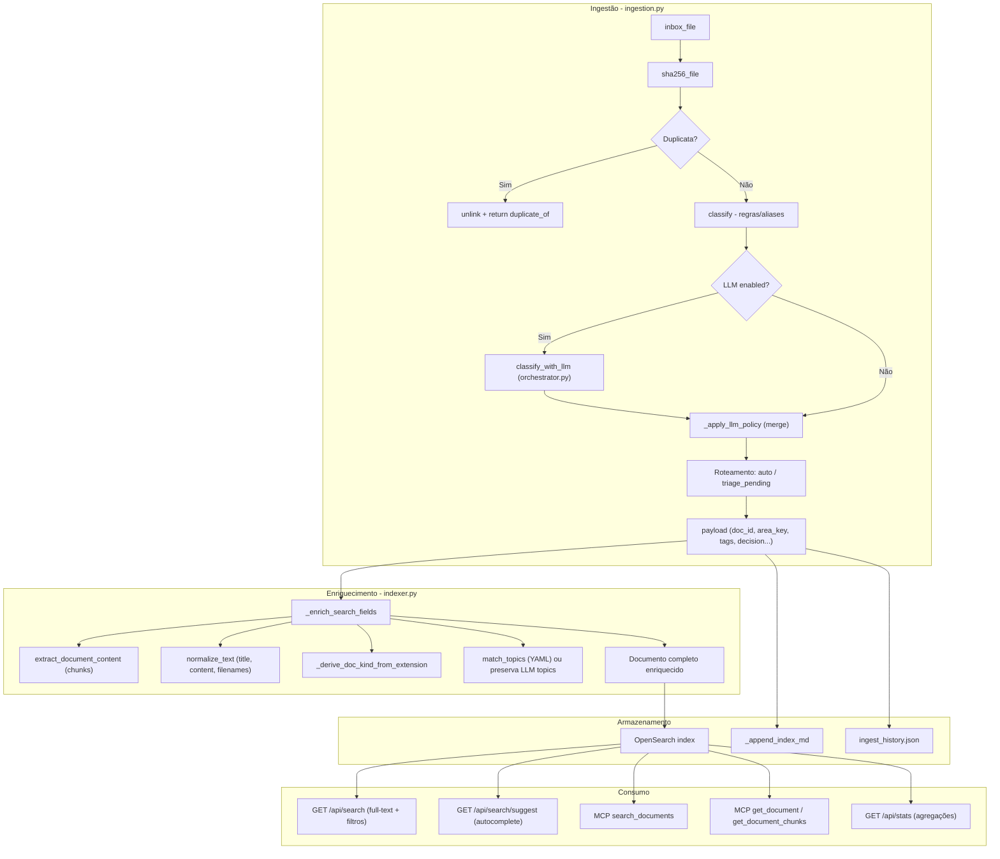

# Mapeamento completo de campos -- origem, derivação e uso

Todos os campos indexados no OpenSearch, organizados por **quem os produz** e **quem os consome/altera**.

## Grupo 1 -- Identidade e metadados de arquivo

Campos automáticos, nunca alterados por LLM.

| Campo | Tipo OS | Produzido por | Consumido por |
|-------|---------|---------------|---------------|
| `doc_id` | keyword | `uuid4()` na ingestão | Chave primária em toda a aplicação |
| `project_id` | keyword | `profile["project_id"]` | Filtro em search, reconcile, stats |
| `sha256` | keyword | `utils.sha256_file()` | Dedup precoce (antes do fluxo) |
| `original_filename` | keyword | `inbox_file.name` | Exibição UI, search highlight |
| `original_filename_text` | text | `_enrich_search_fields` (indexer) | Full-text search |
| `original_filename_normalized` | text | `normalize_text()` (indexer) | Busca normalizada (sem acentos) |
| `original_filename_suggest` | search_as_you_type | `_enrich_search_fields` (indexer) | Autocomplete (modal Cmd+K) |
| `canonical_filename` | keyword | `build_canonical_filename()` | Path final, exibição |
| `canonical_filename_text` | text | indexer | Full-text search |
| `canonical_filename_normalized` | text | indexer | Busca normalizada |
| `path` | keyword | Destino final (auto ou triage) | Download link, reconcile |
| `extension` | keyword | `Path(path).suffix.lower()` (indexer) | Filtro por extensão |
| `doc_kind` | keyword | `_derive_doc_kind_from_extension()` (indexer) | Filtro por tipo de documento |

## Grupo 2 -- Conteúdo extraído

Campos automáticos, nunca alterados por LLM.

| Campo | Tipo OS | Produzido por | Consumido por |
|-------|---------|---------------|---------------|
| `title` | text | `inbox_file.stem` | Search ranking (boost 5x) |
| `title_normalized` | text | `normalize_text()` (indexer) | Busca normalizada |
| `title_suggest` | search_as_you_type | indexer | Autocomplete |
| `content` | text | `extract_document_content()` via indexer | Full-text search, LLM chat chunks |
| `content_normalized` | text | `normalize_text()` (indexer) | Busca normalizada |
| `content_chunks` | nested {location, text, text_normalized} | Chunking em `document_extractor.py` via indexer | Search inner_hits (evidências por página) |
| `content_chunks_text` | text | Chunks concatenados (indexer) | Full-text search (boost 2x) |
| `content_chunks_normalized` | text | indexer | Busca normalizada |
| `chunk_locations` | keyword | IDs dos chunks (ex: `page:1`) | Exibição de localidade nos resultados |
| `content_type` | keyword | MIME type da extração (indexer) | Ícone no frontend |
| `extraction_status` | keyword | `ok`, `partial`, `error` (indexer) | Diagnóstico |
| `extraction_metadata` | object (disabled) | Metadados da extração (indexer) | Não indexado (storage only) |

## Grupo 3 -- Classificação (regras + LLM pode alterar)

| Campo | Tipo OS | Produzido por | LLM pode alterar? | Condição para LLM alterar |
|-------|---------|---------------|--------------------|--------------------------|
| `area_key` | keyword | `classify()` (alias scoring / routing rules) | Sim (mode=full_override) | `max_area_changes >= 1` AND confiança da regra < `area_override_only_if_rule_confidence_below` AND explanation fornecida |
| `confidence_score` | float | `classify()` | Sim | `"confidence" in allow_override_fields` |
| `document_type` | keyword | LLM via `submit_classification` | Sim (é a fonte primária) | `"document_type" in allow_override_fields` |
| `tags` | keyword (array) | `[area_key]` + `classification.suggested_tags` | Sim | `"tags" in allow_override_fields` |
| `topics` | keyword (array) | `match_topics()` (synonym_match do YAML) OU LLM | Sim | `"topics" in allow_override_fields`; se LLM fornece, indexer preserva (`topics_source = "llm_policy"`) |
| `topics_source` | keyword | `"synonym_match"`, `"llm_policy"`, ou `"none"` | Indiretamente | Se LLM fornece topics, source muda para `llm_policy` |
| `decision` | keyword | `auto`, `triage_pending`, `duplicate` | Indiretamente | mode=review força `triage_pending` |
| `review_status` | keyword | `"needs_review"` se conf < threshold | Indiretamente | LLM pode alterar confidence, afetando threshold |

## Grupo 4 -- Proveniência e timestamps

Campos automáticos, nunca alterados por LLM.

| Campo | Tipo OS | Produzido por | Consumido por |
|-------|---------|---------------|---------------|
| `source_channel` | keyword | Hardcoded `""` (futuro: canais externos) | Futuro |
| `source_ref` | keyword | Hardcoded `""` | Futuro |
| `sender` | keyword | Hardcoded `""` | Futuro |
| `received_at` | date | Hardcoded `None` | Futuro |
| `ingested_at` | date | `utc_now_iso()` | Filtro date_from/date_to no search |
| `processed_at` | date | `utc_now_iso()` | Ordenação, auditoria |
| `correspondent` | keyword | Não populado; alterável via MCP `set_metadata` | Futuro: filtro, exibição |

## Fluxo de dados por etapa

## Campos de visibilidade LLM (não indexados no OpenSearch)

Campos preservados no pipeline de classificação para rastreabilidade, visíveis na UI de triagem e no histórico de ingestão:

| Campo | Tipo | Produzido por | Onde visível |
|-------|------|---------------|-------------|
| `rule_area_key` | string | `_apply_llm_policy` (área original antes de override) | Card de triagem, histórico |
| `rule_confidence` | float | `_apply_llm_policy` (confiança original) | Card de triagem, histórico |
| `llm_explanation` | string | LLM via `submit_classification` | Tooltip/expandível no card de triagem |
| `llm_proposed_area` | string | LLM (quando propõe área inexistente) | Card de triagem, botão "Aprovar com área proposta" |
| `classification_reason` | string | `classify()` (ex: `filename_contains:contrato`) | Histórico de ingestão |
