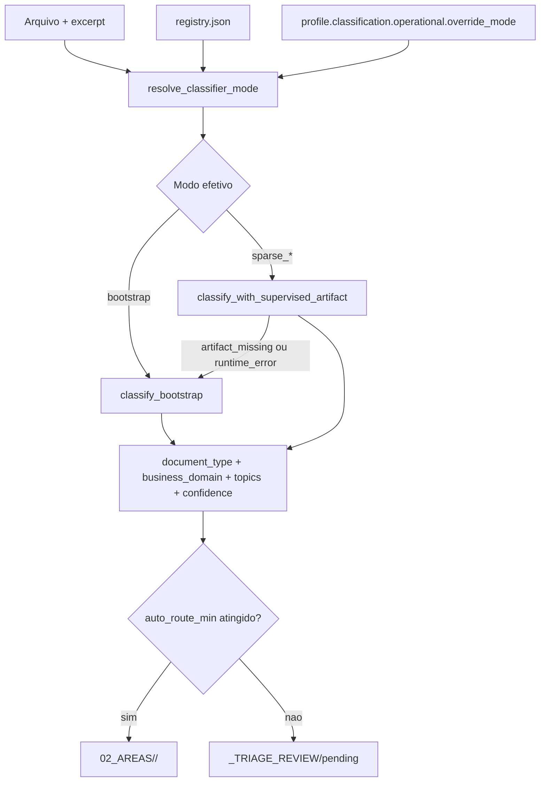

# Design do classificador -- estado atual da 0.8.0

## Contrato operacional

Na 0.8.0 o AtlasFile resolve um modo efetivo de classificacao antes da ingestao. O runtime considera:

- `champion_mode` persistido no registry global em `_ATLASFILE/classifier/registry.json`
- datasets operacionais persistidos em `_ATLASFILE/classifier/datasets`
- `classification.operational.override_mode` no profile do projeto, quando o override por projeto estiver habilitado
- fallback explicito para `bootstrap` se o artefato supervisionado estiver ausente ou falhar em runtime

Os modos publicos suportados sao:

- `bootstrap`
- `sparse_logreg`
- `sparse_linear_svc`

O fluxo operacional e:

```text
1. Resolver classifier_mode efetivo
2. Classificar document_type
3. Extrair entidades deterministicas
4. Classificar business_domain
5. Derivar topics
6. Calcular confidence final
7. Auto-route ou triagem humana
```

O `baseline` legado nao faz mais parte do contrato publico do produto, da UI nem do benchmark oficial exposto ao usuario.

`validation_set` e `training_pool` operacionais existem apenas em `_ATLASFILE/classifier/datasets`. O repo nao participa do runtime desses datasets; no repositório fica apenas uma fixture mínima de `validation_set` para um teste de integração em `backend/tests/fixtures/classifier_datasets`.

## Arquitetura atual



## Caminho `bootstrap`

No modo `bootstrap`, o AtlasFile segue heuristicas deterministicas implementadas em `backend/app/classification_bootstrap.py`.

### Eixo 1 -- `document_type`

`detect_document_type()` segue esta ordem:

1. `extension_confidence_by_extension`
2. `detection_rules` estruturais
3. score por aliases + bonus de extensao
4. fallback por `fallback_priority`

Sinais usados:

- extensao do arquivo
- nome do arquivo
- cabecalho e inicio do excerpt
- regras `any_of`, `all_of`, `with_any_of`, `exclude_any_of`

Resultado emitido:

- `document_type`
- `document_type_confidence`
- `document_type_reason`
- `top_document_type_candidates`

### Eixo 2 -- `business_domain`

`classify_business_domain()` usa:

- hits de aliases no filename
- hits de aliases no excerpt
- hits de aliases nas entidades extraidas
- overlap entre o `document_type` detectado e o lexicon de dominios

Os pesos atuais continuam fixos no codigo:

- filename: `3`
- excerpt: `2`
- entities: `2`
- document_type: `2`

Tambem ha um componente de especificidade do alias para desempate. Se nenhum dominio pontuar, o metodo faz best-effort com base no `document_type` ou na ordem configurada no profile.

Resultado emitido:

- `business_domain`
- `business_domain_confidence`
- `business_domain_reason`
- `top_business_domain_candidates`

## Caminho `sparse_*`

Nos modos supervisionados, `backend/app/classifier_supervised.py` treina dois modelos TF-IDF char n-gram:

- um modelo para `business_domain`
- um modelo para `document_type`

O texto de features usado no runtime e:

```text
source_path.name + "\n" + text_excerpt[:4000]
```

O supervisionado retorna o mesmo contrato principal do bootstrap:

- `business_domain`
- `document_type`
- `business_domain_confidence`
- `document_type_confidence`
- `confidence`
- `top_candidates`
- `top_document_type_candidates`

Mesmo no caminho supervisionado, o AtlasFile continua extraindo `entities` e derivando `topics` para manter o enriquecimento e a observabilidade do documento.

## Confidence final e triagem

Tanto no bootstrap quanto no supervisionado, a confidence geral segue:

```text
min(document_type_confidence, business_domain_confidence)
```

O gate operacional usa `classification.confidence_thresholds`:

- `auto_route_min`: vai para `02_AREAS/<business_domain>/<document_type>/`
- abaixo do gate: vai para `_TRIAGE_REVIEW/pending`

Ou seja: o sistema sempre sugere um `business_domain` e um `document_type`, mas baixa confianca continua indo para triagem humana.

## Entidades e topics

`extract_entities()` faz extracao deterministica em duas camadas:

1. regexes basicas para `cnpj`, `email`, `contrato` e `valor`
2. `entity_catalog` do profile, quando preenchido

Depois disso, `match_topics()` roda sobre filename + excerpt usando `config/topics_v1.yaml`.

## Papel do LLM

O schema ainda suporta `tag_only`, `review` e `full_override`, mas o contrato da 0.8.0 e:

- `llm_policy.enabled = false` no template default
- LLM nao substitui o classificador operacional
- quando habilitado, o LLM atua como enriquecedor ou revisor
- custo/uso do LLM de classificacao, quando existir, vai para `atlasfile_classification_usage`

## Benchmark, ciclo e promocao

O benchmark oficial e `backend/scripts/benchmark_classification.py`, e o ciclo completo fica em `backend/scripts/run_classifier_cycle.py`.

Modos suportados pelo benchmark oficial:

- `bootstrap`
- `sparse_logreg`
- `sparse_linear_svc`
- `all`

Gates do benchmark:

- `validation_set` rotulado em `_ATLASFILE/classifier/datasets/validation_set`
- `training_pool` disjunto em `_ATLASFILE/classifier/datasets/training_pool`
- checagem de integridade por overlap entre datasets
- gates minimos de volume total e suporte por classe para habilitar os modos supervisionados

Ao final do ciclo, o sistema:

1. persiste artefatos supervisionados em `_ATLASFILE/classifier/models`
2. salva um report versionado em `_ATLASFILE/classifier/reports`
3. registra `dataset_manifest` com lineage e digests de `validation_set` e `training_pool`
4. escolhe o `champion_mode` conforme `promotion_policy`
5. atualiza o registry global com campeao, report, manifesto e status do ultimo ciclo

Na 0.8.0 a politica padrao e `auto_best_with_ui_override`: o melhor candidato elegivel pode virar campeao, mas o projeto ainda pode fixar `classification.operational.override_mode` quando precisar servir outro modo explicitamente.

## O que este documento substitui

Este documento substitui o desenho antigo de:

- `routing_rules -> alias scoring -> LLM override` como fluxo principal
- `baseline` como modo publico ou operacional
- um eixo funcional legado como taxonomia primaria
- `document_type` como campo dependente do LLM

Na 0.8.0, o contrato real e `business_domain + document_type` com runtime operacional controlado por registry, benchmark e override de projeto.
