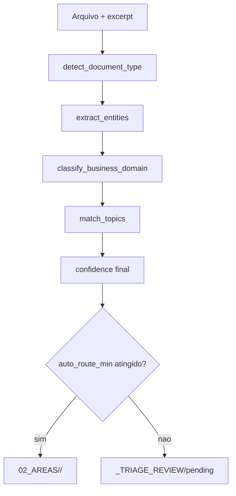

# Design do classificador -- estado atual da 0.7.0

## Contrato operacional

Na 0.7.0 o classificador principal do AtlasFile e o `bootstrap` deterministico implementado em `backend/app/classification_bootstrap.py`.

O fluxo operacional e:

```text
1. Detectar document_type
2. Extrair entidades deterministicas
3. Classificar business_domain
4. Derivar topics
5. Calcular confidence final
6. Auto-route ou triagem humana
```

O classificador legado continua existindo apenas como baseline de comparacao no benchmark. O LLM nao e classificador primario e fica desabilitado por padrao no `default.json`.

## Arquitetura atual



## Eixo 1 -- `document_type`

`detect_document_type()` segue esta ordem:

1. `extension_confidence_by_extension`
2. `detection_rules` estruturais
3. score por aliases + bonus de extensao
4. fallback por `fallback_priority`

### Sinais usados hoje

- extensao do arquivo
- nome do arquivo
- cabecalho e inicio do excerpt
- regras `any_of`, `all_of`, `with_any_of`, `exclude_any_of`

### Resultado

O metodo sempre retorna:

- `document_type`
- `document_type_confidence`
- `document_type_reason`
- `top_document_type_candidates`

## Eixo 2 -- `business_domain`

`classify_business_domain()` usa:

- hits de aliases no filename
- hits de aliases no excerpt
- hits de aliases nas entidades extraidas
- overlap entre o `document_type` detectado e o lexicon de dominios

Os pesos atuais sao fixos no codigo:

- filename: `3`
- excerpt: `2`
- entities: `2`
- document_type: `2`

Tambem ha um componente de especificidade do alias para desempate. Se nenhum dominio pontuar, o metodo faz best-effort com base no `document_type` ou na ordem configurada no profile.

### Resultado

O metodo sempre retorna:

- `business_domain`
- `business_domain_confidence`
- `business_domain_reason`
- `top_business_domain_candidates`

## Eixo 3 -- entidades e topics

`extract_entities()` faz extracao deterministica em duas camadas:

1. regexes basicas para `cnpj`, `email`, `contrato` e `valor`
2. `entity_catalog` do profile, quando preenchido

Depois disso, `match_topics()` roda sobre filename + excerpt usando `config/topics_v1.yaml`.

## Confidence final e triagem

`classify_bootstrap()` define a confidence geral como:

```text
min(document_type_confidence, business_domain_confidence)
```

O gate operacional usa `classification.confidence_thresholds`:

- `auto_route_min`: vai para `02_AREAS/<business_domain>/<document_type>/`
- abaixo do gate: vai para `_TRIAGE_REVIEW/pending`

Ou seja: o sistema sempre sugere um `business_domain` e um `document_type`, mas baixa confianca continua indo para triagem.

## Papel do LLM

O schema ainda suporta `tag_only`, `review` e `full_override`, mas o contrato da 0.7.0 e:

- `llm_policy.enabled = false` no template default
- LLM nao substitui o bootstrap
- quando habilitado, o LLM atua como enriquecedor ou revisor
- custo/uso do LLM de classificacao, quando existir, vai para `atlasfile_classification_usage`

## Benchmark e promocao de modelo

O script oficial e `backend/scripts/benchmark_classification.py`.

Modos suportados hoje:

- `baseline`: classificador legado, apenas para referencia
- `bootstrap`: classificador operacional atual
- `sparse_logreg`: candidato supervisionado
- `sparse_linear_svc`: candidato supervisionado
- `all`: executa todos os modos acima

Gates do benchmark:

- `validation_set` rotulado em `config/validation_set`
- `training_pool` disjunto em `config/training_pool`
- checagem de integridade por overlap entre datasets

Promocao de modelo supervisionado nao e automatica. O fluxo correto e:

1. revisar `validation_set`
2. rodar benchmark
3. comparar com o bootstrap
4. promover explicitamente apenas se houver ganho verificado

## O que este documento substitui

Este documento substitui o desenho antigo de:

- `routing_rules -> alias scoring -> LLM override` como fluxo principal
- `area_key` como taxonomia primaria
- `document_type` como campo dependente do LLM

Na 0.7.0, o contrato real e `business_domain + document_type` com bootstrap deterministico como baseline operacional.
