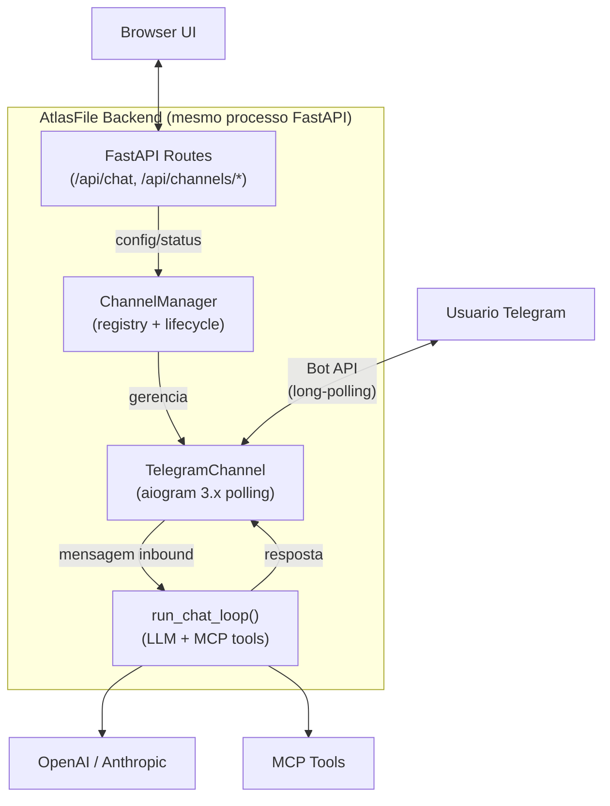

# Channels Nativos no AtlasFile (Alternativa C)

## Contexto

- AtlasFile backend = Python/FastAPI, sem dependencia de OpenClaw
- Objetivo: mesma experiencia plug/configure/play de canais que o OpenClaw oferece
- Padrao: abstracacao `Channel` (protocol Python) + `ChannelManager` + implementacoes concretas
- Canal default: Telegram via **aiogram 3.x** (mesma lib base que grammy no ecossistema Python)
- Arquitetura: channels rodam como async tasks DENTRO do processo FastAPI (zero containers novos)

## Arquitetura




**Principio**: zero hop HTTP entre canal e orchestrator. Mensagem inbound chama `run_chat_loop()` diretamente no mesmo processo. Latencia minima.

## Modulo `backend/app/channels/`

### Estrutura de arquivos

```
backend/app/channels/
  __init__.py          # re-exporta ChannelManager, Channel
  base.py              # Protocol Channel + tipos compartilhados
  manager.py           # ChannelManager (registry, start/stop, dispatch)
  telegram.py          # TelegramChannel (aiogram)
```

### `base.py` -- Protocol Channel

Inspirado no `ChannelPlugin` do OpenClaw, adaptado para Python:

```python
from typing import Protocol, runtime_checkable

class ChannelMessage:
    """Mensagem inbound de um canal."""
    channel_id: str          # "telegram"
    sender_id: str           # ID do remetente no canal
    sender_name: str         # Nome display
    chat_id: str             # ID do chat (DM ou grupo)
    text: str                # Texto da mensagem
    message_id: str          # ID da mensagem no canal
    chat_type: str           # "private" | "group" | "supergroup"
    raw: dict                # Payload original do canal

class ChannelStatus:
    """Status de um canal."""
    channel_id: str
    running: bool
    connected: bool
    error: str | None
    uptime_seconds: float

@runtime_checkable
class Channel(Protocol):
    id: str
    name: str
    description: str

    async def start(self, config: dict) -> None: ...
    async def stop(self) -> None: ...
    async def send_message(self, chat_id: str, text: str) -> None: ...
    def is_running(self) -> bool: ...
    def get_status(self) -> ChannelStatus: ...
```

### `manager.py` -- ChannelManager

```python
class ChannelManager:
    """Registra canais, gerencia lifecycle, despacha mensagens inbound para o orchestrator."""

    def __init__(self, on_message: Callable[[ChannelMessage], Awaitable[str]]):
        self._channels: dict[str, Channel] = {}
        self._on_message = on_message  # callback: recebe msg, retorna resposta

    def register(self, channel: Channel) -> None: ...
    async def start_all(self, config: dict) -> None: ...
    async def stop_all(self) -> None: ...
    async def start_channel(self, channel_id: str, config: dict) -> None: ...
    async def stop_channel(self, channel_id: str) -> None: ...
    def get_status(self) -> list[ChannelStatus]: ...
    def get_channel(self, channel_id: str) -> Channel | None: ...
```

O callback `on_message` e injetado no startup e chama `run_chat_loop()`:

```python
async def handle_channel_message(msg: ChannelMessage) -> str:
    provider, model = get_llm_config("chat")
    messages = [{"role": "user", "content": msg.text}]
    result = await run_chat_loop(messages, provider, model)
    return result["content"]
```

### `telegram.py` -- TelegramChannel

Usa **aiogram 3.x** com long-polling:

```python
from aiogram import Bot, Dispatcher
from aiogram.client.default import DefaultBotProperties
from aiogram.enums import ParseMode

class TelegramChannel:
    id = "telegram"
    name = "Telegram"
    description = "Telegram Bot API via aiogram"

    def __init__(self, on_message: Callable):
        self._bot: Bot | None = None
        self._dp: Dispatcher | None = None
        self._polling_task: asyncio.Task | None = None
        self._on_message = on_message
        self._running = False
        self._start_time: float = 0

    async def start(self, config: dict) -> None:
        token = config.get("bot_token")
        if not token:
            raise ValueError("telegram.bot_token is required")
        self._bot = Bot(token=token, default=DefaultBotProperties(parse_mode=ParseMode.HTML))
        self._dp = Dispatcher()
        self._register_handlers()
        self._polling_task = asyncio.create_task(
            self._dp.start_polling(self._bot, handle_signals=False)
        )
        self._running = True
        self._start_time = time.time()

    async def stop(self) -> None:
        if self._dp:
            await self._dp.stop_polling()
        if self._polling_task:
            self._polling_task.cancel()
            with suppress(asyncio.CancelledError):
                await self._polling_task
        if self._bot:
            await self._bot.session.close()
        self._running = False

    async def send_message(self, chat_id: str, text: str) -> None:
        if self._bot:
            await self._bot.send_message(chat_id=int(chat_id), text=text)

    def _register_handlers(self) -> None:
        @self._dp.message()
        async def on_msg(message: AiogramMessage) -> None:
            channel_msg = ChannelMessage(...)
            reply = await self._on_message(channel_msg)
            await message.answer(reply)
```

Pontos criticos de `handle_signals=False` (para nao conflitar com uvicorn/FastAPI).

## Integracao no Backend

### `config.py` -- novas settings

```python
# --- Channels ---
channels_enabled: bool = False
telegram_bot_token: str = ""
telegram_enabled: bool = False
```

Env vars correspondentes: `CHANNELS_ENABLED`, `TELEGRAM_BOT_TOKEN`, `TELEGRAM_ENABLED`.

### `models.py` -- novos modelos

```python
class ChannelConfigTelegram(BaseModel):
    enabled: bool = False
    bot_token: str = ""

class ChannelConfigUpdate(BaseModel):
    channels_enabled: bool = False
    telegram: ChannelConfigTelegram = ChannelConfigTelegram()

class ChannelStatusItem(BaseModel):
    channel_id: str
    name: str
    running: bool
    connected: bool
    error: str | None = None
    uptime_seconds: float = 0

class ChannelStatusResponse(BaseModel):
    channels_enabled: bool
    channels: list[ChannelStatusItem]
```

### `main.py` -- lifespan estendido

```python
from app.channels import ChannelManager
from app.channels.telegram import TelegramChannel

channel_manager: ChannelManager | None = None

@asynccontextmanager
async def lifespan(app: FastAPI):
    global channel_manager
    # ... existing startup (ensure_index, etc.) ...

    # Channel startup (graceful: falha nao impede o app)
    if settings.channels_enabled:
        channel_manager = ChannelManager(on_message=_handle_channel_message)
        channel_manager.register(TelegramChannel(on_message=channel_manager.dispatch))
        try:
            await channel_manager.start_all(_build_channel_config())
        except Exception:
            logger.exception("Channel startup failed (non-fatal)")

    yield

    # Channel shutdown
    if channel_manager:
        await channel_manager.stop_all()
    _reconcile_stop.set()
```

Ponto critico: **falha no channel startup NAO impede o backend de subir**. Channels sao opcionais.

### `api/channels.py` -- router de canais

```python
router = APIRouter(prefix="/api/channels", tags=["channels"])

@router.get("/config")
async def get_channel_config() -> ChannelConfigUpdate: ...

@router.put("/config")
async def update_channel_config(body: ChannelConfigUpdate) -> ChannelConfigUpdate:
    # Salva config (OpenSearch ou file)
    # Restart canais afetados via channel_manager
    ...

@router.get("/status")
async def get_channel_status() -> ChannelStatusResponse:
    # Retorna status de todos os canais registrados
    ...

@router.post("/test")
async def test_channel(channel_id: str) -> dict:
    # Envia mensagem de teste
    ...
```

## Frontend

### Mockup: Modal "Configuracao do Assistente" (estado atual + canais)

O modal usa as classes existentes do AtlasFile: `.modal-overlay`, `.modal`, `.field`, `.sub`, `.checkbox-inline`, `.btn.primary`, `.modal-actions`, `.pill`. Nenhum estilo novo e criado.

A secao de canais e adicionada DENTRO do mesmo modal, abaixo dos campos existentes, separada por `<hr />`. Cada canal e um bloco `.card` colapsavel (accordion).

```
+-------------------------------------------------------------+
|  Configuracao do Assistente                                  |
|                                                              |
|  Modelo de triagem (classificacao no ingest) e modelo de     |
|  chat podem ser diferentes. Chaves sao enviadas so na        |
|  requisicao e nao ficam no servidor.                         |
|                                                              |
|  Modelo triagem                                              |
|  [  openai / gpt-4o-mini                              v ]    |
|                                                              |
|  Modelo chat                                                 |
|  [  anthropic / claude-sonnet-4-6                     v ]    |
|                                                              |
|  OpenAI API Key                                              |
|  [  sk-••••••••••••                                     ]    |
|                                                              |
|  Anthropic API Key                                           |
|  [  sk-ant-••••••••••••                                 ]    |
|                                                              |
|  [x] Gerar titulo da sessao via LLM (em background)         |
|      Se desativado, o titulo sera a primeira mensagem.       |
|                                                              |
|  -----------------------------------------------------------  |
|                                                              |
|  Canais de comunicacao                                       |
|  Conecte o assistente a canais de mensagem externos.         |
|  Canais sao opcionais e nao afetam o chat web.               |
|                                                              |
|  +-------------------------------------------------------+  |
|  | > Telegram                       ● Conectado           |  |
|  |                                                        |  |
|  |   [x] Habilitado                                       |  |
|  |                                                        |  |
|  |   Bot Token (@BotFather)                               |  |
|  |   [  ••••••••••••••••••••••••••••••••••••••••     ]    |  |
|  |                                                        |  |
|  |   Como criar: abra @BotFather no Telegram, use         |  |
|  |   /newbot e copie o token gerado.                      |  |
|  |                                                        |  |
|  +-------------------------------------------------------+  |
|                                                              |
|  +-------------------------------------------------------+  |
|  | > Discord                        ○ Desabilitado        |  |
|  |   (colapsado -- clique para expandir)                  |  |
|  +-------------------------------------------------------+  |
|                                                              |
|  +-------------------------------------------------------+  |
|  | > Slack                          ○ Desabilitado        |  |
|  |   (colapsado -- clique para expandir)                  |  |
|  +-------------------------------------------------------+  |
|                                                              |
|                                           [  Fechar  ]       |
+-------------------------------------------------------------+
```

### Detalhes de implementacao do mockup

**Componentes e classes CSS reutilizadas (zero CSS novo):**

- Container: `<div className="modal">` (ja tem `width: min(560px, 100%)`, padding, shadow)
- Titulo: `<h3>` (ja estilizado dentro de `.modal`)
- Descricao: `<p className="sub">` (cor muted, font menor)
- Campos: `<div className="field"><label>...</label><select|input>...</div>`
- Checkbox: `<label className="checkbox-inline"><input type="checkbox" />...</label>`
- Separador: `<hr style={{ border: 'none', borderTop: '1px solid var(--border)', margin: '16px 0' }} />`
- Card canal: `<div className="card">` (ja tem border, background, border-radius, padding)
- Status pill: `<span className="pill">● Conectado</span>` ou `<span className="pill">○ Desabilitado</span>`
- Accordion: click no header do card expande/colapsa body (estado React local `expandedChannel`)
- Botao fechar: `<button className="btn primary">Fechar</button>` (ja existe)
- Dica: `<span className="sub">Como criar: abra @BotFather...</span>`

**Comportamento:**

- Canais colapsados por default; apenas o primeiro habilitado fica expandido
- Status carregado via `GET /api/channels/status` no mount do modal
- Salvar e automatico (onChange chama `PUT /api/channels/config` com debounce 500ms)
- Campos de token sao `type="password"` com toggle de visibilidade
- Canais futuros (Discord, Slack) aparecem como cards desabilitados com "Em breve" no body
- Sem "Projeto padrao": canal e apenas um meio de entrada; o assistente opera em todos os projetos (igual "Geral" no chat web); usuario pode filtrar via texto natural

**Estado React (Props adicionais no AssistantSettingsModal):**

```typescript
// Novas props
channelConfig: ChannelConfig | null;
channelStatus: ChannelStatusResponse | null;
onChangeChannelConfig: (config: ChannelConfig) => void;
```

### `api.ts`

Novas funcoes (seguem o padrao existente de `fetchChatSessions`, `createChatSession`, etc.):

```typescript
export async function fetchChannelConfig(): Promise<ChannelConfig> {
  const res = await fetch(`${API}/api/channels/config`);
  return res.json();
}

export async function updateChannelConfig(config: ChannelConfig): Promise<ChannelConfig> {
  const res = await fetch(`${API}/api/channels/config`, {
    method: "PUT",
    headers: { "Content-Type": "application/json" },
    body: JSON.stringify(config),
  });
  return res.json();
}

export async function fetchChannelStatus(): Promise<ChannelStatusResponse> {
  const res = await fetch(`${API}/api/channels/status`);
  return res.json();
}
```

### `types.ts`

```typescript
interface ChannelConfigTelegram {
  enabled: boolean;
  bot_token: string;
}

interface ChannelConfig {
  channels_enabled: boolean;
  telegram: ChannelConfigTelegram;
}

interface ChannelStatusItem {
  channel_id: string;
  name: string;
  running: boolean;
  connected: boolean;
  error: string | null;
  uptime_seconds: number;
}

interface ChannelStatusResponse {
  channels_enabled: boolean;
  channels: ChannelStatusItem[];
}
```

## Docker

**Zero containers novos.** Apenas adicionar env vars ao servico `api` existente:

```yaml
api:
  environment:
    # ... existentes ...
    - CHANNELS_ENABLED=${CHANNELS_ENABLED:-false}
    - TELEGRAM_BOT_TOKEN=${TELEGRAM_BOT_TOKEN:-}
    - TELEGRAM_ENABLED=${TELEGRAM_ENABLED:-false}
```

## Dependencias

Adicionar ao `requirements.txt`:

```
aiogram>=3.26.0
```

A aiogram depende de `aiohttp`, `pydantic` (ja presente), `aiofiles`. Sem conflitos com o stack atual.

## Testes

### Novos testes unitarios: `tests/unit/test_channels.py`

- `test_channel_protocol` -- verifica que TelegramChannel implementa o Protocol
- `test_channel_manager_register` -- registrar e listar canais
- `test_channel_manager_start_stop` -- lifecycle com mock de channel
- `test_channel_manager_dispatch` -- mensagem inbound chama callback
- `test_telegram_channel_start_requires_token` -- erro se bot_token vazio
- `test_telegram_channel_stop_graceful` -- stop cancela polling task
- `test_handle_channel_message` -- callback chama run_chat_loop e retorna content

### Novos testes integracao: `tests/integration/test_api_channels.py`

- `test_get_channel_config_default` -- GET /api/channels/config retorna config default
- `test_update_channel_config` -- PUT /api/channels/config salva e retorna
- `test_get_channel_status_disabled` -- status quando channels_enabled=false
- `test_get_channel_status_enabled` -- status com channel registrado

### Testes existentes (zero regressao)

Rodar a suite completa (252+ testes) antes e depois das alteracoes:

```bash
cd backend && python -m pytest tests/ -v --tb=short
```

Todas as alteracoes sao **aditivas**: novo modulo `channels/`, novos endpoints, nova secao no frontend. Nenhum arquivo existente e modificado de forma que altere comportamento -- apenas extensoes (lifespan, router, config).

## Gestao de sessao por canal

**MVP**: cada mensagem de canal e processada como request independente (sem historico de sessao). O usuario envia mensagem, o assistente responde com base no texto + MCP tools. Simples e funcional para consultas atomicas ("Quantos documentos temos?", "Busque contratos").

**Fase 2** (pos-MVP): sessoes por canal armazenadas em OpenSearch (como as sessoes de chat web), usando `channel_id:chat_id` como chave de sessao. Permite conversas multi-turn.

## Como adicionar um novo canal (futuro)

1. Criar `backend/app/channels/discord.py` implementando o Protocol `Channel`
2. Adicionar dependencia (ex: `discord.py`) ao `requirements.txt`
3. Registrar no `ChannelManager` (1 linha em `main.py`)
4. Adicionar config UI no frontend (card no AssistantSettingsModal)
5. Adicionar env vars no docker-compose

Bibliotecas Python equivalentes por canal:

- Telegram: `aiogram` (async, production-ready)
- Discord: `discord.py` (async, maduro)
- Slack: `slack-bolt` (async, oficial Slack)
- WhatsApp: `yowsup` ou Baileys via bridge
- Signal: `semaphore` ou signal-cli REST
- Matrix: `matrix-nio` (async)

## Arquivos a criar/alterar


| Arquivo                                                     | Acao                                                                 |
| ----------------------------------------------------------- | -------------------------------------------------------------------- |
| `backend/app/channels/__init__.py`                          | Novo: re-exporta ChannelManager, Channel                             |
| `backend/app/channels/base.py`                              | Novo: Protocol Channel, ChannelMessage, ChannelStatus                |
| `backend/app/channels/manager.py`                           | Novo: ChannelManager                                                 |
| `backend/app/channels/telegram.py`                          | Novo: TelegramChannel (aiogram)                                      |
| `backend/app/api/channels.py`                               | Novo: router /api/channels/*                                         |
| `backend/app/config.py`                                     | Alterar: adicionar channels_enabled, telegram_*                      |
| `backend/app/models.py`                                     | Alterar: adicionar ChannelConfig*, ChannelStatus*                    |
| `backend/app/main.py`                                       | Alterar: importar channel manager, estender lifespan, incluir router |
| `backend/requirements.txt`                                  | Alterar: adicionar aiogram>=3.26.0                                   |
| `backend/tests/unit/test_channels.py`                       | Novo: testes unitarios do modulo channels                            |
| `backend/tests/integration/test_api_channels.py`            | Novo: testes de integracao dos endpoints                             |
| `frontend/src/features/settings/AssistantSettingsModal.tsx` | Alterar: adicionar secao Canais                                      |
| `frontend/src/api.ts`                                       | Alterar: adicionar funcoes de channel API                            |
| `docker-compose.yml`                                        | Alterar: adicionar env vars CHANNELS_*, TELEGRAM_*                   |
| `.env.example`                                              | Alterar: adicionar CHANNELS_ENABLED, TELEGRAM_BOT_TOKEN              |
| `CHANGELOG.md`                                              | Alterar: documentar feature                                          |


## Pre-condicoes e riscos

- **API keys no backend**: chaves LLM devem estar em env vars (ja configuradas no docker-compose linhas 54-55)
- **aiogram + aiohttp**: verificar compatibilidade com httpx ja presente (ambos coexistem sem conflito)
- **Long-polling**: aiogram faz polling ao Telegram API; se o container nao tem acesso a internet, o canal nao funciona (graceful error)
- **Restart**: ao reiniciar o servico api, os canais reconectam automaticamente (lifespan gerencia)
- **Bot Token seguranca**: token armazenado como env var ou via API (PUT /api/channels/config); nunca exposto em logs

