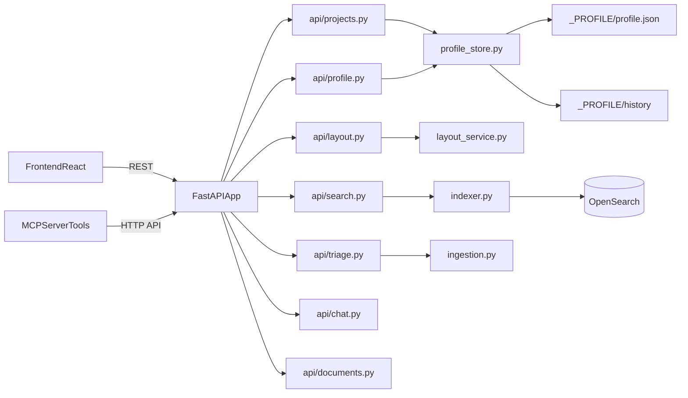

# Plano de execução — Profile v2 sem migração

## Entendimento confirmado

- Objetivo de negócio: evoluir AtlasFile para Profile v2 editável, layout dinâmico com plan/apply, política de LLM governada e topics controlados, sem perder estabilidade operacional.
- Decisões confirmadas:
  - **Cutover direto** para `_PROFILE/profile.json` (sem suporte runtime a `_PROJECT_PROFILE.md`).
  - **Componentização moderada** de [backend/app/main.py](backend/app/main.py) e [frontend/src/App.tsx](frontend/src/App.tsx), mantendo estado/código essencial inicialmente nos arquivos principais.
- Restrição operacional: os 2 projetos atuais podem ser **rebootstrapados** (sem preservação de estrutura/arquivos).

## Arquitetura alvo (incremental)

## Fase 0 — Baseline e segurança de mudança

- Congelar baseline com `make test` verde antes de cada bloco relevante.
- Registrar contratos que não podem quebrar (MCP/tools e endpoints atuais):
  - [backend/app/mcp/server.py](backend/app/mcp/server.py)
  - [backend/app/main.py](backend/app/main.py)
  - [frontend/src/api.ts](frontend/src/api.ts)
- Resultado esperado: baseline reproduzível e comparável pós-mudança.

## Fase 1 — Cutover de Profile v2 (sem legado)

### Mudanças

- Criar schema/store:
  - [backend/app/profile_schema_v2.py](backend/app/profile_schema_v2.py) (baseado em `docs/plano_profile/profile_v2.py`)
  - [backend/app/profile_store.py](backend/app/profile_store.py)
- Fonte da verdade:
  - `_PROFILE/profile.json`
  - `_PROFILE/history/<timestamp>__vNN.json`
- Remover dependência de `_PROJECT_PROFILE.md` no runtime:
  - [backend/app/project_profile.py](backend/app/project_profile.py)
  - [backend/app/main.py](backend/app/main.py)
- Template default (sem hardcode):
  - [config/templates/profile_v2_default.json](config/templates/profile_v2_default.json)
  - [scripts/bootstrap_project.py](scripts/bootstrap_project.py)

### Decisões de schema/mapping/query

- Schema canônico: `ProjectProfileV2` com `paths/layout/classification/indexing/version`.
- Concorrência otimista: `if_match_version` + ETag de JSON canônico.

### Steps operacionais (sem migração)

- Rebootstrap dos 2 projetos de teste usando template v2.
- Validação imediata via `GET profile` + `validate`.

## Fase 2 — APIs de profile e layout plan/apply

### Mudanças

- Endpoints profile:
  - `GET/PUT/POST validate/GET history` em [backend/app/api/profile.py](backend/app/api/profile.py)
- Endpoints layout:
  - `POST /layout/plan` e `POST /layout/apply` em [backend/app/api/layout.py](backend/app/api/layout.py)
- Serviço de migração determinística:
  - [backend/app/layout_service.py](backend/app/layout_service.py) (base em `docs/plano_profile/layout_migration.py`)
- Wiring de rotas em [backend/app/main.py](backend/app/main.py) (ou app factory).

### Decisões de execução

- `plan` sempre dry-run e retorna `plan_id` hash.
- `apply` exige `confirm=true` e `plan_id` válido.
- `cleanup_empty_dirs` best-effort.

## Fase 3 — Ingestão/reconcile orientados por layout dinâmico

### Mudanças

- Resolver destino por `layout.areas_root + layout.area_folders`:
  - [backend/app/area_resolver.py](backend/app/area_resolver.py)
  - [backend/app/ingestion.py](backend/app/ingestion.py)
  - [backend/app/bootstrap.py](backend/app/bootstrap.py)
  - [backend/app/reconcile.py](backend/app/reconcile.py)
- Remover dependência rígida de `_WORK` para roteamento funcional (manter apenas compatibilidade de artefatos se necessário).

### Decisões de dados

- `area_key` continua sendo o pivô da classificação.
- Path final sempre derivado de `profile.layout`.

## Fase 4 — Topics controlados + indexação profile-aware

### Mudanças

- Integrar matcher de topics controlados:
  - [backend/app/topics.py](backend/app/topics.py) (base em `docs/plano_profile/topics_v1.yaml` + lógica de `indexer_v3.py`)
- Tornar indexação profile-aware:
  - [backend/app/indexer.py](backend/app/indexer.py)
  - [backend/app/opensearch_client.py](backend/app/opensearch_client.py)
  - [backend/app/document_extractor.py](backend/app/document_extractor.py)

### Decisões de mapping/query

- Adicionar/garantir campos: `topics`, `topics_source`, `doc_kind`, `extension`.
- Matching determinístico por sinônimos antes do LLM.
- LLM só pode sugerir topic keys existentes.

## Fase 5 — LLM policy governada (tag_only/review/full_override)

### Mudanças

- Aplicar `classification.llm_policy` por projeto:
  - [backend/app/ingestion.py](backend/app/ingestion.py)
  - [backend/app/orchestrator.py](backend/app/orchestrator.py)
  - [backend/app/prompts/system_prompt_classify.md](backend/app/prompts/system_prompt_classify.md)
- Regras:
  - `tag_only`: não altera `area_key`.
  - `review`: divergência vira `triage_pending`.
  - `full_override`: altera `area_key` apenas com guardrails.

### Decisão operacional

- LLM não executa migração de layout; somente revisão/classificação.

## Fase 6 — Componentização moderada do backend main

### Mudanças

- Extrair por domínio sem quebrar contratos:
  - [backend/app/api/search.py](backend/app/api/search.py)
  - [backend/app/api/projects.py](backend/app/api/projects.py)
  - [backend/app/api/reconcile.py](backend/app/api/reconcile.py)
  - [backend/app/api/triage.py](backend/app/api/triage.py)
  - [backend/app/api/documents.py](backend/app/api/documents.py)
  - [backend/app/api/chat.py](backend/app/api/chat.py)
  - [backend/app/services/reconcile_service.py](backend/app/services/reconcile_service.py)
  - [backend/app/services/search_service.py](backend/app/services/search_service.py)
- [backend/app/main.py](backend/app/main.py) permanece como composição/wiring + estado essencial de runtime nesta etapa.

## Fase 7 — Componentização moderada do frontend App

### Mudanças

- Extrair componentes por domínio mantendo estado essencial no `App`:
  - [frontend/src/features/operations/ReconcilePanel.tsx](frontend/src/features/operations/ReconcilePanel.tsx)
  - [frontend/src/features/operations/TriagePanel.tsx](frontend/src/features/operations/TriagePanel.tsx)
  - [frontend/src/features/search/SearchModal.tsx](frontend/src/features/search/SearchModal.tsx)
  - [frontend/src/features/search/FullSearchResultsPanel.tsx](frontend/src/features/search/FullSearchResultsPanel.tsx)
  - [frontend/src/features/search/searchFormatters.ts](frontend/src/features/search/searchFormatters.ts)
  - [frontend/src/features/settings/AssistantSettingsModal.tsx](frontend/src/features/settings/AssistantSettingsModal.tsx)
  - [frontend/src/features/triage/CorrectDecisionModal.tsx](frontend/src/features/triage/CorrectDecisionModal.tsx)
- Preparar workspace para profile/layout:
  - [frontend/src/features/profile-layout/ProfileLayoutWorkspace.tsx](frontend/src/features/profile-layout/ProfileLayoutWorkspace.tsx)
  - [frontend/src/features/profile-layout/types.ts](frontend/src/features/profile-layout/types.ts)
  - [frontend/src/features/profile-layout/api.ts](frontend/src/features/profile-layout/api.ts)
- Ajustar [frontend/src/api.ts](frontend/src/api.ts) e [frontend/src/types.ts](frontend/src/types.ts) para novos endpoints/contratos.

## Fase 8 — UX/UI de Profile por projeto (mockup + implementação conectada ao design system)

### Mudanças

- Incluir no plano e na execução um **mockup estruturado** da experiência de edição de profile/layout por projeto, antes da implementação final de UI.
- Entregáveis de UX/UI:
  - [frontend/src/features/profile-layout/ProfileLayoutWorkspace.tsx](frontend/src/features/profile-layout/ProfileLayoutWorkspace.tsx)
  - [frontend/src/features/profile-layout/ProfileLayoutEditor.tsx](frontend/src/features/profile-layout/ProfileLayoutEditor.tsx)
  - [frontend/src/features/profile-layout/LayoutPlanPreview.tsx](frontend/src/features/profile-layout/LayoutPlanPreview.tsx)
  - [frontend/src/features/profile-layout/profileLayout.css](frontend/src/features/profile-layout/profileLayout.css)
- Conectar a UI diretamente aos endpoints reais de profile/layout (sem tela “fake”): `GET/PUT profile`, `validate`, `history`, `layout/plan`, `layout/apply`.

### Regras de qualidade visual (obrigatórias)

- UI deve seguir o look & feel atual do AtlasFile, reutilizando tokens e padrões existentes:
  - [frontend/src/styles.css](frontend/src/styles.css)
  - [frontend/src/components/ChatPanel.css](frontend/src/components/ChatPanel.css)
- Não introduzir paleta paralela: usar variáveis CSS existentes (`--bg`, `--panel`, `--text`, `--accent`, `--border`, `--radius-`*, `--shadow-`*).
- Compatibilidade com temas `light` e `dark` obrigatória.
- Componentes devem ser responsivos (desktop e mobile) e manter consistência com topbar/cards/modals já usados no produto.
- Evitar UI “tosca/placeholder”: incluir estados completos de loading, erro, sucesso, validação e confirmação de apply.

### Critérios de aceite de UX/UI

- A nova área de profile/layout parece parte nativa do AtlasFile (mesmos tokens, tipografia e comportamento visual).
- Fluxo completo funciona sem sair da tela: editar -> validar -> gerar plano (dry-run) -> revisar preview -> aplicar.
- Sem regressão visual dos fluxos atuais (operacional e assistente).
- Testes de frontend seguem verdes e são adicionados testes para os estados principais da nova UI.

## Testes e validações obrigatórias por fase

- Backend: `cd backend && .venv/bin/python -m pytest`
- Frontend: `cd frontend && npm run test`
- Gate final: `make test`
- Smoke funcional pós-cutover:
  - inicialização de projeto
  - ingestão inbox
  - triagem approve/correct/reject
  - busca + suggest
  - reconcile
  - MCP tools (`search_documents`, `get_document`, `get_document_chunks`, `apply_tags`, `set_metadata`, `list_tags`)

## Critérios de aceite

- Sem regressão no baseline (`make test` verde).
- Novo profile v2 funciona fim a fim sem `_PROJECT_PROFILE.md`.
- Layout plan/apply funciona com preview, confirmação e apply determinístico.
- Indexação + MCP + tools continuam operacionais com LLM.
- `backend/app/main.py` e `frontend/src/App.tsx` ficam menores e com responsabilidades mais claras, sem perder estados essenciais nesta primeira onda.
- UI de profile/layout é entregue com qualidade visual consistente com o AtlasFile (tema/tokens/componentes), sem telas provisórias desconectadas do produto.

