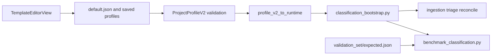

# Refatoração Config-Driven do Bootstrap

## Objetivo

Tornar `classification` a única fonte de verdade da política de negócio do bootstrap, eliminando `DEFAULT_*`, merges implícitos e fallback silencioso em [backend/app/classification_bootstrap.py](backend/app/classification_bootstrap.py), sem perder benchmark. O refactor será em duas etapas: primeiro paridade semântica com a heurística atual; depois expansão controlada da taxonomia com `suprimentos`, `edital` e `plano`.

## Decisões Fechadas

- `suprimentos` entra agora como novo `business_domain`.
- `edital` e `plano` entram agora como `document_type`.
- `RFP` e `RFQ` entram como aliases/termos ligados de `edital`.
- `projeto`, `gantt` e `WBS` entram como aliases/termos ligados de `plano`.
- `minuta` continua como topic/fase contratual, não como `document_type`.
- `default.json` será o arquivo único da política bootstrap; não haverá `bootstrap_policy.json` separado.
- Sem fallback de configuração: profile/template incompleto deve falhar cedo na validação ou no carregamento.
- O classificador continua best-effort dentro do universo configurado; ele não inventa tipo/domínio fora da config.

## Leitura Obrigatória Antes de Editar

- [backend/app/classification_bootstrap.py](backend/app/classification_bootstrap.py)
- [backend/app/profile_schema_v2.py](backend/app/profile_schema_v2.py)
- [backend/app/project_profile.py](backend/app/project_profile.py)
- [backend/app/ingestion.py](backend/app/ingestion.py)
- [backend/app/profile_runtime.py](backend/app/profile_runtime.py)
- [backend/app/area_resolver.py](backend/app/area_resolver.py)
- [backend/app/main.py](backend/app/main.py)
- [backend/scripts/benchmark_classification.py](backend/scripts/benchmark_classification.py)
- [config/templates/default.json](config/templates/default.json)
- [config/topics_v1.yaml](config/topics_v1.yaml)
- [config/validation_set/expected.json](config/validation_set/expected.json)
- [frontend/src/types.ts](frontend/src/types.ts)
- [frontend/src/features/templates/TemplateEditorView.tsx](frontend/src/features/templates/TemplateEditorView.tsx)

## Arquitetura Alvo

## Fase 1: Fechar o contrato de configuração

- Em [backend/app/profile_schema_v2.py](backend/app/profile_schema_v2.py), tornar obrigatórios e validados para o bootstrap:
  - `classification.business_domains`
  - `classification.document_types`
  - `classification.document_type_priors`
  - `classification.entity_domain_affinity`
  - `classification.context_boosts`
  - `classification.thresholds`
- Manter `confidence_thresholds` apenas para triagem nesta fase, para não quebrar o contrato já usado fora do bootstrap.
- Adicionar validação cruzada:
  - todo `document_type_prior` referencia `document_type` existente;
  - todo `document_type_prior.default` referencia `business_domain` existente;
  - toda `entity_domain_affinity[*].domain` referencia `business_domain` existente;
  - todo `context_boost` referencia `document_type` e `business_domain` válidos;
  - pastas de `document_types` e `business_domains` não podem colidir.
- Decisão de baixo risco: `business_domains` e `document_types` passam a ser a autoridade; `work_areas` e mirrors legados ficam só para compatibilidade, nunca como fonte lida pelo bootstrap.

## Fase 2: Refatorar o motor bootstrap sem alterar semântica

- Em [backend/app/classification_bootstrap.py](backend/app/classification_bootstrap.py):
  - remover `DEFAULT_BUSINESS_DOMAINS`, `DEFAULT_DOCUMENT_TYPES`, `DEFAULT_DOCUMENT_TYPE_PRIORS` e `DEFAULT_ENTITY_DOMAIN_AFFINITY`;
  - remover merge implícito e leitura de fontes alternativas fora de `classification.*`;
  - substituir `_domain_context_boosts()` por um interpretador de `classification.context_boosts`;
  - mover caps, escalas e pesos numéricos hoje hardcoded para `classification.thresholds`;
  - derivar sinais estruturais e por extensão a partir de `document_types` configurados, mantendo em código apenas o motor genérico de regex, OCR normalization e noisy-OR.
- Regra operacional:
  - config ausente ou inconsistente deve falhar no load, startup ou benchmark;
  - classificação de baixa confiança continua existindo, mas sempre escolhendo entre candidatos da configuração, nunca por `"relatorio"`, `"operacoes"` ou “primeiro domínio da lista” hardcoded.
- Arquivos de consumo que precisam acompanhar esse contrato:
  - [backend/app/ingestion.py](backend/app/ingestion.py)
  - [backend/app/profile_runtime.py](backend/app/profile_runtime.py)
  - [backend/app/area_resolver.py](backend/app/area_resolver.py)
  - [backend/app/main.py](backend/app/main.py)
  - [backend/app/reconcile.py](backend/app/reconcile.py)
- Trade-off assumido: profiles parciais antigos deixam de “funcionar por sorte”; em troca, o drift deixa de ser silencioso e o benchmark passa a medir o que realmente está configurado.

## Fase 3: Materializar a política no template e migrar a taxonomia

- Em [config/templates/default.json](config/templates/default.json):
  - manter a política bootstrap inteira no próprio `default.json`, sem fragmentar em arquivo auxiliar;
  - adicionar `suprimentos` ao catálogo de `business_domains` e ao layout/pastas;
  - adicionar `edital` e `plano` em `document_types`;
  - registrar aliases:
    - `edital`: `rfp`, `rfq`, `request for proposal`, `request for quotation`;
    - `plano`: `plano`, `projeto`, `gantt`, `wbs`;
  - manter `minuta` fora de `document_types` e tratá-la como topic/contexto;
  - migrar os boosts hoje hardcoded para `context_boosts` com os pesos atuais;
  - migrar os knobs numéricos atuais para `thresholds`, preservando primeiro os mesmos valores para buscar paridade.
- Em [config/topics_v1.yaml](config/topics_v1.yaml):
  - garantir topics para `minuta`, `rfp_rfq` e planejamento (`plano`, `gantt`, `wbs`) se eles forem usados como contexto transversal no benchmark e na busca.
- Para profiles já persistidos:
  - criar uma migração ou backfill explícito a partir do template atual, ou um reparo obrigatório de profile;
  - não aceitar fallback silencioso em runtime como substituto de migração.

## Fase 4: Blindar benchmark, dataset e round-trip do editor

- Em [config/validation_set/expected.json](config/validation_set/expected.json):
  - relabelar os casos afetados pela nova taxonomia, em especial as planilhas `Contratos Vigentes Oi Services CCOX_04022026.xlsx` e `Contratos Vigentes Tahto_04022026.xlsx` para `suprimentos`;
  - ajustar documentos que passam a ser `edital` ou `plano`.
- Em [backend/scripts/benchmark_classification.py](backend/scripts/benchmark_classification.py):
  - usar sempre o profile validado como a aplicação usa;
  - falhar cedo se faltar config obrigatória ou se o validation set estiver vazio ou não rotulado;
  - manter `baseline` apenas como comparador histórico, não como fallback de produção.
- Em [backend/tests/integration/test_bootstrap_validation_set.py](backend/tests/integration/test_bootstrap_validation_set.py):
  - manter o piso de qualidade dos 12 arquivos atuais;
  - adicionar cobertura mínima para caminhos configurados por `prior`, `entity_affinity`, `context_boost` e detecção estrutural ou por extensão.
- Adicionar testes unitários e integrados para:
  - schema inválido sem `context_boosts` ou `thresholds`;
  - referências cruzadas inválidas em `priors`, `affinity` e `context_boosts`;
  - ausência de `DEFAULT_*` e de fallback hardcoded;
  - comportamento de triagem e reconcile quando domínio ou tipo não está configurado.
- Frontend obrigatório para não reintroduzir drift ao salvar:
  - [frontend/src/types.ts](frontend/src/types.ts)
  - [frontend/src/features/templates/TemplateEditorView.tsx](frontend/src/features/templates/TemplateEditorView.tsx)
  - testes de round-trip no editor para provar que `context_boosts`, `thresholds`, `primary_scope`, `subfunction_topics` e novos domínios ou tipos não são perdidos ao salvar.

## Critérios de Aceite

- [backend/app/classification_bootstrap.py](backend/app/classification_bootstrap.py) não contém mais `DEFAULT_*`, merges implícitos nem tokens ou pesos de negócio hardcoded.
- O bootstrap lê apenas configuração validada de `classification.*`.
- Não existe arquivo auxiliar separado para política bootstrap; a fonte única é o próprio `default.json` e os profiles persistidos derivados dele.
- Template ou profile inválido falha cedo e com erro explícito.
- O editor de template não perde campos existentes nem os novos blocos de política ao salvar.
- O benchmark de 50 documentos roda contra a mesma configuração consumida pela aplicação.
- A etapa de paridade não piora o benchmark por efeito colateral da refatoração; a eventual mudança de métrica só pode vir da mudança deliberada da taxonomia.
