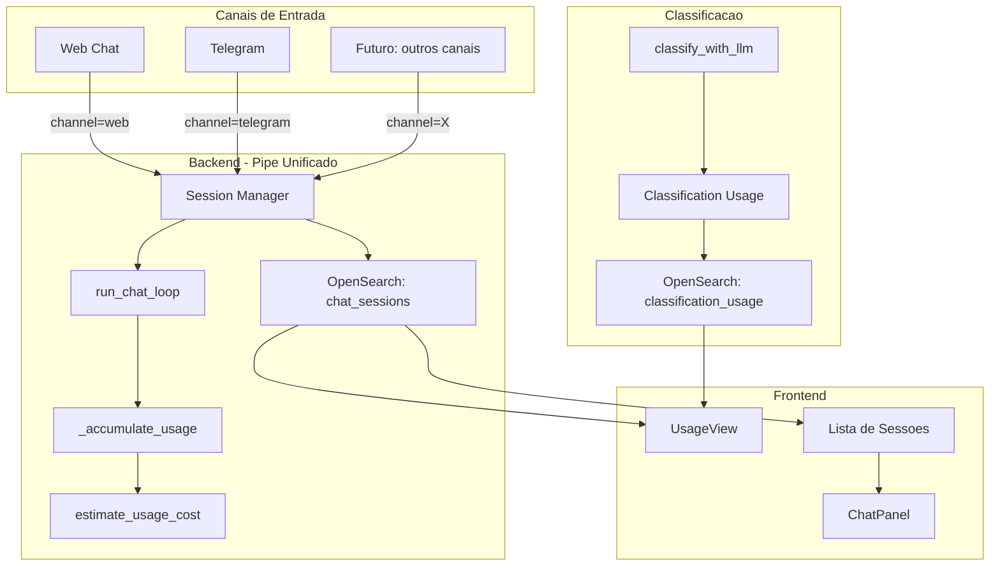

# Canais Transparentes + Rastreamento de Classificacao

## Contexto e Gaps Identificados

Hoje existem dois gaps de rastreamento de uso/custo:

1. **Canais (Telegram)**: `_handle_channel_message` em [backend/app/main.py](backend/app/main.py) chama `run_chat_loop` com uma unica mensagem (sem historico), descarta o campo `usage` do resultado, e nao cria/atualiza sessao.
2. **Classificacao LLM**: `_classify_openai` e `_classify_anthropic` em [backend/app/orchestrator.py](backend/app/orchestrator.py) descartam `resp.usage` e retornam apenas o resultado da classificacao.

---

## Arquitetura Alvo




---

## Parte 1: Canais como Pipe Transparente

### 1.1 Modelo de Dados

**[backend/app/models.py](backend/app/models.py)** - Adicionar campos ao `ChatSession`:

```python
class ChatSession(BaseModel):
    # ... campos existentes ...
    channel: str = "web"                    # "web", "telegram", etc.
    channel_chat_id: str | None = None      # ID do chat no canal (ex: telegram chat_id)
```

`**StoredChatMessage**` - Adicionar campo opcional para rastrear origem por mensagem:

```python
class StoredChatMessage(BaseModel):
    # ... campos existentes (role, content, timestamp, model) ...
    channel: str | None = None  # canal de origem desta mensagem especifica
```

### 1.2 OpenSearch Mapping

**[backend/app/opensearch_client.py](backend/app/opensearch_client.py)** - Adicionar ao `ensure_chat_sessions_index`:

```python
"channel": {"type": "keyword"},
"channel_chat_id": {"type": "keyword"},
```

### 1.3 Session Manager para Canais

**[backend/app/main.py](backend/app/main.py)** - Refatorar `_handle_channel_message`:

Logica:

- Buscar sessao ativa por `(channel_id, chat_id)` no OpenSearch (ordenado por `updatedAt desc`, limit 1)
- Se sessao existe E `updatedAt` < 30 min atras: reutilizar (append messages)
- Se sessao existe E `updatedAt` >= 30 min: criar nova sessao
- Se nao existe: criar nova sessao
- Montar lista de mensagens a partir do historico da sessao + nova mensagem
- Chamar `run_chat_loop` com historico completo
- Acumular usage na sessao (mesmo mecanismo do web: `usage_totals` + `usage_by_model`)
- Salvar sessao atualizada (create ou update)
- Retornar resposta

```python
async def _handle_channel_message(msg: ChannelMessage) -> str:
    provider, model = get_llm_config("chat")
    
    # 1. Buscar sessao ativa
    session = _find_active_channel_session(msg.channel_id, msg.chat_id)
    
    # 2. Verificar timeout (30min)
    if session and _session_timed_out(session, timeout_minutes=30):
        session = None  # forcar nova sessao
    
    # 3. Montar historico
    history = _build_history_from_session(session) if session else []
    history.append({"role": "user", "content": msg.text})
    
    # 4. Chamar LLM
    result = await run_chat_loop(history, provider, model)
    content = result.get("content", "") if isinstance(result, dict) else str(result)
    usage = result.get("usage", {}) if isinstance(result, dict) else {}
    
    # 5. Atualizar/criar sessao
    _upsert_channel_session(session, msg, content, usage, provider, model)
    
    return content
```

### 1.4 Telegram - Comando `/novo`

**[backend/app/channels/telegram.py](backend/app/channels/telegram.py)** - Adicionar handler para `/novo`:

- Registrar handler `_on_novo` no dispatcher
- Marcar a sessao atual do chat_id como "encerrada" (ou simplesmente ignorar timeout na proxima mensagem)
- Abordagem mais simples: manter um set em memoria `_forced_new_sessions: set[str]` com chat_ids que pediram nova sessao. Na proxima mensagem, criar nova sessao e remover do set.

### 1.5 API - Filtros por Canal

**[backend/app/main.py](backend/app/main.py)** - Endpoints existentes recebem parametro opcional `channel`:

- `GET /api/chat/sessions?channel=telegram` - filtrar por canal
- `GET /api/usage/summary?channel=web` - resumo filtrado
- `GET /api/usage/sessions?channel=telegram` - sessoes filtradas
- Default (`channel` ausente): retorna todos (comportamento atual mantido)

### 1.6 Frontend - Sessoes de Canal

**[frontend/src/types.ts](frontend/src/types.ts)**:

- Adicionar `channel?: string` a `ChatSession` e `UsageSessionItem`

**[frontend/src/App.tsx](frontend/src/App.tsx)**:

- Ao criar sessoes via web, incluir `channel: "web"`
- Sessoes de canal aparecem na lista lateral (com indicador visual)
- Ao abrir sessao de canal, carregar historico normalmente
- Novas mensagens enviadas pelo web em sessao de canal: `channel: "web"` no `StoredChatMessage`

**[frontend/src/features/usage/UsageView.tsx](frontend/src/features/usage/UsageView.tsx)**:

- Filtro "Canal" (Todos / Web / Telegram)
- Coluna "Canal" na tabela de sessoes

---

## Parte 2: Rastreamento de Classificacao

### 2.1 Captura de Usage

**[backend/app/orchestrator.py](backend/app/orchestrator.py)**:

`_classify_openai` - capturar `resp.usage`:

```python
async def _classify_openai(...) -> tuple[dict, dict]:
    resp = await client.chat.completions.create(...)
    usage_raw = {}
    if resp.usage:
        usage_raw = {
            "input_tokens": resp.usage.prompt_tokens or 0,
            "output_tokens": resp.usage.completion_tokens or 0,
        }
    # ... extrair args do tool_call ...
    return args, usage_raw
```

`_classify_anthropic` - idem:

```python
async def _classify_anthropic(...) -> tuple[dict, dict]:
    resp = await client.messages.create(...)
    usage_raw = {}
    if resp.usage:
        usage_raw = {
            "input_tokens": resp.usage.input_tokens or 0,
            "output_tokens": resp.usage.output_tokens or 0,
            "cache_read_input_tokens": getattr(resp.usage, "cache_read_input_tokens", 0) or 0,
            "cache_creation_input_tokens": getattr(resp.usage, "cache_creation_input_tokens", 0) or 0,
        }
    return args, usage_raw
```

`classify_with_llm` - retornar usage + estimar custo:

```python
async def classify_with_llm(...) -> dict[str, Any]:
    # ... chamada ao provider ...
    content, usage_raw = await _classify_openai/anthropic(...)
    cost = estimate_usage_cost(usage_raw, provider, model)
    usage_raw["estimated_cost_usd"] = cost
    return {
        # ... campos existentes ...
        "usage": usage_raw,
        "provider": provider,
        "model": model,
    }
```

### 2.2 Indice de Classificacao no OpenSearch

**[backend/app/opensearch_client.py](backend/app/opensearch_client.py)** - Novo indice `classification_usage`:

```python
def ensure_classification_usage_index(client: OpenSearch) -> None:
    properties = {
        "doc_id": {"type": "keyword"},
        "filename": {"type": "keyword"},
        "project_id": {"type": "keyword"},
        "provider": {"type": "keyword"},
        "model": {"type": "keyword"},
        "timestamp": {"type": "date"},
        "input_tokens": {"type": "integer"},
        "output_tokens": {"type": "integer"},
        "cache_read_input_tokens": {"type": "integer"},
        "cache_creation_input_tokens": {"type": "integer"},
        "estimated_cost_usd": {"type": "float"},
    }
    # ... criacao do indice ...
```

### 2.3 Persistencia na Ingestao

**[backend/app/ingestion.py](backend/app/ingestion.py)** - Apos `classify_with_llm`, persistir usage:

```python
if llm_result and llm_result.get("usage"):
    _persist_classification_usage(
        doc_id=doc_id,
        filename=inbox_file.name,
        project_id=project_id,
        provider=llm_result.get("provider"),
        model=llm_result.get("model"),
        usage=llm_result["usage"],
    )
```

### 2.4 API de Resumo de Classificacao

**[backend/app/main.py](backend/app/main.py)** - Novo endpoint:

- `GET /api/usage/classification?start_date=...&end_date=...&project_id=...`
- Retorna: `{ total_calls, total_input_tokens, total_output_tokens, estimated_cost_usd, by_model: [...] }`

### 2.5 Frontend - Secao de Classificacao

**[frontend/src/features/usage/UsageView.tsx](frontend/src/features/usage/UsageView.tsx)**:

- Novo card de resumo: "Classificacoes" (total de chamadas)
- Nova secao "Classificacao" com tabela: Modelo, Chamadas, Input (tokens), Output (tokens), Custo
- Custo total no topo inclui sessoes + classificacao

---

## Mockup AS-IS (estado atual)

```
+-----------------------------------------------------------+
| [Chat]  [Uso e custo]                                     |
+-----------------------------------------------------------+
| Periodo: [06/03/2026] ate [12/03/2026]                    |
| Projeto: [Todos v]                      [Atualizar]       |
+-----------------------------------------------------------+
| +------------+ +------------+ +------------+              |
| | Total tok  | | Custo est. | | Sessoes    |              |
| |   141k     | |   $0.65    | |     7      |              |
| +------------+ +------------+ +------------+              |
+-----------------------------------------------------------+
| [Grafico: Uso diario tokens]   [Tokens por tipo]          |
+-----------------------------------------------------------+
| Por modelo                                                |
| +----------+--------+--------+-------+-------+-----+-----+
| | Modelo   | In tok | Ou tok | In $  | Ou $  | Tot | $   |
| +----------+--------+--------+-------+-------+-----+-----+
| | gpt-5.1  | 113k   | 1.8k   |0.5652 |0.0269 |115k |0.59 |
| | gpt-4.1  |  26k   |  345   |0.0637 |0.0034 | 26k |0.06 |
| +----------+--------+--------+-------+-------+-----+-----+
| | Total    | 139k   | 2.1k   |0.6289 |0.0303 |141k |0.65 |
| +----------+--------+--------+-------+-------+-----+-----+
+-----------------------------------------------------------+
| Sessoes                                                   |
| +----------------------------+-------+------+-------+---+-+
| | Titulo                     | Data  | Proj | Modelo|Tk |$|
| +----------------------------+-------+------+-------+---+-+
| | Qual a definicao de Equ... |09/03  |  --  |gpt-5.1|39k|.19|
| | Me diga em qual contrat... |09/03  |  --  |4.1,5.1|65k|.32|
| +----------------------------+-------+------+-------+---+-+
```

## Mockup TO-BE (estado futuro)

```
+-----------------------------------------------------------+
| [Chat]  [Uso e custo]                                     |
+-----------------------------------------------------------+
| Periodo: [06/03/2026] ate [12/03/2026]                    |
| Projeto: [Todos v]  Canal: [Todos v]    [Atualizar]       |
+-----------------------------------------------------------+
| +----------+ +----------+ +----------+ +----------------+ |
| |Total tok | |Custo est.| | Sessoes  | |Classificacoes  | |
| |  225k    | |  $0.87   | |    12    | |     42         | |
| +----------+ +----------+ +----------+ +----------------+ |
|                                                           |
| Nota: "Custo est." inclui sessoes ($0.65) +               |
|       classificacao ($0.22)                                |
+-----------------------------------------------------------+
| [Grafico: Uso diario tokens]   [Tokens por tipo]          |
+-----------------------------------------------------------+
| Por modelo (Assistente)                                   |
| +----------+--------+--------+-------+-------+-----+-----+
| | Modelo   | In tok | Ou tok | In $  | Ou $  | Tot | $   |
| +----------+--------+--------+-------+-------+-----+-----+
| | gpt-5.1  | 113k   | 1.8k   |0.5652 |0.0269 |115k |0.59 |
| | gpt-4.1  |  26k   |  345   |0.0637 |0.0034 | 26k |0.06 |
| +----------+--------+--------+-------+-------+-----+-----+
| | Total    | 139k   | 2.1k   |0.6289 |0.0303 |141k |0.65 |
| +----------+--------+--------+-------+-------+-----+-----+
+-----------------------------------------------------------+
| Classificacao (uso LLM na ingestao)                       |
| +----------+---------+--------+--------+------------------+
| | Modelo   |Chamadas | In tok | Ou tok | Custo            |
| +----------+---------+--------+--------+------------------+
| | gpt-4.1  |   42    |  84k   |  2.1k  | $0.22            |
| +----------+---------+--------+--------+------------------+
| | Total    |   42    |  84k   |  2.1k  | $0.22            |
| +----------+---------+--------+--------+------------------+
+-----------------------------------------------------------+
| Sessoes                                                   |
| +---------------------+------+------+-----+-------+---+--+
| | Titulo              | Data | Proj |Canal| Modelo|Tk | $ |
| +---------------------+------+------+-----+-------+---+--+
| | Qual a definicao ...|09/03 |  --  | Web |gpt-5.1|39k|.19|
| | Ola, quais docs... |10/03 |  --  | TG  |gpt-4.1|12k|.04|
| | Me diga em qual ...|09/03 |  --  | Web |4.1,5.1|65k|.32|
| +---------------------+------+------+-----+-------+---+--+
|                                                           |
| Legenda: Canal "Web" = chat web, "TG" = Telegram          |
+-----------------------------------------------------------+
```

**Diferencas visuais chave (AS-IS vs TO-BE):**

- Novo card "Classificacoes" nos resumos
- "Custo est." agora agrega sessoes + classificacao
- Novo filtro "Canal" na toolbar
- Nova secao "Classificacao" com tabela propria (Modelo, Chamadas, Input, Output, Custo)
- Coluna "Canal" na tabela de sessoes (Web, TG, etc.)
- Sessoes de Telegram aparecem na mesma lista, filtraveis

---

## Parte 3: Gestao de Janela de Contexto

### Problema

Sessoes multi-turno (especialmente via Telegram) podem acumular historico que excede a janela de contexto do modelo. Hoje o AtlasFile nao tem controle sobre isso. Janelas de contexto dos modelos suportados (de [backend/app/llm_catalog.py](backend/app/llm_catalog.py)):

- gpt-4o-mini: 128k tokens
- gpt-4.1: ~1M tokens
- gpt-5.1: 400k tokens
- claude-haiku-4.5 / sonnet-4.6 / opus-4.6: 200k tokens

O AtlasFile ja tem protecoes para tool results (`_truncate_tool_result`, `get_document_max_chars`), mas nenhuma para o acumulo de mensagens de historico.

### 3.1 Estimativa Precisa de Pressao de Contexto (backend)

O campo `usage_totals.input_tokens` acumulado **nao serve** como indicador de pressao, pois soma todos os tokens de input de todas as chamadas (incluindo tool calls repetidas). O que importa e o tamanho da **proxima** chamada ao LLM.

**Proposta**: O backend calcula e retorna `context_pressure` junto com cada resposta do chat.

**[backend/app/orchestrator.py](backend/app/orchestrator.py)** - Em `run_chat_loop`, apos a ultima chamada ao LLM:

```python
def _estimate_context_pressure(messages: list[dict], provider: str, model: str) -> dict:
    """Estima a pressao de contexto baseado no tamanho das mensagens vs janela do modelo."""
    chars_total = sum(len(str(m.get("content", ""))) for m in messages)
    tokens_estimate = chars_total // 4  # heuristica ~4 chars/token (ja usada em llm_catalog.py)
    context_limit = _get_context_tokens(provider, model)  # do LLM_MODEL_CATALOG
    ratio = tokens_estimate / context_limit if context_limit else 0
    return {
        "context_tokens_estimate": tokens_estimate,
        "context_tokens_limit": context_limit,
        "context_pressure_ratio": round(min(ratio, 1.0), 4),
    }
```

**[backend/app/main.py](backend/app/main.py)** - `POST /api/chat` retorna `context_pressure` no `ChatResponse`:

```python
class ChatResponse(BaseModel):
    content: str
    tool_calls_used: list[str] = []
    usage: TurnUsage | None = None
    context_pressure: ContextPressure | None = None  # NOVO

class ContextPressure(BaseModel):
    context_tokens_estimate: int
    context_tokens_limit: int
    context_pressure_ratio: float  # 0.0 a 1.0
```

### 3.2 Indicador Visual de Pressao de Contexto (frontend)

Inspirado no Cursor: indicador circular (donut/ring) posicionado ao lado do botao "Nova sessao" no footer do ChatPanel.

**Comportamento visual:**

- Anel circular ao redor de um icone de sessao (esmaecido quando vazio, preenchido proporcionalmente ao % usado)
- 0-50%: cor neutra (cinza claro preenchendo)
- 50-75%: cor de atencao (amarelo/laranja)
- 75-100%: cor de alerta (vermelho)
- Tooltip ao passar o mouse: "Contexto: 45% utilizado"
- Sem numeros absolutos visiveis (o usuario nao precisa ver "12k/200k")

**[frontend/src/components/ChatPanel.tsx](frontend/src/components/ChatPanel.tsx)** - Componente `ContextRing`:

```
Mockup do footer do chat (TO-BE):

+-----------------------------------------------------------+
|  [textarea: digite sua mensagem...]              [Enviar]  |
+-----------------------------------------------------------+
|  (O) Nova sessao          Assistente (gpt-4.1)            |
+-----------------------------------------------------------+

Onde (O) e o anel circular:
  - Anel vazio: sessao nova, 0% de contexto
  - Anel 40% preenchido: sessao com historico moderado
  - Anel 90% preenchido (vermelho): proximo do limite
```

**Dados**: O frontend recebe `context_pressure` de cada resposta do `POST /api/chat` e atualiza o estado do anel. Na abertura de sessao existente (load do historico), o backend poderia fornecer a estimativa via um campo na sessao ou o frontend estima localmente (`chars / 4 / context_limit`).

### 3.3 Truncamento por Limite de Tokens (DECISAO: A2)

**Estrategia confirmada**: Antes de cada chamada ao LLM, `run_chat_loop` calcula os tokens estimados do historico (~4 chars/token). Se excede 60% do `context_tokens` do modelo (reservando 20% para tools e 20% para resposta), descarta mensagens mais antigas (FIFO, mantendo system prompt). O LLM **nunca** recebe mais que o limite.

**[backend/app/orchestrator.py](backend/app/orchestrator.py)** - Em `run_chat_loop`, antes de cada chamada ao LLM:

```python
def _trim_history_to_context(
    messages: list[dict], provider: str, model: str
) -> list[dict]:
    """Descarta mensagens antigas (FIFO) para caber em 60% do contexto do modelo.
    Mantem sempre: system prompt (1a msg) + ultima mensagem do usuario."""
    context_limit = get_context_tokens(provider, model)
    max_history_tokens = int(context_limit * 0.6)
    
    # Estimar tokens por mensagem
    msg_tokens = [(m, len(str(m.get("content", ""))) // 4) for m in messages]
    total = sum(t for _, t in msg_tokens)
    
    if total <= max_history_tokens:
        return messages  # cabe, nenhum truncamento
    
    # Manter system prompt (index 0) e ultima mensagem; descartar do meio (mais antigos primeiro)
    system = [messages[0]] if messages and messages[0].get("role") == "system" else []
    rest = messages[1:] if system else messages[:]
    
    while sum(len(str(m.get("content", ""))) // 4 for m in system + rest) > max_history_tokens and len(rest) > 1:
        rest.pop(0)  # descarta mais antiga
    
    return system + rest
```

### 3.4 Comportamento Visual no Limite (DECISAO: Sugerir a 90%)

- **ContextRing atinge 90%**: Frontend exibe tooltip "Contexto quase cheio. Considere iniciar uma nova sessao." Envio nao e bloqueado.
- **Backend trunca automaticamente**: Se o historico excede 60% do contexto, mensagens antigas sao descartadas silenciosamente antes da chamada ao LLM. O `context_pressure` retornado reflete o estado **apos** truncamento (nunca > ~60%).
- **Nao existe cenario de ultrapassar**: o truncamento no backend e um hard limit.

---

## Decisoes Confirmadas

- **Truncamento de historico (A2)**: Limite por tokens com descarte FIFO de mensagens antigas. Hard limit no backend, nunca excede a janela de contexto.
- **Acao no limite**: ContextRing sugere nova sessao a 90%; truncamento automatico no backend sem bloqueio.
- **Timeout de sessao de canal (R1c)**: Configuravel via `settings.channel_session_timeout_minutes`, default 30min. Combinado com comando `/novo`.
- **Concorrencia Telegram (R2a)**: `asyncio.Lock` por `chat_id` em memoria (single-instance). Evoluir para upsert otimista se escalar.
- **Volume classification_usage (R3a)**: Sem acao por ora. OpenSearch lida bem na escala pessoal/equipe do AtlasFile.
- **Separacao Classificacao vs Assistente**: Indices diferentes no OpenSearch (`chat_sessions` vs `classification_usage`), pois sao entidades distintas com schemas diferentes.
- **Canal por mensagem**: Permite rastrear que uma sessao iniciou no Telegram e continuou no Web, com cada mensagem marcada com sua origem.
- **Retrocompatibilidade**: Sessions existentes sem campo `channel` sao tratadas como `"web"` (default). Migracao nao necessaria.

---

## Arquivos a Alterar

**Backend (7 arquivos):**

- `backend/app/models.py` - campos `channel`, `channel_chat_id` em ChatSession; `channel` em StoredChatMessage; modelo `ContextPressure`
- `backend/app/opensearch_client.py` - mapping do chat_sessions + novo indice classification_usage
- `backend/app/main.py` - refatorar `_handle_channel_message`, novos params nos endpoints, novo endpoint classification usage, retornar `context_pressure` no chat
- `backend/app/orchestrator.py` - `_classify_openai`, `_classify_anthropic`, `classify_with_llm` retornam usage; `_estimate_context_pressure` em `run_chat_loop`
- `backend/app/ingestion.py` - persistir classification usage apos classify
- `backend/app/channels/telegram.py` - handler `/novo`
- `backend/app/llm_catalog.py` - helper `get_context_tokens(provider, model)` para lookup do limite

**Frontend (5 arquivos):**

- `frontend/src/types.ts` - campo `channel` nos tipos; tipo `ContextPressure`
- `frontend/src/App.tsx` - enviar `channel: "web"` ao criar sessoes; propagar `context_pressure` ao ChatPanel
- `frontend/src/features/usage/UsageView.tsx` - filtro Canal, coluna Canal, secao Classificacao, card Classificacoes
- `frontend/src/components/ChatPanel.tsx` - componente `ContextRing` (anel circular de pressao); badge de canal em mensagens
- `frontend/src/styles.css` - estilos do `ContextRing` (SVG circle, cores por faixa de pressao)

