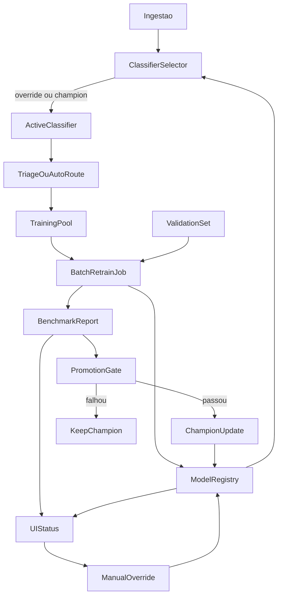

# Evolução do ciclo ML no AtlasFile 0.7.x

## Estado atual verificado

- O classificador operacional do ingest hoje é o `bootstrap`, chamado diretamente em [backend/app/ingestion.py](/Users/alessandro/Development/AtlasFile/backend/app/ingestion.py).
- O benchmark oficial já existe em [backend/scripts/benchmark_classification.py](/Users/alessandro/Development/AtlasFile/backend/scripts/benchmark_classification.py) e hoje mede `baseline`, `bootstrap`, `sparse_logreg` e `sparse_linear_svc`.
- O modo `baseline` atual do script usa `classify()` por `area_key`, não produz `document_type` e não representa o alvo operacional da versão `0.7.x`. Neste plano, ele sai do benchmark oficial e das superfícies de produto.
- O `training_pool` já é alimentado por `approve/correct` na triagem via [backend/app/main.py](/Users/alessandro/Development/AtlasFile/backend/app/main.py) e armazenado em [config/training_pool/records.jsonl](/Users/alessandro/Development/AtlasFile/config/training_pool/records.jsonl).
- Não existe hoje: artefato persistido de modelo supervisionado, serving de `sparse_*` no ingest, benchmark/history via API/UI, retreino agendado, nem promoção automática.
- O `Reconciliar INDEX` já tem streaming de status por SSE; `Processar INBOX` ainda não: hoje o frontend só mostra `loading` local e o backend retorna o resultado final do scan em um único `POST /api/ingest/scan/{project_id}`.

## Decisão de produto fechada

- Retreino e benchmark: automáticos em batch.
- Promoção: automática, mas condicionada a gates.
- Transparência: a UI deve mostrar o champion, o challenger, a última decisão de promoção e a evolução.
- Controle do usuário: a UI deve permitir override explícito do classificador operacional.
- O único baseline oficial do produto passa a ser o `bootstrap`. O modo `baseline` atual por `area_key` sai do benchmark oficial e não aparece como opção de produção.
- Operações longas de produto devem refletir progresso em streaming na UI, seguindo o padrão já existente de `Reconciliar INDEX`: isso vale para `Processar INBOX` e para o futuro ciclo de retreino/benchmark/promoção.
- Gate de avanço: todos os testes atuais e novos devem passar em 100% antes de avançar para a próxima etapa do plano.

## Pesquisa externa e aderência

Fontes externas verificadas:

- [MLflow Model Registry](https://mlflow.org/docs/latest/model-registry/): recomenda registry centralizado com lineage, versionamento, aliases (`@champion`) e metadata para governança e rollback.
- [Google Cloud - Best practices for implementing machine learning on Google Cloud](https://cloud.google.com/architecture/ml-on-gcp-best-practices): recomenda organização de artefatos, orquestração do workflow, tracking de experimentos, treinamento operacionalizado, model serving e monitoramento.
- [scikit-learn - Classification of text documents using sparse features](https://scikit-learn.org/stable/auto_examples/text/plot_document_classification_20newsgroups.html): usa `TfidfVectorizer` + classificadores lineares sobre matriz esparsa como baseline forte e eficiente para classificação de texto/documentos.
- [DataRobot - Configure retraining](https://docs.datarobot.com/en/docs/mlops/deployment-settings/retraining-settings.html): recomenda dataset de retreino explícito, política agendada, usuário responsável e ambiente de previsão para challengers.
- [DataRobot - Challengers tab](https://docs.datarobot.com/11.1/en/docs/mlops/monitor/challengers.html): recomenda challengers pós-deploy, replay de previsões, comparação em dataset out-of-sample e promoção explícita do challenger para champion.
- [River - Active learning](https://riverml.xyz/0.15.0/recipes/active-learning/): mostra padrão de active learning em que o modelo sinaliza amostras para anotação humana e uma UI/queue fecha o loop.

Conclusão objetiva de aderência:

- O AtlasFile atual segue parcialmente as boas práticas: já tem `validation_set`, `training_pool`, benchmark reproduzível, human-in-the-loop pela triagem e `bootstrap` como champion operacional verificável.
- O AtlasFile ainda não segue integralmente as práticas verificadas para MLOps de promoção: faltam registry/alias de champion, artefatos persistidos, job orquestrado de retreino, monitoramento do champion, replay/comparação contínua, benchmark/history via API/UI e override explícito no produto.
- O uso de `sparse_logreg` e `sparse_linear_svc` como challengers é coerente com a literatura/ferramentas para texto esparso; o gap não está na escolha da família de modelos, mas em operacionalização, governança e visibilidade.

## Arquitetura alvo




## Implementação proposta

### 1. Registro operacional do classificador

Criar um registro explícito do estado operacional do classificador com persistência e leitura no runtime.

Arquivos principais:

- [backend/app/config.py](/Users/alessandro/Development/AtlasFile/backend/app/config.py)
- [backend/app/profile_schema_v2.py](/Users/alessandro/Development/AtlasFile/backend/app/profile_schema_v2.py)
- [backend/app/project_profile.py](/Users/alessandro/Development/AtlasFile/backend/app/project_profile.py)
- [config/templates/default.json](/Users/alessandro/Development/AtlasFile/config/templates/default.json)

Campos mínimos sugeridos:

- `classification.operational.mode`: `bootstrap | sparse_logreg | sparse_linear_svc`
- `classification.operational.override_mode`: nullable
- `classification.operational.promotion_policy`: `auto_with_ui_override`
- `classification.operational.last_promoted_at`
- `classification.operational.last_benchmark_report`
- `classification.operational.champion_metrics`
- `classification.operational.manual_override_reason`
- `classification.operational.last_promotion_decision`

Regra importante:

- `baseline` não entra nessa enum e não participa do benchmark oficial exposto ao usuário.

### 2. Job batch de retreino e benchmark

Implementar uma rotina batch simples, sem over-engineering, reutilizando o padrão já existente de job periódico do backend.

Arquivos principais:

- [backend/scripts/backfill_training_pool.py](/Users/alessandro/Development/AtlasFile/backend/scripts/backfill_training_pool.py)
- [backend/scripts/benchmark_classification.py](/Users/alessandro/Development/AtlasFile/backend/scripts/benchmark_classification.py)
- [backend/app/main.py](/Users/alessandro/Development/AtlasFile/backend/app/main.py)
- [backend/app/evaluation_dataset.py](/Users/alessandro/Development/AtlasFile/backend/app/evaluation_dataset.py)

Fluxo:

- consolidar `training_pool`
- validar integridade contra `validation_set`
- medir `bootstrap` como champion de referência
- treinar candidatos supervisionados elegíveis
- gerar relatório versionado de benchmark
- avaliar gates de promoção
- atualizar registry/champion se aprovado

Escopo do benchmark oficial após ajuste:

- `bootstrap`
- `sparse_logreg`
- `sparse_linear_svc`

Remoção explícita:

- remover o modo `baseline` do benchmark oficial, da API futura e das superfícies de UI
- se algum código residual ainda existir por curto período, ele fica fora do contrato público e fora da decisão de promoção

Persistências mínimas:

- `reports/benchmark/latest.json` ou índice dedicado no OpenSearch
- diretório de artefatos do modelo campeão/challengers, por exemplo `artifacts/classifiers/...`

Status operacional mínimo:

- criar um status persistido para o ciclo batch com os mesmos conceitos já usados no reconcile: `running`, `phase`, `progress_current`, `progress_total`, `progress_file`, `progress_project`, `last_run_started_at`, `last_run_finished_at`, `last_failure_message`
- reutilizar esse padrão também para `Processar INBOX`, para que a UI acompanhe arquivo atual, contagens e fase em tempo real

### 3. Serving do champion no ingest

Introduzir um seletor de classificador no fluxo de ingest, com fallback seguro.

Arquivos principais:

- [backend/app/ingestion.py](/Users/alessandro/Development/AtlasFile/backend/app/ingestion.py)
- [backend/app/classification_bootstrap.py](/Users/alessandro/Development/AtlasFile/backend/app/classification_bootstrap.py)
- novo módulo de serving, por exemplo `backend/app/classifier_runtime.py`

Regras:

- se houver `override_mode`, usar override
- senão usar `champion`
- se artefato do champion estiver ausente/inválido, fallback automático para `bootstrap`
- sempre registrar no histórico qual classificador produziu a decisão

### 4. Gating e promoção automática

Promover só se o challenger superar o champion com segurança estatística e operacional.

Arquivos principais:

- [backend/scripts/benchmark_classification.py](/Users/alessandro/Development/AtlasFile/backend/scripts/benchmark_classification.py)
- [docs/07_rollout_kpis.md](/Users/alessandro/Development/AtlasFile/docs/07_rollout_kpis.md)
- [docs/10_classifier_design.md](/Users/alessandro/Development/AtlasFile/docs/10_classifier_design.md)

Gates iniciais sugeridos:

- sem overlap `training_pool` vs `validation_set`
- suporte mínimo por classe mantido
- melhoria mínima em `exact_match_accuracy`
- não piorar `document_type_accuracy`
- não piorar além de margem tolerada em classes críticas (`regulatorio`, `fiscal`, `pessoas`, `suprimentos`)
- benchmark executado no mesmo `validation_set` out-of-sample para champion e challengers
- fallback automático para `bootstrap` em caso de erro no serving

### 5. Transparência e controle na UI

Adicionar uma superfície simples, no look & feel atual, para o usuário saber:

- qual classificador está ativo
- se está em `override` ou `auto`
- quando foi o último benchmark
- quem é o champion
- quais métricas justificaram a última promoção
- se o sistema está “aprendendo” (`training_pool` crescendo, última execução, último delta)
- quais scores agregados cada modelo obteve no benchmark oficial
- qual score/confiança o classificador ativo atribuiu ao documento corrente em triagem
- qual o progresso em tempo real de operações longas (`Processar INBOX`, `Reconciliar INDEX`, `Retreinamento/Benchmark`)

Arquivos principais:

- [frontend/src/features/ingest/IngestTriageCard.tsx](/Users/alessandro/Development/AtlasFile/frontend/src/features/ingest/IngestTriageCard.tsx)
- [frontend/src/features/profile-layout/ProfileLayoutWorkspace.tsx](/Users/alessandro/Development/AtlasFile/frontend/src/features/profile-layout/ProfileLayoutWorkspace.tsx)
- [frontend/src/features/settings/AssistantSettingsModal.tsx](/Users/alessandro/Development/AtlasFile/frontend/src/features/settings/AssistantSettingsModal.tsx)
- [frontend/src/features/usage/UsageView.tsx](/Users/alessandro/Development/AtlasFile/frontend/src/features/usage/UsageView.tsx)
- [frontend/src/features/triage/CorrectDecisionModal.tsx](/Users/alessandro/Development/AtlasFile/frontend/src/features/triage/CorrectDecisionModal.tsx)
- [frontend/src/api.ts](/Users/alessandro/Development/AtlasFile/frontend/src/api.ts)
- [backend/app/main.py](/Users/alessandro/Development/AtlasFile/backend/app/main.py)
- [backend/app/models.py](/Users/alessandro/Development/AtlasFile/backend/app/models.py)

API mínima nova:

- `GET /api/classifier/status`
- `GET /api/classifier/benchmarks/latest`
- `GET /api/classifier/benchmarks/history`
- `POST /api/classifier/override`
- `POST /api/classifier/run-cycle` (manual/on-demand)
- `GET /api/classifier/run-cycle/status`
- `GET /api/classifier/run-cycle/status/stream`
- `GET /api/ingest/scan/{project_id}/status`
- `GET /api/ingest/scan/{project_id}/status/stream`

### Mockup da UI atual e proposta

Ponto de encaixe atual mais natural:

- status global do classificador: topo do [frontend/src/App.tsx](/Users/alessandro/Development/AtlasFile/frontend/src/App.tsx), ao lado do pill de health, ou dentro de `Operacional`
- override manual do classificador por projeto: seção `Classificação LLM` do [frontend/src/features/ingest/IngestTriageCard.tsx](/Users/alessandro/Development/AtlasFile/frontend/src/features/ingest/IngestTriageCard.tsx)
- scores agregados do benchmark: [frontend/src/features/usage/UsageView.tsx](/Users/alessandro/Development/AtlasFile/frontend/src/features/usage/UsageView.tsx)
- scores por documento na triagem: [frontend/src/features/triage/CorrectDecisionModal.tsx](/Users/alessandro/Development/AtlasFile/frontend/src/features/triage/CorrectDecisionModal.tsx)

Mockup da UI atual:

```text
Operacional
  Controle operacional
  Ingestão e triagem
    [colapsável] Classificação LLM
      - habilitado/desabilitado
      - modo
      - provider/model
    Processamentos
    Itens pendentes de triagem

Assistente
  Chat
  Uso e custo
    - totais
    - por modelo
    - classificação (uso LLM na ingestão)
```

Mockup proposto sem quebrar o look & feel:

```text
Operacional
  Controle operacional
  Ingestão e triagem
    [colapsável] Classificador operacional
      - Modo ativo: bootstrap | sparse_logreg | sparse_linear_svc
      - Origem: auto(champion) | override manual
      - Champion atual: sparse_linear_svc @ 2026-03-25 09:40
      - Ultimo ciclo: OK | 100 training docs | 67 validation docs
      - Motivo da ultima promocao: exact_match +0.04 sem regressao em document_type
      - Override manual:
          ( ) Auto usar champion
          ( ) Forcar bootstrap
          ( ) Forcar sparse_logreg
          ( ) Forcar sparse_linear_svc
          [Salvar override]
      - Link: Ver benchmark completo
    Processar INBOX
      - Status: processando 14/38
      - Arquivo atual: Contrato_TSA_v2.pdf
      - Fase: extração -> classificação -> auto-route/triagem
      - Erros: 1 | Pendentes gerados: 4
      - Barra de progresso streaming

Operacional
  Controle operacional
    Reconciliar INDEX
      - continua usando o stream atual
  Classificador operacional
    Retreinamento e benchmark
      - Status: rodando
      - Fase: integridade -> treino -> benchmark -> promoção
      - Modelo em treino: sparse_linear_svc
      - Champion atual: bootstrap
      - Challenger avaliado: sparse_linear_svc
      - Barra de progresso streaming
      - Último evento: promoção aprovada | exact_match +0.04

Assistente > Uso e custo
  Benchmark de classificacao
    Modelo              BD_acc   DT_acc   Exact   Delta_vs_champion   Status
    bootstrap           0.60     0.80     0.54    ref                 champion/fallback
    sparse_logreg       0.62     0.79     0.56    +0.02               elegivel
    sparse_linear_svc   0.64     0.81     0.58    +0.04               promovido
  Historico de ciclos
    Data   TrainingPool   ValidationSet   ChampionAntes   ChampionDepois   Resultado

Triagem > Corrigir
  Score do documento atual
    - business_domain: financeiro 0.71
    - document_type: planilha 0.93
    - top candidatos:
        1. financeiro / planilha 0.71
        2. ti / planilha 0.22
        3. societario / planilha 0.07
```

Critério de decisão visível ao usuário:

- score agregado para escolher override: `business_domain_accuracy`, `document_type_accuracy`, `exact_match_accuracy`, `delta_vs_champion`, `support` do benchmark e data da última execução
- score local por documento: top candidatos e confiança do classificador ativo no item de triagem
- explicação da promoção: por que o challenger venceu, quais gates passaram e qual foi o impacto nas classes críticas
- progresso operacional: fase atual, contador processado/total, item atual e mensagem de erro, sem exigir refresh manual

## Testes e validação

Gate obrigatório:

- antes de avançar qualquer etapa, a suíte aplicável do que já existia e do que foi adicionado na etapa deve estar em 100% verde
- se uma etapa introduzir regressão em teste existente, a etapa não avança
- se uma etapa introduzir funcionalidade nova sem teste proporcional, a etapa não avança

Cobertura mínima:

- unit para registry, gates e fallback de serving
- unit para materialização/carregamento de artefatos
- integration para `run-cycle`, status e override
- integration para promoção automática e rollback
- integration para streams SSE de `Processar INBOX` e `Retreinamento`
- frontend para status do champion, histórico e seleção manual
- teste E2E curto: corrigir triagem, rodar ciclo, verificar benchmark/status/UI e usar override

Arquivos de teste prováveis:

- [backend/tests/unit/test_benchmark_classification.py](/Users/alessandro/Development/AtlasFile/backend/tests/unit/test_benchmark_classification.py)
- [backend/tests/unit/test_evaluation_dataset.py](/Users/alessandro/Development/AtlasFile/backend/tests/unit/test_evaluation_dataset.py)
- [backend/tests/integration/test_api_channel_features.py](/Users/alessandro/Development/AtlasFile/backend/tests/integration/test_api_channel_features.py)
- novos testes para remoção do `baseline` do benchmark oficial
- novos testes de classifier status/cycle/promotion
- testes frontend nas features de ingest/settings/profile

## Respostas diretas às suas perguntas

- `baseline`: o script atual ainda o mede, mas este plano o remove do benchmark oficial e do produto; o baseline oficial passa a ser o próprio `bootstrap`.
- `Como o usuário sabe o que está sendo usado?`: hoje ele não sabe de forma centralizada; o produto não expõe `operational_classifier_mode` nem benchmark oficial via UI/API.
- `Como o usuário sabe se o sistema está aprendendo?`: hoje só indiretamente, pelo crescimento do `training_pool` e pelo histórico de triagem; falta uma superfície explícita de evolução.

## Resultado esperado desta evolução

Ao final, o AtlasFile passa a ter:

- ingestão operacional por champion ou override
- ciclo automático de backfill + benchmark + treino
- promoção automática com gates e rollback
- UI simples para transparência, scorecards de decisão e seleção manual
- benchmark reproduzível e visível
- aprendizado supervisionado rastreável, em vez de implícito

