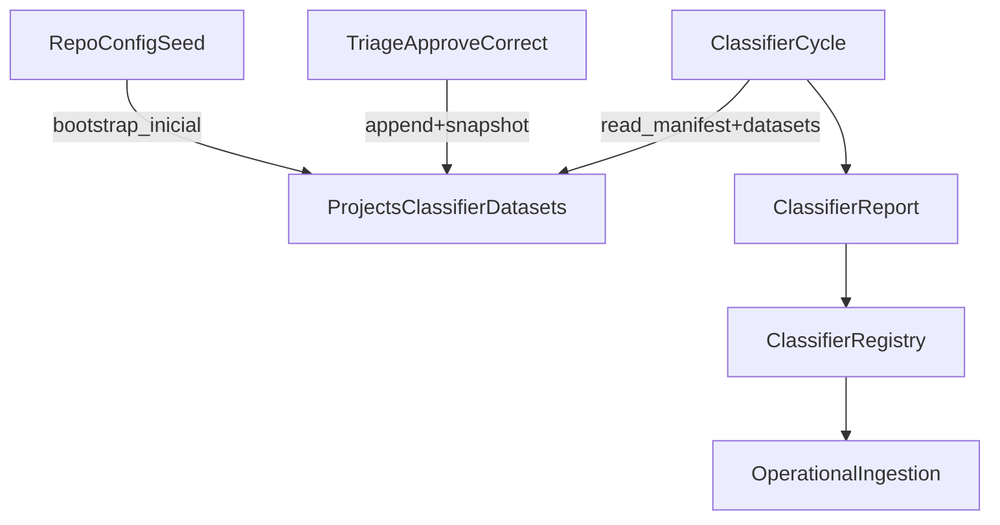

# Plano: Runtime Único para Datasets do Classificador

## Entendimento

Hoje o AtlasFile mistura duas fontes de verdade para os datasets do classificador:

- o runtime Docker lê `validation_set` e `training_pool` a partir do repo baked na imagem, via [backend/app/evaluation_dataset.py](/Users/alessandro/Development/AtlasFile/backend/app/evaluation_dataset.py)
- o estado operacional do classificador (`registry`, `reports`, `models`) já vive em `/projects/_ATLASFILE/classifier`, via [backend/app/classifier_registry.py](/Users/alessandro/Development/AtlasFile/backend/app/classifier_registry.py)
- o `docker-compose` monta apenas `/projects`, não `config/training_pool` nem `config/validation_set`, em [docker-compose.yml](/Users/alessandro/Development/AtlasFile/docker-compose.yml)
- o build da API copia `config/` inteiro para a imagem em [backend/Dockerfile](/Users/alessandro/Development/AtlasFile/backend/Dockerfile)

Isso permite drift operacional: o ciclo usa um dataset diferente do que o host/git mostra, mesmo com o mesmo código.

## Alternativas Consideradas

- Bind-mountar `config/training_pool` e `config/validation_set` do repo nos containers.
Trade-off: simples no dev, mas o runtime continua acoplado ao working copy local e a locks/sync do filesystem.
- Manter repo como canônico e criar sync/checksum entre host e container.
Trade-off: menos invasivo, mas mantém duas fontes de verdade e depende de disciplina operacional.
- Recomendado: tornar `/projects/_ATLASFILE/...` a única fonte de verdade operacional para datasets e deixar `config/` como seed/referência versionada.
Trade-off: exige migração de paths e ajuste de scripts, mas fecha a classe de erro estrutural e alinha dataset, modelos e registry no mesmo volume persistido.

## Recomendação

Adotar um root operacional explícito, por exemplo `/projects/_ATLASFILE/classifier/datasets`, com este contrato:

## Mudanças Planejadas

### 1. Definir o root operacional único dos datasets

- Introduzir em [backend/app/evaluation_dataset.py](/Users/alessandro/Development/AtlasFile/backend/app/evaluation_dataset.py) uma raiz operacional configurável, preferencialmente via env/settings, apontando para `/projects/_ATLASFILE/classifier/datasets`.
- Separar semanticamente:
  - `config/validation_set` e `config/training_pool` no repo: seed/referência versionada
  - `_ATLASFILE/classifier/datasets/...`: estado operacional vivo
- Atualizar [backend/app/classifier_cycle.py](/Users/alessandro/Development/AtlasFile/backend/app/classifier_cycle.py) e scripts que hoje dependem de `repo_root()` para consumirem a nova raiz operacional.
- Tornar o contrato explícito em [docker-compose.yml](/Users/alessandro/Development/AtlasFile/docker-compose.yml), [README.md](/Users/alessandro/Development/AtlasFile/README.md) e [.env.example](/Users/alessandro/Development/AtlasFile/.env.example) se a env nova for adotada.

### 2. Tornar o training pool reproduzível e estável

- Em vez de depender apenas de `path` para arquivos em projetos, materializar snapshot operacional em algo como `_ATLASFILE/classifier/datasets/training_pool/files/`.
- Fazer a triagem em [backend/app/main.py](/Users/alessandro/Development/AtlasFile/backend/app/main.py) gravar:
  - registro JSONL
  - snapshot/cópia estável do arquivo aceito/corrigido
  - metadata mínima de lineage (`doc_id`, origem, digest, reviewed_at)
- Ajustar [backend/scripts/backfill_training_pool.py](/Users/alessandro/Development/AtlasFile/backend/scripts/backfill_training_pool.py) para migrar registros antigos e, quando necessário, materializar snapshots faltantes.

### 3. Adicionar guardrails de integridade e lineage

- Calcular um `dataset_manifest` em [backend/app/classifier_cycle.py](/Users/alessandro/Development/AtlasFile/backend/app/classifier_cycle.py), contendo no mínimo:
  - hash de `validation_set/expected.json`
  - digest dos arquivos do validation set usados no ciclo
  - hash do `training_pool/records.jsonl`
  - digest dos snapshots efetivamente usados no treino
- Persistir esse manifesto no report e no registry em [backend/app/classifier_registry.py](/Users/alessandro/Development/AtlasFile/backend/app/classifier_registry.py).
- Rejeitar no write path da triagem qualquer documento cujo SHA colida com o validation set, reutilizando a mesma regra de integridade hoje aplicada só no ciclo.
- Explicitar no report contagens distintas para:
  - registros no JSONL
  - exemplos realmente resolvidos/usados
  - exemplos ignorados/skipped

### 4. Ajustar bootstrapping e operação contínua

- Fazer [backend/scripts/bootstrap_validation_set.py](/Users/alessandro/Development/AtlasFile/backend/scripts/bootstrap_validation_set.py) e [backend/scripts/run_classifier_cycle.py](/Users/alessandro/Development/AtlasFile/backend/scripts/run_classifier_cycle.py) trabalharem com a nova raiz operacional.
- Definir um passo de bootstrap idempotente: se o root operacional estiver vazio, semear a partir de `config/` do repo; se já existir, nunca sobrescrever automaticamente.
- Revisar [backend/Dockerfile](/Users/alessandro/Development/AtlasFile/backend/Dockerfile): `config/` pode continuar indo para a imagem como seed, mas não como fonte de verdade operacional.

### 5. Testes e validação

- Estender [backend/tests/unit/test_evaluation_dataset.py](/Users/alessandro/Development/AtlasFile/backend/tests/unit/test_evaluation_dataset.py) para validar a nova resolução de paths e bootstrap idempotente.
- Estender [backend/tests/unit/test_classifier_cycle.py](/Users/alessandro/Development/AtlasFile/backend/tests/unit/test_classifier_cycle.py) e [backend/tests/unit/test_benchmark_classification.py](/Users/alessandro/Development/AtlasFile/backend/tests/unit/test_benchmark_classification.py) para:
  - manifesto do dataset
  - distinção entre JSONL e exemplos efetivos
  - falha por overlap na escrita e no ciclo
- Estender [backend/tests/unit/test_triage.py](/Users/alessandro/Development/AtlasFile/backend/tests/unit/test_triage.py) para garantir que `approve/correct` atualizam training pool operacional e bloqueiam colidir com validation set.
- Validar manualmente com Docker:
  1. alterar seed no repo sem rebuild e confirmar que o runtime operacional não deriva mais da imagem
  2. aprovar/corrigir documento e confirmar reflexo no root operacional persistido
  3. rodar ciclo, reiniciar containers e confirmar mesmo dataset_manifest/report

## Decisões de dados e migração

- Sem migração de banco/OpenSearch.
- Migração de filesystem necessária:
  - copiar `config/validation_set/*` para o novo root operacional inicial
  - migrar `config/training_pool/records.jsonl` para o root operacional
  - materializar snapshots para registros históricos ainda dependentes apenas de paths de projeto
- Manter `config/` no repo como seed auditável e material de versionamento humano; não como estado vivo de produção.

## Riscos e Mitigações

- Risco: crescer o volume operacional com snapshots do training pool.
Mitigação: naming por `doc_id`/digest, política simples de retenção e deduplicação por hash.
- Risco: scripts legados continuarem lendo `config/` do repo.
Mitigação: centralizar todos os paths de dataset em `evaluation_dataset.py` e cobrir com testes.
- Risco: rollout parcial deixar runtime e docs inconsistentes.
Mitigação: atualizar docs e smoke Docker no mesmo ciclo de mudança.

