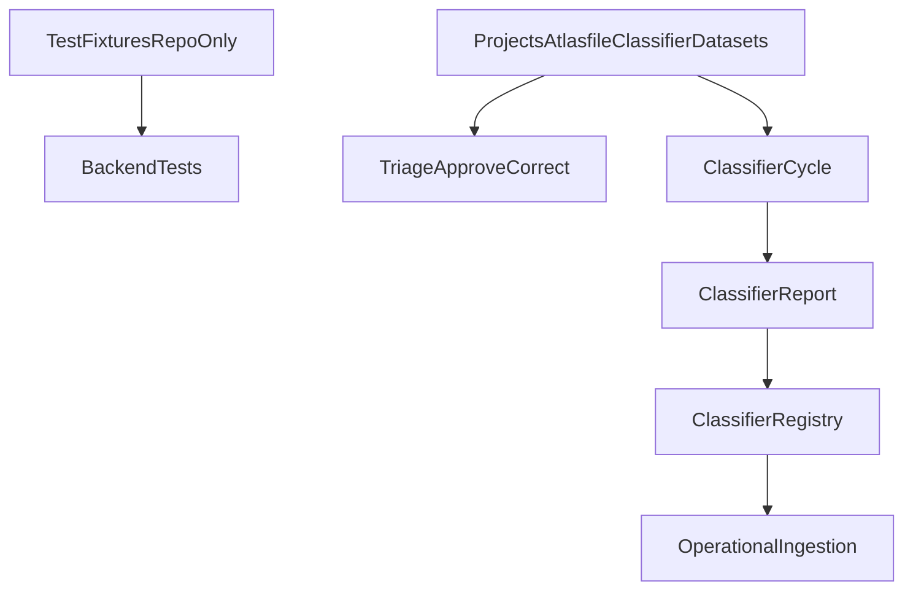

# Plano: Fonte Única de Dataset em `_ATLASFILE`

## Entendimento

A implementação atual já moveu o runtime do classificador para `/_ATLASFILE/classifier/datasets`, mas ainda mantém um modelo de bootstrap por seed física em `config/validation_set` e `config/training_pool`. Isso preserva duplicação física potencial e mantém ambiguidade documental e operacional.

Objetivo deste segundo corte:

- `_ATLASFILE/classifier/datasets` vira a única fonte física operacional e persistida
- `config/validation_set` e `config/training_pool` deixam de ser datasets vivos do produto
- fixtures de teste passam a viver fora do contrato operacional, em área de teste dedicada
- documentação da `0.8.0` é corrigida para refletir o estado final
- fechamento com commit usando plumbing, sem trailers

## Desenho alvo

## Mudanças planejadas

### 1. Remover o seed físico do repo do contrato operacional

- Atualizar [backend/app/evaluation_dataset.py](/Users/alessandro/Development/AtlasFile/backend/app/evaluation_dataset.py) para parar de copiar automaticamente de `config/validation_set` e `config/training_pool`.
- Manter apenas a resolução de paths operacionais sob `/_ATLASFILE/classifier/datasets`.
- Se necessário, falhar explicitamente quando o dataset operacional estiver ausente, em vez de recriar a partir do repo silenciosamente.

### 2. Separar fixtures de teste do dataset operacional

- Criar fixtures mínimas e explícitas em algo como [backend/tests/fixtures/](/Users/alessandro/Development/AtlasFile/backend/tests/fixtures/) para os testes que hoje dependem indiretamente de `load_validation_set()`.
- Ajustar [backend/tests/integration/test_bootstrap_validation_set.py](/Users/alessandro/Development/AtlasFile/backend/tests/integration/test_bootstrap_validation_set.py) e testes correlatos para apontarem para fixtures controladas de teste, não para o dataset operacional vivo.
- Garantir que a suíte continue reproduzível sem depender de arquivos em `/_ATLASFILE` do host.

### 3. Limpar artefatos de repo que hoje parecem fonte viva

- Remover ou esvaziar de forma controlada os artefatos em [config/validation_set/](/Users/alessandro/Development/AtlasFile/config/validation_set/) e [config/training_pool/](/Users/alessandro/Development/AtlasFile/config/training_pool/) que hoje ainda funcionam como dataset físico.
- Preservar apenas o que fizer sentido como documentação, placeholders ou fixtures não-operacionais.
- Revisar scripts como [backend/scripts/bootstrap_validation_set.py](/Users/alessandro/Development/AtlasFile/backend/scripts/bootstrap_validation_set.py), [backend/scripts/backfill_training_pool.py](/Users/alessandro/Development/AtlasFile/backend/scripts/backfill_training_pool.py) e [backend/scripts/benchmark_classification.py](/Users/alessandro/Development/AtlasFile/backend/scripts/benchmark_classification.py) para assumirem somente o root operacional.

### 4. Endurecer o contrato operacional

- Deixar explícito no código e nos reports que o benchmark/ciclo opera apenas sobre `/_ATLASFILE/classifier/datasets`.
- Validar que `dataset_manifest` continue refletindo somente o root operacional.
- Garantir que nenhum bootstrap silencioso do repo reabra drift entre host, imagem e runtime.

### 5. Atualizar documentação da 0.8.0

- Atualizar [README.md](/Users/alessandro/Development/AtlasFile/README.md) para descrever `_ATLASFILE/classifier/datasets` como única fonte operacional.
- Atualizar [CHANGELOG.md](/Users/alessandro/Development/AtlasFile/CHANGELOG.md), dentro da própria seção `0.8.0`, registrando o segundo corte arquitetural que remove o seed físico do repo.
- Revisar docs relevantes em [/Users/alessandro/Development/AtlasFile/docs](/Users/alessandro/Development/AtlasFile/docs), em especial [docs/10_classifier_design.md](/Users/alessandro/Development/AtlasFile/docs/10_classifier_design.md) e qualquer referência ainda ativa a `config/validation_set` / `config/training_pool` como fonte operacional.
- Não reescrever planos concluídos históricos além do estritamente necessário para não criar inconsistência em docs vivas.

### 6. Testes, rebuild e fechamento

- Rodar a suíte backend completa com o interpretador do projeto.
- Rodar `frontend` tests + build para garantir que o monorepo permaneceu íntegro.
- Reconstruir `api`/`mcp` em Docker e validar dentro do container:
  - root dos datasets
  - integridade do dataset
  - ausência de dependência do repo para o ciclo
- Fazer commit somente ao final, via plumbing (`commit-tree` / `update-ref` ou equivalente seguro), sem `git commit --amend` tradicional se houver risco de trailer automático.

## Arquivos mais prováveis

- [backend/app/evaluation_dataset.py](/Users/alessandro/Development/AtlasFile/backend/app/evaluation_dataset.py)
- [backend/app/classifier_cycle.py](/Users/alessandro/Development/AtlasFile/backend/app/classifier_cycle.py)
- [backend/scripts/bootstrap_validation_set.py](/Users/alessandro/Development/AtlasFile/backend/scripts/bootstrap_validation_set.py)
- [backend/scripts/backfill_training_pool.py](/Users/alessandro/Development/AtlasFile/backend/scripts/backfill_training_pool.py)
- [backend/tests/integration/test_bootstrap_validation_set.py](/Users/alessandro/Development/AtlasFile/backend/tests/integration/test_bootstrap_validation_set.py)
- [backend/tests/fixtures/](/Users/alessandro/Development/AtlasFile/backend/tests/fixtures/)
- [README.md](/Users/alessandro/Development/AtlasFile/README.md)
- [CHANGELOG.md](/Users/alessandro/Development/AtlasFile/CHANGELOG.md)
- [docs/10_classifier_design.md](/Users/alessandro/Development/AtlasFile/docs/10_classifier_design.md)

## Validação esperada

- Nenhum dataset vivo do classificador depende mais de `config/` no repo.
- O ciclo em Docker usa apenas `/_ATLASFILE/classifier/datasets`.
- Os testes seguem reprodutíveis por fixtures próprias.
- A documentação da `0.8.0` fica coerente com o estado final.
- O commit final sai sem trailers ou metadata de ferramenta.

