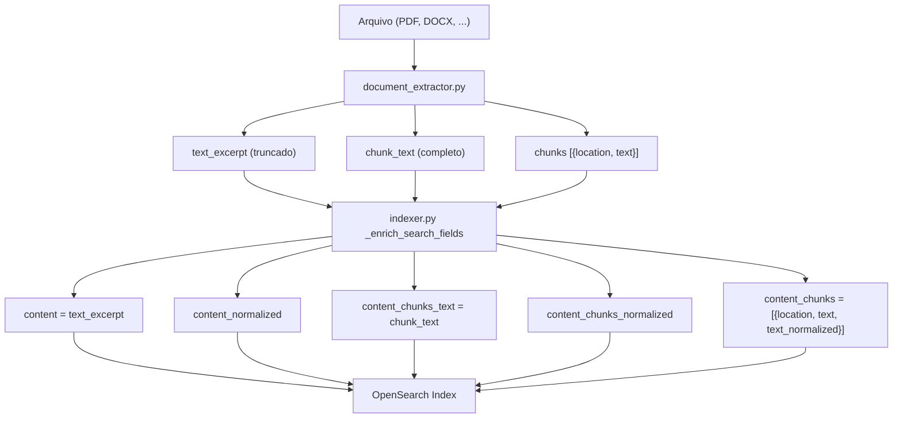
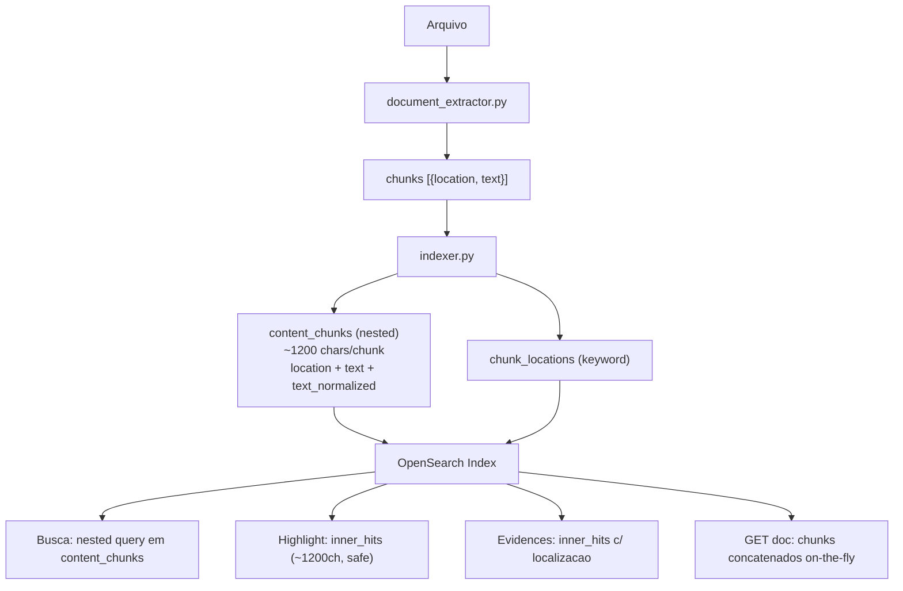

# Arquitetura de Indexacao de Conteudo -- AtlasFile (Pure Nested)

## 1. Diagnostico Factual: O Que Acontece Hoje

### Fluxo de dados atual (5 copias redundantes)




### Redundancia comprovada no codigo

Em [backend/app/indexer.py](backend/app/indexer.py) linhas 196-208:

```python
max_chars = None if mode == "all" else max_chars_cfg
extracted = extract_document_content(path_obj, max_chars=max_chars)
enriched["content"] = extracted.text_excerpt        # truncado
enriched["content_chunks_text"] = extracted.chunk_text  # completo
```

Em [backend/app/document_extractor.py](backend/app/document_extractor.py) (PDF, linhas 225-229):

```python
if max_chars and sum(len(v) for _, v in chunk_rows) >= max_chars * 2:
    break
chunk_text = "\n".join(value for _, value in chunk_rows)
excerpt = _safe_excerpt(chunk_text, max_chars)  # prefix de chunk_text
```

**Fato:** `content` e literalmente um prefixo truncado de `content_chunks_text`. Ambos sao subconjuntos do que ja esta em `content_chunks` (nested). Armazena-se **5 copias** do mesmo texto.

### Causa raiz do erro de highlight

Em [backend/app/main.py](backend/app/main.py) linhas 1699-1706:

```python
"highlight": {
    "fields": {
        "content": {},             # campo flat, pode ter milhoes de chars
        "content_chunks_text": {}, # idem
    },
}
```

O unified highlighter (default) re-analisa o texto. Limite `index.highlight.max_analyzed_offset` = 1.000.000 chars. Um PDF de 25MB gera ~6M chars. Resultado: **HTTP 400** que aborta a busca inteira.

---

## 2. Pesquisa de Referencias e Best Practices

### 2.1 Highlight em documentos grandes

**Fontes:**

- [OpenSearch Docs -- Highlight](https://opensearch.org/docs/latest/search-plugins/searching-data/highlight/)
- [ES Issue #52155](https://github.com/elastic/elasticsearch/issues/52155)
- [OS Issue #3842](https://github.com/opensearch-project/OpenSearch/issues/3842) (fix em OS 2.2.0, nos usamos 2.17.1)

A solucao definitiva: **nao fazer highlight em campos flat gigantes**. Usar chunks (~1200 chars) que nunca atingem o limite.

### 2.2 Chunking + nested como best practice

**Fontes:**

- [Elastic Labs -- Chunking via Ingest Pipelines](https://www.elastic.co/search-labs/blog/chunking-via-ingest-pipelines)
- [Elastic Labs -- Chunking Strategies](https://www.elastic.co/search-labs/blog/chunking-strategies-elasticsearch)
- [SO -- Search with large PDFs](https://stackoverflow.com/questions/35630939)

Best practices para escala pessoal/equipe (ate ~100K docs):

- **Nested chunks** e a arquitetura recomendada: cada chunk e um mini-documento no Lucene
- **Passage-level retrieval** (score por trecho, nao por documento inteiro) e o padrao moderno
- **Zero risco de max_analyzed_offset** com chunks de ~1200 chars (limite = 1.000.000)

### 2.3 Decisao arquitetural: Pure Nested

Para a escala do AtlasFile (pessoal/equipe, centenas a milhares de documentos):

- **Pure nested** e a melhor pratica: simples, robusto, elimina a classe inteira de problemas com docs grandes
- **Overhead de nested queries (~10-30%)** e imperceptivel nesta escala (20ms vs 15ms, dominado por latencia de rede)
- **Cross-chunk phrase matching** mitigado por overlap de 150 chars entre chunks
- **Scoring passa de doc-level para passage-level** (melhor para relevancia de busca documental)
- Se algum dia for necessario escalar para >100K docs, a migracao para separate-documents-per-chunk e um refator previsivel

---

## 3. Plano de Execucao

### Fase 1 -- Safety Net Imediato (zero reindex, zero breaking change)

**Objetivo:** Impedir HTTP 400 em qualquer busca, independente do tamanho do documento.

**Prerequisito obrigatorio:** Leitura integral de todos os arquivos que serao modificados e de todos os testes existentes.

**Arquivos a alterar:**

- [backend/app/main.py](backend/app/main.py): adicionar `"max_analyzer_offset": 1_000_000` ao objeto `highlight` em:
  - Endpoint `/api/search` (linha ~1699)
  - Endpoint `/api/search/suggest` (linha ~1856)

**Testes:**

- Novo teste que verifica que busca com highlight em doc com campo >1M chars NAO retorna 400
- Rodar 100% dos testes backend (`backend/.venv/bin/python -m pytest tests/ -v`) e validar ZERO regressao

**Resultado:** busca nunca mais quebra por documento grande. Highlight retorna vazio para campos oversized, mas evidences via nested inner_hits continuam funcionando.

### Fase 2 -- Pure Nested (requer RESET_INDEX=1)

**Objetivo:** Eliminar TODOS os 4 campos flat de conteudo. Busca, highlight e retrieval usam apenas `content_chunks` (nested).

**Prerequisito obrigatorio:** Re-leitura de TODOS os pontos no codigo que referenciam os campos a remover.

#### 2a. Mapping ([backend/app/opensearch_client.py](backend/app/opensearch_client.py))

**Remover** do mapping:

- `content` (text)
- `content_normalized` (text)
- `content_chunks_text` (text)
- `content_chunks_normalized` (text)

**Manter**:

- `content_chunks` (nested) com `text` e `text_normalized` -- fonte unica de texto pesquisavel
- `chunk_locations` (keyword) -- lista de localizacoes para resposta rapida

**Adicionar** nos index settings como safety net:

```python
"settings": {
    "index": {
        "number_of_shards": 1,
        "number_of_replicas": 0,
        "highlight.max_analyzed_offset": 10_000_000,
    }
}
```

#### 2b. Indexer ([backend/app/indexer.py](backend/app/indexer.py))

Em `_enrich_search_fields`:

- Parar de gravar `content`, `content_normalized`, `content_chunks_text`, `content_chunks_normalized`
- Manter `content_chunks` (nested) como unica saida de texto
- Simplificar `_trim_payload_to_limit`: so precisa reduzir chunks, sem campos flat para dropar
- `_rebuild_chunk_fields`: remover reconstrucao de campos flat

#### 2c. Queries de busca ([backend/app/main.py](backend/app/main.py))

**Endpoint `/api/search`** -- migrar de flat para nested:

Onde hoje temos:

```python
{"multi_match": {"fields": ["content_chunks_text^2", "content"], ...}}
{"match_phrase": {"content_chunks_normalized": {...}}}
{"match_phrase": {"content_normalized": {...}}}
```

Migrar para:

```python
{"nested": {
    "path": "content_chunks",
    "query": {"multi_match": {"fields": ["content_chunks.text^2", "content_chunks.text_normalized^2"], ...}},
    "score_mode": "max",
    "inner_hits": {"size": N, "highlight": {"fields": {"content_chunks.text": {}}}}
}}
```

A query nested com inner_hits que ja existe (linhas 1642-1658) serve como modelo. As clauses flat de multi_match e match_phrase migram para dentro de nested queries.

**Endpoint `/api/search/suggest`** -- mesma logica: migrar multi_match e match_phrase_prefix de campos flat para nested.

#### 2d. Highlight

Com pure nested, o highlight acontece DENTRO dos inner_hits de cada chunk (~1200 chars). Nao precisa de highlight em campos flat (que nao existem mais). O `max_analyzer_offset` no query e mantido como safety net.

#### 2e. Retrieval ([backend/app/main.py](backend/app/main.py))

- `GET /api/documents/{doc_id}`: servir `content` na resposta como concatenacao dos chunks (truncada por `get_document_max_chars`), computado on-the-fly a partir de `content_chunks`
- `GET /api/documents/{doc_id}/chunks`: sem mudanca (ja usa `content_chunks`)
- `_apply_get_document_limit`: adaptar para trabalhar com chunks em vez de campo flat

#### 2f. MCP tools ([backend/app/mcp/server.py](backend/app/mcp/server.py))

Verificar e ajustar:

- `search_documents`: usa `/api/search` (impactado pela migracao de queries)
- `get_document`: usa `/api/documents/{doc_id}` (impactado pela mudanca em retrieval)
- Validar que respostas do MCP continuam no formato esperado pelo LLM

#### 2g. Testes

**Atualizar testes existentes:**

- Todos os testes que mockam ou verificam `content`, `content_normalized`, `content_chunks_text`, `content_chunks_normalized`
- Testes de busca (`test_api_search.py` ou similar)
- Testes de indexacao (`test_indexer.py` ou similar)
- Testes de MCP (`test_mcp*.py`)

**Novos testes:**

- Busca full-text via nested retorna resultados corretos com score e localizacao
- Highlight vem dos inner_hits (nao de campos flat)
- Documento grande (>1M chars de texto) e buscavel e nao causa erro
- `GET /api/documents/{doc_id}` retorna `content` computado dos chunks
- `GET /api/documents/{doc_id}/chunks` continua funcionando
- `_trim_payload_to_limit` reduz chunks corretamente
- Stats e agregacoes nao sao afetadas (nao usam campos de conteudo)
- `backfill_search_fields` adaptado ou removido

**Validacao final:**

- `backend/.venv/bin/python -m pytest tests/ -v` -- 100% passando, ZERO regressao

#### 2h. Documentacao

- [docs/09_field_mapping.md](docs/09_field_mapping.md): remover campos flat, documentar arquitetura pure nested
- [docs/05_index_models.md](docs/05_index_models.md): atualizar modelo de indice
- [CHANGELOG.md](CHANGELOG.md): registrar mudanca arquitetural
- [README.md](README.md): atualizar se menciona campos de conteudo

---

## 4. Arquitetura Proposta (pos Fase 2)




---

## 5. Impacto e Trade-offs

- **Busca full-text**: via nested queries em `content_chunks.text` e `content_chunks.text_normalized`
- **Localizacao**: nativa via `content_chunks[].location` nos inner_hits
- **Highlight**: cada chunk tem ~1200 chars -- NUNCA atinge max_analyzed_offset. Problema eliminado estruturalmente.
- **Armazenamento**: reduzido ~60-70% (eliminacao de 4 campos flat que duplicavam o texto dos chunks)
- **Performance**: overhead nested ~10-30% -- imperceptivel na escala do AtlasFile (<50ms)
- **Scoring**: passage-level (score do melhor chunk) -- melhor para relevancia em busca documental
- **Compatibilidade API**: respostas mantem mesmo formato (content computado on-the-fly dos chunks)
- **Documentos de qualquer tamanho**: suportados sem workaround

## 6. Lista completa de arquivos a verificar/alterar

**Fase 1 (1 arquivo + testes):**

- `backend/app/main.py`

**Fase 2 (6+ arquivos + testes + docs):**

- `backend/app/opensearch_client.py` -- mapping e settings
- `backend/app/indexer.py` -- _enrich_search_fields, _trim_payload_to_limit, _rebuild_chunk_fields, backfill_search_fields
- `backend/app/main.py` -- /api/search, /api/search/suggest, GET /api/documents, _apply_get_document_limit, _field_highlight_priority, _extract_locations_from_chunk_text
- `backend/app/config.py` -- verificar settings (highlight_max_analyzer_offset)
- `backend/app/mcp/server.py` -- search_documents, get_document
- `backend/app/document_extractor.py` -- verificar que ExtractionResult.chunk_text ainda e gerado (para backcompat de outros usos)
- `backend/tests/` -- todos os testes impactados + novos
- `docs/09_field_mapping.md`, `docs/05_index_models.md`, `CHANGELOG.md`, `README.md`

## 7. Protocolo de execucao

1. **ANTES de qualquer mudanca:** ler integralmente cada arquivo listado acima
2. **ANTES de cada fase:** rodar testes existentes e confirmar baseline verde
3. **DURANTE implementacao:** alterar um ponto por vez, rodar testes apos cada mudanca
4. **APOS cada fase:** rodar 100% dos testes com `backend/.venv/bin/python -m pytest tests/ -v`
5. **NUNCA:** usar python3 do sistema; SEMPRE usar .venv
6. **NUNCA:** commitar sem testes passando

