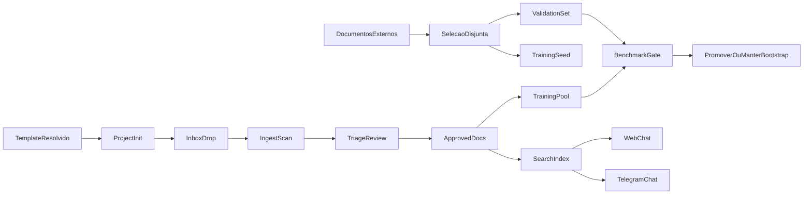

# Fechar ciclo AtlasFile

## Entendimento

- Estado verificado: o `validation_set` já tem `50` documentos rotulados em [config/validation_set/expected.json](config/validation_set/expected.json), mas o `training_pool` está vazio em [config/training_pool/records.jsonl](config/training_pool/records.jsonl).
- Estado verificado: o benchmark atual em [backend/scripts/benchmark_classification.py](backend/scripts/benchmark_classification.py) já compara `baseline`, `bootstrap`, `sparse_logreg` e `sparse_linear_svc`, mas bloqueia o supervisionado sem `training_pool` suficiente.
- Estado verificado: `make docker-update` em [Makefile](Makefile) recompila e sobe o stack, mas o smoke atual é raso e não cobre ingestão, busca/highlight, chat web nem Telegram.
- Estado verificado: o roteiro em [docs/plano_teste_e2e_v0.4.0.md](docs/plano_teste_e2e_v0.4.0.md) está defasado e ainda fala em `_INBOX` e `area_key`.

## Decisões do ciclo

- `bootstrap` continua sendo o classificador de produção neste ciclo.
- `sparse_logreg` e `sparse_linear_svc` ficam como candidatos de benchmark, não como alvo já decidido.
- `validation_set` e `training_pool` permanecem estritamente separados; nenhum documento poderá existir nos dois conjuntos.
- `thresholds` não voltam para a operação humana; qualquer gate numérico fica no benchmark e na policy operacional, não no template.
- O `LLM` entra neste ciclo apenas como consumidor do índice no chat/Telegram e, se já houver caminho pronto, como `reviewer/reranker` restrito; ele não vira classificador principal.

## Arquitetura de fechamento do ciclo

## Fase 1. Congelar o contrato de aceite deste ciclo

- Arquivos-alvo:
  - [backend/scripts/benchmark_classification.py](backend/scripts/benchmark_classification.py)
  - [backend/app/evaluation_dataset.py](backend/app/evaluation_dataset.py)
  - [docs/plano_teste_e2e_v0.4.0.md](docs/plano_teste_e2e_v0.4.0.md)
  - [Makefile](Makefile)
- Mudanças:
  - explicitar no benchmark que `bootstrap` é o baseline operacional atual e que `sparse_*` são apenas candidatos;
  - acrescentar verificação de vazamento entre `validation_set` e `training_pool` no runner do benchmark;
  - ampliar o relatório com métricas de aceite que faltam hoje: macro-F1, recall por classe e matriz de confusão por eixo;
  - atualizar o roteiro E2E para o estado real do produto: `_INBOX_DROP`, `business_domain`, `document_type`, busca/highlight, chat web e Telegram.
- Decisão de schema/mapping/query:
  - nenhuma mudança de taxonomia ou de mapping OpenSearch nesta fase; o objetivo é congelar contrato e medição.

## Fase 2. Popular `training_pool` sem contaminar o `validation_set`

- Arquivos-alvo:
  - [config/training_pool/records.jsonl](config/training_pool/records.jsonl)
  - [backend/app/main.py](backend/app/main.py)
  - [backend/app/evaluation_dataset.py](backend/app/evaluation_dataset.py)
  - [frontend/src/features/triage/CorrectDecisionModal.tsx](frontend/src/features/triage/CorrectDecisionModal.tsx)
  - [frontend/src/api.ts](frontend/src/api.ts)
- Mudanças:
  - usar documentos externos de `/Users/alessandro/Library/CloudStorage/OneDrive-Personal/Área de Trabalho/_Projetos` que não estejam no `validation_set` para criar um lote de treino inicial;
  - passar esses documentos por um projeto temporário real do AtlasFile, com ingestão e revisão humana (`approve`/`correct`), para que o `training_pool` seja alimentado pelo fluxo operacional e não por edição manual do JSONL;
  - alinhar a UI de triagem ao backend para impedir promessa falsa de criar `business_domain` ou `document_type` fora da taxonomia atual;
  - se o volume revisado pelo fluxo normal ainda for insuficiente, adicionar um utilitário determinístico de backfill para gerar `TrainingPoolRecord` a partir de documentos já aprovados no projeto temporário, preservando a estrutura atual e registrando a origem em `notes`.
- Steps de migração:
  - criar um ou mais projetos temporários de treino;
  - inicializar com o template `default` resolvido;
  - ingerir lotes disjuntos e revisar a triagem até atingir massa suficiente para benchmark supervisionado.

## Fase 3. Fechar lacunas do `validation_set` só onde falta cobertura real

- Arquivos-alvo:
  - [config/validation_set/expected.json](config/validation_set/expected.json)
  - [backend/scripts/bootstrap_validation_set.py](backend/scripts/bootstrap_validation_set.py)
  - [backend/tests/integration/test_bootstrap_validation_set.py](backend/tests/integration/test_bootstrap_validation_set.py)
- Mudanças:
  - expandir o `validation_set` apenas se continuarem faltando exemplos para domínios/tipos críticos hoje subcobertos, como `compliance`, `regulatorio`, `fiscal`, `parecer`, `procuracao`, `ata`, `nota_fiscal`, `edital` e `especificacao`;
  - manter o conjunto novo totalmente disjunto do `training_pool`;
  - revisar os novos rótulos com você antes de congelar o benchmark oficial.
- Critério:
  - ampliar apenas o necessário para o benchmark de aceitação ficar representativo; evitar inflar o gold set sem revisão humana.

## Fase 4. Rodar benchmark oficial e decidir o vencedor por evidência

- Arquivos-alvo:
  - [backend/scripts/benchmark_classification.py](backend/scripts/benchmark_classification.py)
  - [backend/tests/unit/test_benchmark_classification.py](backend/tests/unit/test_benchmark_classification.py)
  - [config/training_pool/records.jsonl](config/training_pool/records.jsonl)
  - [config/validation_set/expected.json](config/validation_set/expected.json)
- Mudanças:
  - executar `backend/scripts/benchmark_classification.py --mode all --json` com `training_pool` já populado;
  - registrar um comparativo objetivo entre `bootstrap`, `sparse_logreg` e `sparse_linear_svc`;
  - só considerar promoção se o candidato supervisionado vencer o `bootstrap` no conjunto disjunto e sem quebrar cobertura por classe.
- Decisão arquitetural:
  - se o supervisionado ganhar, ele vira candidato de próxima fase;
  - se não ganhar, o `bootstrap` permanece classificador principal e o supervisionado volta para backlog experimental.

## Fase 5. Reconstruir Docker e validar o produto fim a fim

- Arquivos-alvo:
  - [Makefile](Makefile)
  - [scripts/smoke-project-init.sh](scripts/smoke-project-init.sh)
  - [docs/plano_teste_e2e_v0.4.0.md](docs/plano_teste_e2e_v0.4.0.md)
  - [backend/app/template_store.py](backend/app/template_store.py)
  - [backend/app/profile_store.py](backend/app/profile_store.py)
  - [backend/app/main.py](backend/app/main.py)
- Mudanças:
  - usar `make docker-update RESET_INDEX=1 RESET_CHAT=1` como rebuild canônico deste ciclo;
  - endurecer o smoke de inicialização para validar template resolvido, criação de projeto e profile persistido;
  - executar um smoke funcional com projeto novo: ingestão, classificação, triagem, reconcile, busca, highlight, suggest e stats;
  - validar que projetos novos nascem com a taxonomia atual do template resolvido e sem conceitos operacionais antigos na UI.
- Requisitos externos:
  - `.env` com `PROJECTS_HOST_ROOT` válido;
  - chaves do provedor LLM para chat;
  - `TELEGRAM_BOT_TOKEN` e canal habilitado para o trecho Telegram.

## Fase 6. Validar assistente web e Telegram sobre o índice real

- Arquivos-alvo:
  - [backend/app/orchestrator.py](backend/app/orchestrator.py)
  - [backend/app/api/channels.py](backend/app/api/channels.py)
  - [backend/app/channels/telegram.py](backend/app/channels/telegram.py)
  - [frontend/src/features/settings/AssistantSettingsModal.tsx](frontend/src/features/settings/AssistantSettingsModal.tsx)
- Mudanças:
  - testar o chat web com consultas reais de `list_documents`, `search`, `stats` e highlights sobre o projeto de smoke;
  - testar Telegram no mesmo índice, com o canal realmente ativo, e confirmar que responde com dados do projeto certo;
  - manter a classificação LLM fora do caminho crítico; nesta fase o LLM serve para consumo do índice e explicação, não para decidir roteamento principal.
- Critério:
  - o assistente precisa responder corretamente sobre os documentos indexados sem misturar projetos ou depender de `area_key` legado.

## Testes e validação obrigatórios

- Backend:
  - `backend/.venv/bin/pytest -q`
  - testes do benchmark/dataset/triagem/template/init passando antes e depois de cada fase relevante
- Frontend:
  - `cd frontend && npm test`
  - validar UI de triagem, templates e assistente sem referências operacionais antigas
- Benchmark:
  - `backend/scripts/benchmark_classification.py --mode all --json`
  - checagem de disjunção entre `validation_set` e `training_pool`
- Operacional:
  - `make docker-update RESET_INDEX=1 RESET_CHAT=1`
  - smoke manual do projeto novo, ingestão, triagem, busca/highlight, chat web e Telegram

## Critérios de aceite deste ciclo

- Existe um `training_pool` real e disjunto do `validation_set`.
- O benchmark oficial consegue medir `bootstrap` e candidatos supervisionados sem vazamento.
- A decisão sobre promover ou não supervisionado passa a ser guiada por benchmark, não por preferência arquitetural.
- Docker reconstrói o stack com smoke inicial confiável.
- Um projeto novo nasce com o template atual e percorre o fluxo completo: ingestão, classificação, triagem, indexação, busca/highlight, assistente web e Telegram.
- Backend e frontend fecham o ciclo com `100%` dos testes automatizados passando.
