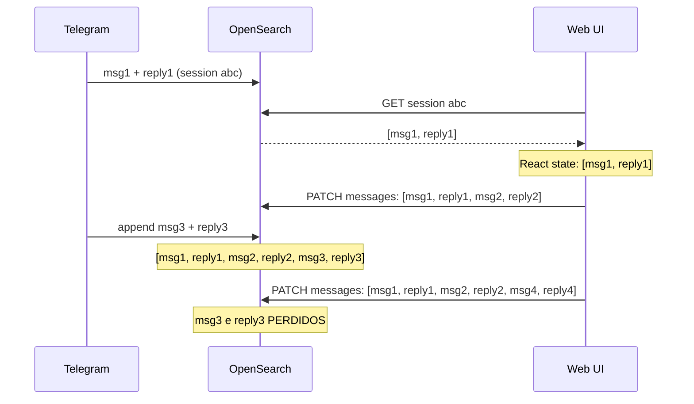

# Correcao de sessoes cross-channel + espelhamento configuravel

## Problema

Dois bugs e uma feature ausente na interacao web <-> Telegram:

1. **Stale UI**: Frontend web mantem mensagens em React state; nao ve mensagens adicionadas pelo Telegram
2. **Overwrite destrutivo**: Web faz PATCH com lista completa de mensagens (`messages: [...]`), sobrescrevendo mensagens que o Telegram adicionou ao OpenSearch enquanto o web tinha estado stale
3. **Sem espelhamento**: Quando o usuario continua via web uma sessao originada no Telegram, a resposta nao e encaminhada ao Telegram




## Estrategia: append atomico + refresh antes de enviar + mirror

### 1. Backend: append atomico no PATCH

**Arquivo**: [backend/app/models.py](backend/app/models.py)

Adicionar campo `append_messages` ao `ChatSessionUpdate`:

```python
class ChatSessionUpdate(BaseModel):
    title: Optional[str] = None
    messages: Optional[list[StoredChatMessage]] = None  # full replace (legado)
    append_messages: Optional[list[StoredChatMessage]] = None  # append atomico
    project_id: Optional[str] = None
    usage_totals: Optional[UsageTotals] = None
    usage_by_model: Optional[dict[str, UsageTotals]] = None
```

**Arquivo**: [backend/app/main.py](backend/app/main.py) -- `update_chat_session` (L1456)

Quando `append_messages` e fornecido:

- Ler mensagens atuais do OpenSearch (`GET` do doc)
- Concatenar `existing_messages + append_messages`
- Salvar o resultado

Quando `messages` e fornecido: manter comportamento atual (full replace).

Se ambos fornecidos: rejeitar com 400.

### 2. Backend: mirror configuravel

**Arquivo**: [backend/app/config.py](backend/app/config.py)

```python
channel_mirror_responses: bool = False  # global default
telegram_mirror_responses: bool = False  # per-channel
```

**Arquivo**: [backend/app/main.py](backend/app/main.py) -- `update_chat_session` (L1456)

Apos o append (ou full replace) de mensagens:

- Verificar se a sessao tem `channel` e `channel_chat_id`
- Verificar se mirror esta habilitado para aquele canal (ex: `settings.telegram_mirror_responses`)
- Se o `channel_manager` esta ativo e o canal esta rodando
- Extrair a ultima mensagem `role=assistant` do `append_messages`
- Chamar `channel.send_message(session.channel_chat_id, text)` em background (fire-and-forget via `asyncio.create_task`)

O `channel_manager` ja e global (L96 de `main.py`) e expoe `get_channel(channel_id)`.
O protocol `Channel` ja define `send_message(chat_id, text)` ([backend/app/channels/base.py](backend/app/channels/base.py) L45).
`TelegramChannel.send_message` ja implementa envio com chunking ([backend/app/channels/telegram.py](backend/app/channels/telegram.py) L156-160).

**Nao** espelhar quando a propria mensagem veio do canal (evitar loop). Para isso, adicionar parametro `source_channel` opcional ao PATCH. Se `source_channel == session.channel`, nao espelhar.

### 3. Frontend: refresh antes de enviar

**Arquivo**: [frontend/src/App.tsx](frontend/src/App.tsx) -- `handleChatSend` (L568)

Antes de montar `messagesForApi` (L606), se `activeSessionId` existe:

- Chamar `getChatSession(activeSessionId)` para obter mensagens atualizadas do backend
- Atualizar `chatMessages` no React state com as mensagens do backend
- Usar essas mensagens (+ nova do usuario) como contexto para o LLM

Isso garante que o LLM ve mensagens adicionadas pelo Telegram.

### 4. Frontend: usar append ao salvar

**Arquivo**: [frontend/src/api.ts](frontend/src/api.ts) -- `updateChatSession` (L273)

Adicionar campo `append_messages` ao payload type.

**Arquivo**: [frontend/src/App.tsx](frontend/src/App.tsx) -- `handleChatSend` (L646-651)

Trocar:

```typescript
updateChatSession(activeSessionId, { messages: storedMsgs, ... })
```

Por:

```typescript
const newMsgs = messagesToStored([userMsg, assistantMsg]);
updateChatSession(activeSessionId, { append_messages: newMsgs, ... })
```

Enviar apenas as 2 mensagens novas (user + assistant) em vez da lista completa.

### 5. Frontend: toggle de mirror no settings

**Arquivo**: [frontend/src/features/settings/AssistantSettingsModal.tsx](frontend/src/features/settings/AssistantSettingsModal.tsx) ou equivalente

Adicionar checkbox "Espelhar respostas para canal de origem" na secao de configuracao do Telegram.

**Arquivo**: [frontend/src/api.ts](frontend/src/api.ts) -- endpoints de channel config

O `PUT /api/channels/config` ja existe; estender para incluir `mirror_responses` por canal.

### 6. Testes

- **test_append_messages**: PATCH com `append_messages` adiciona ao final sem perder existentes
- **test_append_and_messages_conflict**: PATCH com ambos retorna 400
- **test_mirror_fires_send**: quando mirror habilitado + sessao com channel + append com assistant msg → `send_message` chamado
- **test_mirror_skip_same_channel**: quando `source_channel == session.channel` → nao espelha
- **test_mirror_disabled**: quando mirror desabilitado → nao espelha

## Arquivos a alterar

**Backend (4 arquivos):**

- `backend/app/models.py` -- `append_messages` em `ChatSessionUpdate`
- `backend/app/config.py` -- settings de mirror
- `backend/app/main.py` -- logica de append atomico + mirror no PATCH
- `.env.example` -- novas vars

**Frontend (3 arquivos):**

- `frontend/src/App.tsx` -- refresh antes de enviar + append ao salvar
- `frontend/src/api.ts` -- `append_messages` no tipo do payload
- Settings modal -- toggle de mirror

**Testes (2 arquivos):**

- `backend/tests/integration/test_api_chat_sessions.py` -- append + conflito
- `backend/tests/unit/test_mirror_channel.py` (novo) -- mirror logic

