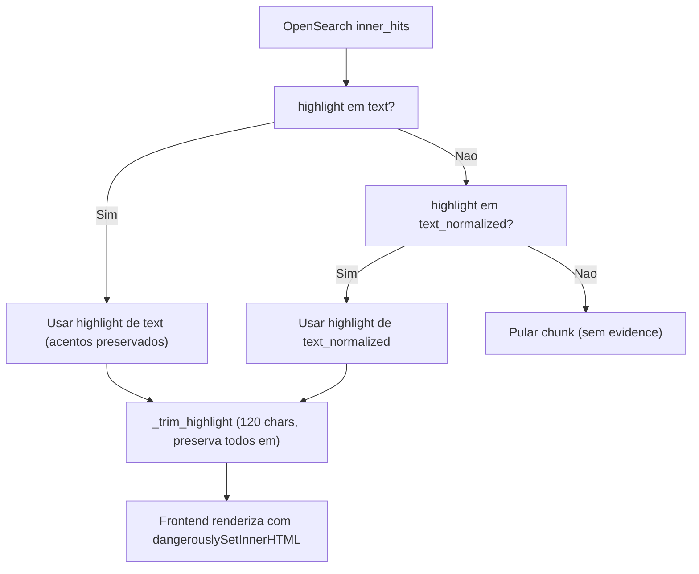

# Correcao do Highlighting de Busca

## Diagnostico (resumo)

Tres problemas raiz identificados em [backend/app/main.py](backend/app/main.py):

1. `**_build_evidence_snippet` descarta o highlight nativo do OpenSearch** (linha 1760): recebe `raw_text` do `_source` e tenta re-localizar o termo manualmente com `norm_str.find(norm_q)`. Isso e match exato de frase -- falha com plurais, flexoes ou variantes.
2. **So marca a primeira ocorrencia**: `norm_str.find` retorna apenas o primeiro indice; demais ocorrencias no mesmo chunk ficam sem `<em>`.
3. `**_trim_highlight_to_80` preserva apenas o primeiro `<em>`** (linha 287-319): reconstroi a saida com um unico par `<em>...</em>`, mesmo que o fragmento original do OpenSearch tenha multiplos highlights.

## Decisao: dual highlight nativo, sem fallback manual

Analise factual dos cenarios (discutido com o usuario):


| Cenario                                  | `_build_evidence_snippet` (atual) | OpenSearch nativo             |
| ---------------------------------------- | --------------------------------- | ----------------------------- |
| Palavra curta com acentos (acao -> Acao) | Funciona (1a ocorrencia)          | Falha se edit distance > AUTO |
| Multiplas ocorrencias                    | So a primeira                     | Todas                         |
| Plurais/flexoes                          | Falha                             | Funciona (fuzziness)          |
| Reordenacao de palavras                  | Falha                             | Funciona (slop)               |
| Typos                                    | Falha                             | Funciona (fuzziness)          |


OpenSearch nativo e melhor em 4/5 cenarios. O cenario de acentos e coberto pedindo highlight de **ambos** `content_chunks.text` (original) e `content_chunks.text_normalized` (sem acentos).

**Decisao do usuario:** se nao ha highlight, nao exibir o snippet. `_build_evidence_snippet` e `_rehighlight_snippet` sao **eliminados**.

## Tamanho do snippet: 120 caracteres


| Valor          | Linhas visuais (~55 chars/linha a 0.93rem) | Trade-off                                          |
| -------------- | ------------------------------------------ | -------------------------------------------------- |
| 80 (atual)     | ~1.5 linhas                                | Corta contexto, perde highlights                   |
| 120 (proposta) | ~2.2 linhas                                | Equilibrio: mostra contexto + highlights, compacto |
| 150            | ~2.7 linhas                                | Ja fica verboso com 5-10 evidencias por documento  |


## Plano de mudancas

### 1. Dual highlight nativo + eliminacao de funcoes manuais

**Arquivo:** [backend/app/main.py](backend/app/main.py)

**1a. Adicionar `content_chunks.text_normalized` ao highlight dos inner_hits** (linha 1644):

Atual:

```python
"highlight": {
    "fields": {"content_chunks.text": {"fragment_size": fragment_size, "number_of_fragments": 1}},
    "pre_tags": ["<em>"],
    "post_tags": ["</em>"],
},
```

Novo:

```python
"highlight": {
    "fields": {
        "content_chunks.text": {"fragment_size": fragment_size, "number_of_fragments": 2},
        "content_chunks.text_normalized": {"fragment_size": fragment_size, "number_of_fragments": 2},
    },
    "pre_tags": ["<em>"],
    "post_tags": ["</em>"],
},
```

**1b. Alterar processamento dos inner_hits** (linhas 1757-1764):

Atual:

```python
raw_text = (nh.get("_source") or {}).get("text", "")
snippet = _build_evidence_snippet(raw_text, q)
```

Novo:

```python
nh_hl = nh.get("highlight") or {}
hl_text = nh_hl.get("content_chunks.text", [])
hl_norm = nh_hl.get("content_chunks.text_normalized", [])
chosen = hl_text or hl_norm
if not chosen:
    continue  # sem highlight = nao exibir
snippet = _trim_highlight(chosen[0])
```

Logica: preferir `text` (preserva acentos originais); se nao disponivel, usar `text_normalized`; se nenhum tem highlight, pular o chunk.

**1c. Eliminar funcoes** (linhas 179-279):

- `_build_evidence_snippet` -- **deletar**
- `_rehighlight_snippet` -- **deletar**
- `_snippet_word_boundary_before` -- **deletar** (usada apenas por `_build_evidence_snippet`)
- `_snippet_word_boundary_after` -- **deletar** (idem)

Verificar se alguma outra funcao/teste referencia essas funcoes antes de deletar.

### 2. Reescrever `_trim_highlight_to_80` como `_trim_highlight`

**Arquivo:** [backend/app/main.py](backend/app/main.py), linhas 282-319

**Problema:** A funcao atual preserva apenas o primeiro `<em>`.

**Nova logica:**

1. Separar o snippet em segmentos de texto puro e tags `<em>...</em>`
2. Calcular comprimento do texto puro total
3. Se cabe em `SNIPPET_TOTAL_MAX` (120), retornar como esta
4. Se nao cabe, determinar janela de 120 chars centrada no primeiro `<em>`, preservando TODAS as tags `<em>...</em>` que caiam dentro da janela
5. Truncar antes/depois com "..." respeitando limites de palavra
6. Renomear funcao para `_trim_highlight`

### 3. Atualizar `snippet_total_max` de 80 para 120

**Arquivo:** [backend/app/config.py](backend/app/config.py), linha 60

```python
snippet_total_max: int = 120
```

### 4. Aumentar `number_of_fragments` no inner_hits

Ja incluido no passo 1a -- `number_of_fragments: 2` para ambos os campos.

### 5. Ordenacao hibrida de evidencias

**Arquivo:** [backend/app/main.py](backend/app/main.py), linha 1765

```python
evidences.sort(key=lambda e: _evidence_location_sort_key(e.get("location", "")))
if evidences:
    best_idx = max(range(len(evidences)), key=lambda i: int(evidences[i].get("match_count", 0)))
    if best_idx > 0:
        evidences.insert(0, evidences.pop(best_idx))
```

Evidence com mais matches vai para o topo; demais mantem ordem do documento.

### 6. Atualizar testes

**Arquivo:** [backend/tests/test_main.py](backend/tests/test_main.py) (e outros que referenciem funcoes eliminadas)

- Remover testes de `_build_evidence_snippet`, `_rehighlight_snippet`
- Ajustar assercoes que validam tamanho de snippet (80 -> 120)
- Novo teste: dual highlight -- `text` preferido sobre `text_normalized`
- Novo teste: inner_hit sem highlight e pulado (nao gera evidence)
- Novo teste: `_trim_highlight` preserva multiplos `<em>` dentro de 120 chars
- Novo teste: ordenacao hibrida

### 7. Atualizar CHANGELOG

- [CHANGELOG.md](CHANGELOG.md): registrar eliminacao de highlight manual e adocao de highlight nativo dual.

## Fluxo apos a mudanca




## Funcoes eliminadas vs mantidas


| Funcao                             | Status                                                         |
| ---------------------------------- | -------------------------------------------------------------- |
| `_build_evidence_snippet`          | **Eliminada**                                                  |
| `_rehighlight_snippet`             | **Eliminada**                                                  |
| `_snippet_word_boundary_before`    | **Eliminada**                                                  |
| `_snippet_word_boundary_after`     | **Eliminada**                                                  |
| `_trim_highlight_to_80`            | **Reescrita** como `_trim_highlight` (120 chars, todos `<em>`) |
| `_count_query_occurrences_in_text` | Mantida (usada para match_count)                               |
| `_evidence_location_sort_key`      | Mantida                                                        |


## Arquivos impactados

- `backend/app/main.py` -- inner_hits highlight dual, eliminacao de funcoes, novo _trim_highlight, ordenacao hibrida
- `backend/app/config.py` -- snippet_total_max 80 -> 120
- `backend/tests/test_main.py` -- testes atualizados
- `CHANGELOG.md` -- registro da mudanca

## Riscos e mitigacoes

- **Risco:** OpenSearch retornar fragmentos maiores que o esperado. **Mitigacao:** `_trim_highlight` trunca para 120 chars de texto puro.
- **Risco:** Regressao no autocomplete/suggest. **Mitigacao:** `_trim_highlight` e usada de forma unificada; 100% dos testes rodam com `.venv` apos a mudanca.
- **Risco:** Chunks sem highlight em nenhum campo. **Mitigacao:** chunk e simplesmente pulado; documento ainda aparece nos resultados se tiver outros chunks com highlight ou match no titulo/filename.

