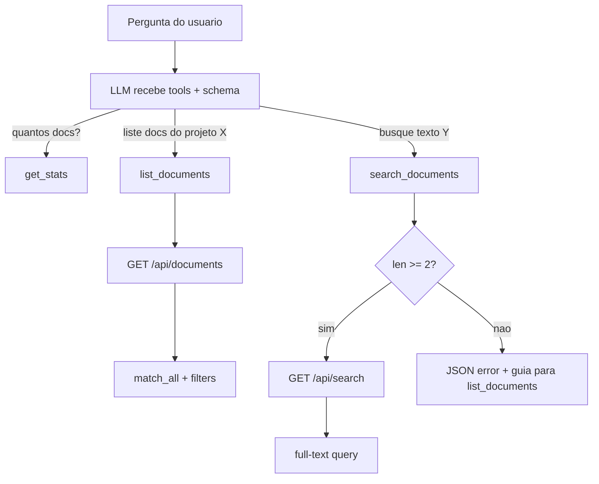
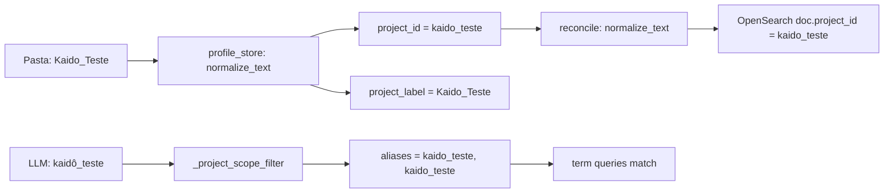

# list_documents + MCP fixes + project_id normalization

## Contexto / Problemas

**Problema 1 - Gap funcional:** O LLM consegue contagens via `get_stats` mas nao tem como enumerar documentos individuais sem query textual (`search_documents` exige `query: str` required + API `min_length=2`). Causa Pydantic validation error e 422.

**Problema 2 - Inconsistencia de acentos:** `project_id` e gravado no OpenSearch com acentos do nome da pasta (ex: `kaidô_teste`). Buscas com `term` query sao case/accent-sensitive, entao `kaido_teste` != `kaidô_teste`. O LLM e o usuario podem referenciar o projeto de formas diferentes.

---

## Parte A: list_documents + MCP fixes

### A1. Novos modelos Pydantic

**Arquivo:** [backend/app/models.py](backend/app/models.py)

Adicionar ao final do arquivo:

```python
class ListDocumentItem(BaseModel):
    doc_id: str
    project_id: str
    title: str
    original_filename: str
    path: str
    doc_kind: str | None = None
    document_type: str | None = None
    area_key: str | None = None
    tags: list[str] = Field(default_factory=list)
    ingested_at: str | None = None

class ListDocumentsResponse(BaseModel):
    total: int
    page: int
    page_size: int
    items: list[ListDocumentItem]
```

### A2. Novo endpoint API: `GET /api/documents`

**Arquivo:** [backend/app/main.py](backend/app/main.py)

- Endpoint `GET /api/documents` com `response_model=ListDocumentsResponse`
- Parametros opcionais: `project_id`, `doc_kind`, `document_type`, `area_key`, `page`, `size`
- Query: `match_all` + `bool.filter` (reutilizar `_project_scope_filter` para project_id)
- `_source` restrito a metadados (sem `content`, sem `content_chunks`)
- Ordenacao: `ingested_at` desc
- Paginacao: `from = (page - 1) * size`

### A3. Nova MCP tool: `list_documents`

**Arquivo:** [backend/app/mcp/server.py](backend/app/mcp/server.py)

```python
@mcp.tool()
def list_documents(
    project_id: str | None = None,
    doc_kind: str | None = None,
    document_type: str | None = None,
    area_key: str | None = None,
    page: int = 1,
    size: int = 20,
) -> str:
    """List/browse documents with optional filters (no text search required).
    Returns doc_id, title, filename, project_id, doc_kind, document_type,
    area_key, tags, ingested_at for each document. Use to enumerate documents
    in a project or browse by type/area. For text search use search_documents instead."""
```

Chama `get("/api/documents", params=...)`.

### A4. Guarda de min_length em `search_documents`

**Arquivo:** [backend/app/mcp/server.py](backend/app/mcp/server.py)

Na funcao `search_documents`, antes da linha `params: dict[str, Any] = {"q": query, ...}`:

```python
if len(query.strip()) < 2:
    return json.dumps(
        {"error": "query must have at least 2 characters. Use list_documents to browse without text query."},
        ensure_ascii=False,
    )
```

### A5. Atualizar system prompt

**Arquivo:** [backend/app/prompts/system_prompt_chat.md](backend/app/prompts/system_prompt_chat.md)

Mudancas concretas:

- **Secao "Busca e leitura"**: adicionar `list_documents` com descricao e exemplo
- **Corrigir exemplo**: `search_documents(q="vicio critico", ...)` para `search_documents(query="vicio critico", ...)`
- **Nova secao "Escopo e limites"**:
  - Responder apenas com base nos documentos indexados e ferramentas disponiveis
  - Sem resultados: informar que nao encontrou, sem inventar conteudo
  - Fora do escopo: recusar educadamente e explicar o que o assistente pode fazer
- **Estrategias de resposta**: adicionar "Para listar/enumerar documentos: use list_documents"

---

## Parte B: Normalizacao de project_id

Utiliza `normalize_text()` de [backend/app/utils.py](backend/app/utils.py) (strip accents via NFKD + lowercase). `project_label` permanece intacto para exibicao na UI.

### B1. Na indexacao - `reconcile.py` linha 96

**Arquivo:** [backend/app/reconcile.py](backend/app/reconcile.py)

```python
# Antes (linha 96):
project_id = str(profile.get("project_id", project_root.name))

# Depois:
from app.utils import normalize_text
project_id = normalize_text(str(profile.get("project_id", project_root.name)))
```

Todos os docs novos/reindexados entram com project_id normalizado.

### B2. Na criacao de perfis - `profile_store.py` linha 80

**Arquivo:** [backend/app/profile_store.py](backend/app/profile_store.py)

```python
# Antes (linha 80):
template["project_id"] = project_id or project_root.name

# Depois:
from app.utils import normalize_text
template["project_id"] = normalize_text(project_id or project_root.name)
```

`project_label` (linha 81) continua sem normalizar.

### B3. No filtro de busca - `_project_scope_filter` em `main.py`

**Arquivo:** [backend/app/main.py](backend/app/main.py) - funcao `_project_scope_filter` (linha 601)

Adicionar a versao normalizada de `ref` ao set de aliases:

```python
# Apos a linha: aliases: set[str] = {ref}
from app.utils import normalize_text
normalized_ref = normalize_text(ref)
if normalized_ref and normalized_ref != ref:
    aliases.add(normalized_ref)
```

Assim qualquer variante ("Kaido_Teste", "kaidô_teste", "KAIDO_TESTE") resolve para o mesmo set de aliases, cobrindo docs antigos (com acento) e novos (normalizados).

### Impacto e migracoes

- Docs ja indexados com acentos: serao atualizados no proximo reconcile (reindex)
- `_project_scope_filter` com aliases garante busca funcional durante a transicao (aceita tanto a versao acentuada quanto a normalizada)
- `project_label` nao e afetado (UI continua exibindo "Kaido" com acento)
- Zero risco de quebrar busca existente

---

## Parte C: Testes

### C1. Novo: `backend/tests/unit/test_list_documents_endpoint.py`

- `test_list_documents_no_filters` - match_all retorna todos
- `test_list_documents_with_project_id` - filtra por project_id
- `test_list_documents_with_doc_kind` - filtra por doc_kind
- `test_list_documents_pagination` - page 2 retorna segundo lote

### C2. Existente: [backend/tests/unit/test_mcp.py](backend/tests/unit/test_mcp.py)

- `test_list_documents_tool_calls_api` - mock do `get`, verifica params
- `test_search_documents_short_query_returns_error` - query com 1 char retorna JSON error sem chamar API
- `test_search_documents_empty_query_returns_error` - query vazia idem

### C3. Novo: `backend/tests/unit/test_project_id_normalization.py`

- `test_reconcile_normalizes_accented_project_id` - profile com "kaidô_teste" gera project_id "kaido_teste"
- `test_create_default_profile_normalizes_project_id` - ensure_profile com "Kaidô" grava project_id "kaido"
- `test_create_default_profile_preserves_label` - project_label mantem acentos
- `test_project_scope_filter_matches_accented_variant` - _project_scope_filter("kaidô_teste") gera aliases com versao normalizada
- `test_project_scope_filter_matches_uppercase_variant` - _project_scope_filter("KAIDO_TESTE") idem

---

## Fluxo apos as mudancas





## Arquivos alterados (resumo)

- `backend/app/models.py` - 2 novos modelos (~15 linhas)
- `backend/app/main.py` - 1 novo endpoint (~40 linhas) + ~3 linhas em `_project_scope_filter`
- `backend/app/mcp/server.py` - 1 nova tool + guarda min_length (~25 linhas)
- `backend/app/prompts/system_prompt_chat.md` - prompt reescrito
- `backend/app/reconcile.py` - 1 import + 1 linha alterada
- `backend/app/profile_store.py` - 1 import + 1 linha alterada
- `backend/tests/unit/test_list_documents_endpoint.py` - novo
- `backend/tests/unit/test_mcp.py` - 3 novos testes
- `backend/tests/unit/test_project_id_normalization.py` - novo (5 testes)

