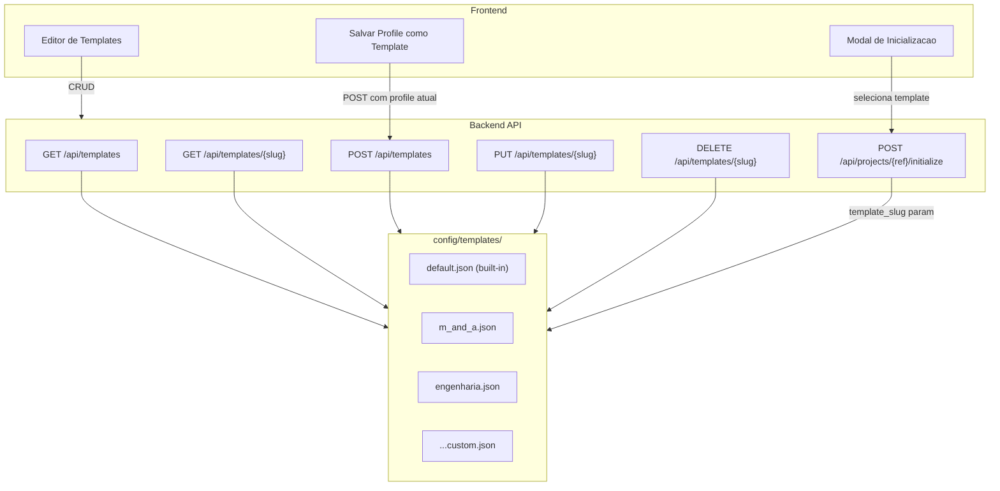

# LLM Visibility, Templates CRUD, Aliases Audit

## Contexto

O classificador rule-based classificou um resumo executivo financeiro como `contratos_comunicacao` (conf 0.90) porque os aliases de `financeiro` não cobrem vocabulário financeiro básico (receita, ebitda, custos), enquanto `contratos_comunicacao` tem `cliente`/`contrato` que aparecem em qualquer doc de negócios. O LLM concordou porque recebeu os aliases como contexto. Alem disso, o retorno do LLM (explanation, area proposta, de->para) se perde no pipeline e nunca chega ao frontend.

---

## Frente A -- Auditoria e Correção de Aliases

### Problema

Aliases atuais em `config/templates/profile_v2_default.json` e no profile do Kaido sao desbalanceados. `financeiro` tem aliases ultra-especificos (carveout, cp, fianca) enquanto faltam termos comuns.

### Mudancas

**Arquivo**: [config/templates/profile_v2_default.json](config/templates/profile_v2_default.json)

Revisao completa das 9 areas. Principio: aliases devem cobrir o vocabulario mais provavel de documentos reais, evitando termos genericos que geram falso-positivo cruzado.

Ajustes prioritarios:

- **financeiro**: adicionar `receita`, `ebitda`, `custos`, `margem`, `resultado`, `dre`, `demonstrativo`, `orcamento`, `balanco`, `fluxo_caixa`, `budget`, `pnl`. Remover `cp` (ambiguo, substring match).
- **contratos_comunicacao**: remover `cliente` (generico demais, match cruzado). Manter `contrato`, `fornecedor`, `comunicacao`, `preambulo`, `eml`. Adicionar `aditivo`, `distrato`, `sla`, `nda`.
- **societario_fiscal**: adicionar `imposto`, `tributo`, `aliquota`, `regime`, `enquadramento`.
- **juridica**: adicionar `litígio`, `sentenca`, `agravo`, `mandado`, `procuracao`.
- **ativos**: adicionar `patrimonio`, `inventario`, `depreciacao`, `bem`, `cessao`.
- **pessoas**: adicionar `folha`, `ferias`, `rescisao`, `admissao`, `treinamento`, `headcount`.
- **sistemas_migracao**: adicionar `integracao`, `api`, `banco_dados`, `cloud`, `infra`.
- **processos_tsa**: adicionar `procedimento`, `fluxograma`, `manual`, `instrucao`.
- **entregaveis**: adicionar `milestone`, `cronograma`, `baseline`, `workstream`.

### Testes

- Novo arquivo `backend/tests/unit/test_classifier_aliases.py`:
  - Cenario "resumo financeiro com receita/ebitda/custos" deve classificar como `financeiro`
  - Cenario "contrato de prestacao de servicos" deve classificar como `contratos_comunicacao`
  - Cenario com "cliente" no texto financeiro NAO deve classificar como `contratos_comunicacao`
  - Cenario regressao para cada area (1 doc tipico por area)
- Re-processar o "Slide Resumo Jan25" apos ajustes e validar classificacao correta

---

## Frente B -- Visibilidade do Retorno LLM

### Problema

Dados que o LLM retorna mas se perdem no pipeline:


| Dado                       | Onde nasce      | Onde se perde                             |
| -------------------------- | --------------- | ----------------------------------------- |
| `explanation`              | orchestrator.py | payload em ingestion.py nao copia         |
| area original (rule-based) | classify()      | sobrescrito in-place em _apply_llm_policy |
| area proposta pelo LLM     | orchestrator.py | descartada se nao existe (linha 128)      |
| reason da classificacao    | classify()      | nao copiado para payload                  |


### Mudancas Backend

**Arquivo**: [backend/app/ingestion.py](backend/app/ingestion.py)

1. Em `_apply_llm_policy`: preservar dados antes de mutar:
  - Salvar `classification["_rule_area_key"] = classification["area_key"]` antes de qualquer override
  - Salvar `classification["_rule_confidence"] = classification["confidence"]` idem
  - NAO descartar `llm_area` quando nao existe nas areas -- salvar como `classification["llm_proposed_area"]`
  - Sempre copiar `llm_result["explanation"]` para `classification["llm_explanation"]` (nao apenas no full_override)
2. Em `process_inbox_file`, no payload:
  - Adicionar campos opcionais:

```python
if classification.get("_rule_area_key"):
    payload["rule_area_key"] = classification["_rule_area_key"]
    payload["rule_confidence"] = classification.get("_rule_confidence", 0)
if classification.get("llm_explanation"):
    payload["llm_explanation"] = classification["llm_explanation"]
if classification.get("llm_proposed_area"):
    payload["llm_proposed_area"] = classification["llm_proposed_area"]
payload["classification_reason"] = classification.get("reason", "")
```

1. No triage metadata JSON (`save_pending_metadata`): incluir `llm_explanation`, `llm_proposed_area`, `rule_area_key` no dict `meta`.

**Arquivo**: [backend/app/models.py](backend/app/models.py)

- Adicionar campos opcionais ao `ScanFileResult` (se existir) ou documentar que o payload e dict livre.

**Arquivo**: [frontend/src/types.ts](frontend/src/types.ts)

- Adicionar a `ScanFileResult`:

```typescript
rule_area_key?: string;
rule_confidence?: number;
llm_explanation?: string;
llm_proposed_area?: string;
classification_reason?: string;
```

- Adicionar a `TriageItem`:

```typescript
llm_explanation?: string;
llm_proposed_area?: string;
rule_area_key?: string;
```

### Mudancas Frontend

**Arquivo**: [frontend/src/features/ingest/IngestTriageCard.tsx](frontend/src/features/ingest/IngestTriageCard.tsx)

1. Na tabela de Processamentos, na coluna de area/pasta: se `rule_area_key` != `area_key`, mostrar indicador visual de override:
  - Tooltip ou badge: `regra: societario_fiscal -> LLM: financeiro`
2. No indicador LLM (emoji robo): ao clicar/hover, expandir mini-card com:
  - `llm_explanation` (justificativa)
  - `rule_area_key` vs `area_key` final (de -> para)
  - `llm_proposed_area` se diferente das existentes (com badge "nova area proposta")
3. Nos itens de triagem pendentes: mostrar seção expandida com o contexto LLM:
  - "Classificacao por regras: `financeiro` (conf 0.45)"
  - "Sugestao LLM: `financeiro_relatorios` (area nova) -- motivo: ..."
  - Ou: "LLM divergiu: sugere `financeiro` vs regra `contratos_comunicacao`"

### Testes

- `backend/tests/unit/test_llm_visibility.py`:
  - `_apply_llm_policy` preserva `_rule_area_key` e `_rule_confidence`
  - `_apply_llm_policy` preserva `llm_explanation` em todos os modos (nao so full_override)
  - `_apply_llm_policy` preserva `llm_proposed_area` quando area nao existe
  - Payload final contem todos os campos de visibilidade
- Frontend: ajustar `IngestTriageCard.test.tsx` para testar renderizacao dos novos campos

---

## Frente C -- Auto-Criacao de Areas Propostas pelo LLM

### Problema

Se o LLM propoe uma area nova (ex: `financeiro_relatorios`), hoje e silenciosamente descartada. O usuario teria que ir manualmente em Profile > Layout > +Adicionar area_folder.

### Mudancas Backend

**Arquivo**: [backend/app/main.py](backend/app/main.py) -- endpoint `decide_triage`

- Na acao `approve` ou `correct`, se `target_area` nao existir no profile:
  1. Criar a work_area e area_folder automaticamente no profile
  2. Gerar `jd_number` como proximo disponivel
  3. Gerar `folder` como `NN_area_key` (padrao existente em area_resolver)
  4. Salvar profile atualizado (com versao incrementada)
  5. Criar o diretorio fisico
  6. Continuar com o fluxo normal (mover arquivo, indexar)
- Novo helper `_ensure_area_in_profile(project_root, profile, area_key) -> dict`:
  - Checa se area_key existe em `work_areas` e `area_folders`
  - Se nao, adiciona e salva o profile
  - Retorna profile atualizado

**Arquivo**: [backend/app/ingestion.py](backend/app/ingestion.py)

- No triage metadata: incluir `llm_proposed_area` para que o frontend saiba mostrar a opcao

### Mudancas Frontend

**Arquivo**: [frontend/src/features/ingest/IngestTriageCard.tsx](frontend/src/features/ingest/IngestTriageCard.tsx)

- Nos itens de triagem com `llm_proposed_area`:
  - Botao adicional: "Aprovar com area proposta: `financeiro_relatorios`"
  - Ao clicar, chama `onDecision(item, "correct")` com `target_area = llm_proposed_area`
  - O backend cria a area automaticamente

**Arquivo**: App.tsx -- `CorrectDecisionModal`

- Adicionar opcao de digitar nova area_key (input texto livre alem do select de existentes)
- Se area nao existir, mostrar aviso: "Esta area sera criada automaticamente"

### Testes

- `backend/tests/unit/test_auto_area_creation.py`:
  - Approve com area existente: comportamento normal
  - Approve com area nova: profile atualizado, pasta criada, arquivo movido
  - Correct com area nova: idem
  - Area nova aparece no profile.layout.area_folders e classification.work_areas

---

## Frente D -- Sistema de Templates CRUD

### Arquitetura




### Modelo de dados

Cada template JSON em `config/templates/` segue o mesmo schema de `ProjectProfileV2`, com campos adicionais no topo:

```json
{
  "template_meta": {
    "slug": "m_and_a",
    "name": "M&A / Carve-out",
    "description": "Template para projetos de fusoes e aquisicoes com areas pre-definidas...",
    "created_at": "2026-03-05T...",
    "updated_at": "2026-03-05T..."
  },
  "profile_version": 2,
  "project_id": "__PROJECT_ID__",
  ...
}
```

O `default.json` (renomear de `profile_v2_default.json`) e protegido contra delecao.

### Mudancas Backend

**Novo arquivo**: [backend/app/template_store.py](backend/app/template_store.py)

```python
TEMPLATES_DIR = Path("config/templates")

def list_templates() -> list[dict]
def get_template(slug: str) -> dict
def save_template(slug: str, data: dict) -> dict
def delete_template(slug: str) -> None  # protege "default"
def create_profile_from_template(slug: str, project_root, project_id, project_label) -> ProjectProfileV2
```

**Arquivo**: [backend/app/main.py](backend/app/main.py)

- `GET /api/templates` -- lista templates com meta (slug, name, description, areas count)
- `GET /api/templates/{slug}` -- retorna template completo
- `POST /api/templates` -- cria template (body: template completo ou `{ "from_profile": "project_id" }`)
- `PUT /api/templates/{slug}` -- atualiza template
- `DELETE /api/templates/{slug}` -- deleta (protege default)
- `POST /api/projects/{ref}/initialize` -- adiciona query param `template` (slug), default="default"

**Arquivo**: [backend/app/profile_store.py](backend/app/profile_store.py)

- `create_default_profile` aceita `template_slug` opcional
- `_template_path(slug)` resolve o arquivo correto

### Mudancas Frontend

**Arquivo**: [frontend/src/api.ts](frontend/src/api.ts)

```typescript
export async function listTemplates(): Promise<TemplateMeta[]>
export async function getTemplate(slug: string): Promise<TemplateData>
export async function saveTemplate(slug: string, data: TemplateData): Promise<TemplateMeta>
export async function deleteTemplate(slug: string): Promise<void>
export async function initializeProject(ref: string, templateSlug?: string): Promise<...>
```

**Arquivo**: [frontend/src/types.ts](frontend/src/types.ts)

```typescript
export interface TemplateMeta {
  slug: string;
  name: string;
  description: string;
  areas_count: number;
  created_at: string;
  updated_at: string;
}
```

### Mockup 1 -- Template Select Modal (inicializacao de projeto)

**Quando aparece**: ao selecionar um projeto nao-inicializado no `<select>` do header. Substitui o auto-init silencioso atual.

**Trigger**: `handleSelectProject()` em `App.tsx` -- se `!target.initialized`, em vez de chamar `initializeProject(nextProject)` direto, abre o `TemplateSelectModal`.

```
+-------------------------------------------------------------+
|                                                             |
|  Inicializar projeto: Kaido                             [X] |
|                                                             |
|  Selecione um template para configurar o projeto.           |
|  Areas, aliases e regras podem ser editados depois.         |
|                                                             |
|  +-------------------------------------------------------+  |
|  | [*] M&A / Carve-out (default)                         |  |
|  |     9 areas: societario, juridica, ativos, financeiro  |  |
|  |     Ideal para projetos de fusao e aquisicao           |  |
|  +-------------------------------------------------------+  |
|  | [ ] Engenharia                                        |  |
|  |     5 areas: civil, mecanica, eletrica, qualidade...   |  |
|  |     Projetos de engenharia e construcao                |  |
|  +-------------------------------------------------------+  |
|  | [ ] Em branco                                         |  |
|  |     0 areas pre-definidas                              |  |
|  |     Comece do zero, sem areas pre-configuradas         |  |
|  +-------------------------------------------------------+  |
|                                                             |
|  -- Preview do template selecionado --                      |
|  +-------------------------------------------------------+  |
|  | Areas:                                                |  |
|  | 01 societario_fiscal    aliases: societario, fiscal... |  |
|  | 02 juridica             aliases: juridico, litígio...  |  |
|  | 03 ativos               aliases: ativo, imobilizado... |  |
|  | 04 financeiro           aliases: receita, ebitda...    |  |
|  | ...                                                    |  |
|  | LLM: desativado | Threshold auto: 0.85                |  |
|  +-------------------------------------------------------+  |
|                                                             |
|  [Cancelar]                    [Inicializar com template]   |
|                                                             |
+-------------------------------------------------------------+
```

**Componente**: `frontend/src/features/templates/TemplateSelectModal.tsx`

- Props: `open`, `projectRef`, `projectLabel`, `onClose`, `onInitialized`
- Chama `listTemplates()` ao abrir para popular a lista
- Radio buttons para selecao (um template ativo por vez)
- Preview dinamico: ao selecionar template, chama `getTemplate(slug)` e mostra areas/config
- Botao "Inicializar com template" chama `initializeProject(projectRef, selectedSlug)`
- Usa as classes CSS existentes `.modal-overlay` + `.modal` (com `width: min(680px, 100%)` para acomodar o preview)

**Fluxo no App.tsx**:

```
handleSelectProject(nextProject)
  ├─ target.initialized? -> carrega normalmente
  └─ !target.initialized?
       ├─ ANTES: auto-init silencioso
       └─ DEPOIS: setTemplateModalProject(nextProject) -> abre TemplateSelectModal
            └─ usuario seleciona template -> onInitialized()
                 ├─ initializeProject(ref, slug)
                 ├─ refreshProjects()
                 └─ fecha modal
```

---

### Mockup 2 -- Template Editor (CRUD completo)

**Como e acessado**: nova aba/botao no `topbar-nav` do header, ao lado de "Operacional" e "Assistente":

```
topbar:
  [AtlasFile] [v Kaido]     [Operacional] [Assistente] [Templates]     [Search] [Health OK] [tema]
```

Ao clicar em "Templates", a view principal muda para o gerenciador de templates (similar a como "Operacional" e "Assistente" alternam o conteudo).

**Layout da view Templates**:

```
+------------------------------------------------------------------+
| Templates de projeto                      [+ Novo template]      |
+------------------------------------------------------------------+
|                                                                  |
| +--------------------------------------------------------------+ |
| | M&A / Carve-out                               [default]      | |
| | 9 areas | Atualizado em 05/03/2026                           | |
| | Template padrao para projetos M&A/carve-out                  | |
| |                                      [Editar] [Duplicar]     | |
| +--------------------------------------------------------------+ |
| | Engenharia                                                   | |
| | 5 areas | Atualizado em 05/03/2026                           | |
| | Projetos de engenharia e construcao                          | |
| |                              [Editar] [Duplicar] [Excluir]   | |
| +--------------------------------------------------------------+ |
|                                                                  |
+------------------------------------------------------------------+
```

**Ao clicar "Editar" ou "+ Novo template"**: abre o `TemplateEditorModal`:

```
+-------------------------------------------------------------+
|                                                             |
|  Editar template: M&A / Carve-out                       [X] |
|                                                             |
|  +-------------------------------------------------------+  |
|  | Nome     [M&A / Carve-out                           ] |  |
|  | Slug     [m_and_a                    ] (somente leitura se existente)  |
|  | Descricao[Template para projetos de fusao...]         |  |
|  +-------------------------------------------------------+  |
|                                                             |
|  v Estrutura de Layout                                      |
|  +-------------------------------------------------------+  |
|  | Modo: [para_jd v]                                     |  |
|  | Raiz areas: [02_AREAS          ]                      |  |
|  | AREA_KEY         | PASTA           | ALIASES          |  |
|  | societario_fiscal| 01_societario   | societario, ...  |  |
|  | juridica         | 02_juridica     | juridico, ...    |  |
|  | financeiro       | 04_financeiro   | receita, ebitda..|  |
|  | ...              | ...             | ...              |  |
|  |                           [+ Adicionar area_folder]   |  |
|  +-------------------------------------------------------+  |
|                                                             |
|  v Regras de roteamento                                     |
|  +-------------------------------------------------------+  |
|  | filename contem: contrato,fornecedor -> contratos_com  |  |
|  | filename contem: filiais,cnpj -> societario_fiscal     |  |
|  | ...                                                    |  |
|  |                            [+ Adicionar regra]        |  |
|  +-------------------------------------------------------+  |
|                                                             |
|  v Configuracao LLM                                         |
|  +-------------------------------------------------------+  |
|  | LLM habilitado: [off]   Provider: [openai v]          |  |
|  | Modelo: [gpt-4o-mini v] Modo: [tag_only v]            |  |
|  | Threshold auto: [0.85]  Threshold triagem: [0.5]      |  |
|  +-------------------------------------------------------+  |
|                                                             |
|  [Cancelar]              [Salvar template]                  |
|                                                             |
+-------------------------------------------------------------+
```

**Componente**: `frontend/src/features/templates/TemplateEditorModal.tsx`

- Props: `open`, `slug` (null para novo), `onClose`, `onSaved`
- Se `slug` fornecido: carrega via `getTemplate(slug)`, senao cria vazio
- Reutiliza a logica de edicao de areas/aliases do `ProfileLayoutEditor` existente (extrair componente compartilhado `AreaFoldersEditor`)
- Secoes colapsaveis (mesmo padrao `<details>` do resto da UI)
- Slug auto-gerado do nome (slugify) ao criar novo, somente-leitura ao editar
- Salvar chama `PUT /api/templates/{slug}` (editar) ou `POST /api/templates` (novo)
- Template `default` nao pode ser excluido (botao ausente)

---

### Mockup 3 -- "Salvar como Template" no Profile

**Onde aparece**: botao na toolbar do `ProfileLayoutWorkspace`, ao lado de "Recarregar", "Validar", "Salvar Profile":

```
+------------------------------------------------------------------+
| Projeto: Kaido                              Profile v2 JSON      |
| ID: Kaido | Versao: 10 | Ultima: layout:apply                   |
+------------------------------------------------------------------+
| [Recarregar] [Validar alteracoes] [Salvar Profile] [Salvar como Template]  |
+------------------------------------------------------------------+
```

**Ao clicar "Salvar como Template"**: abre mini-modal (prompt simples):

```
+---------------------------------------------+
|                                             |
|  Salvar profile como template           [X] |
|                                             |
|  Nome     [M&A Kaido customizado       ]    |
|  Slug     [m_and_a_kaido_custom        ]    |
|  Descricao[Template derivado do Kaido..]    |
|                                             |
|  [Cancelar]            [Salvar template]    |
|                                             |
+---------------------------------------------+
```

- Chama `POST /api/templates` com `{ from_profile: "Kaido", name, slug, description }`
- Backend copia o profile atual, substitui project_id/label/root por placeholders, adiciona `template_meta`

---

### Mockup 4 -- Visibilidade LLM na tabela de Processamentos (Frente B)

**Na tabela existente do IngestTriageCard**, coluna AREA/PASTA com indicador de override:

```
+-----+------------------+---------------------+-----------------------------+----------+------+
|     | DATA / HORA      | ARQUIVO             | AREA / PASTA                | DECISAO  | CONF.|
+-----+------------------+---------------------+-----------------------------+----------+------+
| ⏳  | 05/03/26, 14:47  | Slide Resumo.pdf 🤖| contratos_comunicacao       | TRIAGEM  | 0.90 |
|     |                  |                     | regra: contratos → LLM: ≡   |          |      |
+-----+------------------+---------------------+-----------------------------+----------+------+
| ✓   | 05/03/26, 12:50  | Marketing_V1.2.pdf🤖| contratos_comunicacao       | AUTO     | 0.98 |
+-----+------------------+---------------------+-----------------------------+----------+------+
```

**Ao clicar no 🤖**: expande inline (ou tooltip) com detalhes LLM:

```
+-------------------------------------------------------+
| Detalhes da classificacao LLM                         |
| Regra: contratos_comunicacao (conf 0.90)              |
| LLM:   contratos_comunicacao (conf 0.90)              |
| Motivo: "Documento menciona contratos e clientes,     |
|          classificado na area existente mais proxima"  |
| Area proposta: -- (nenhuma nova)                      |
+-------------------------------------------------------+
```

Ou, quando o LLM propoe area nova:

```
+-------------------------------------------------------+
| Detalhes da classificacao LLM                         |
| Regra: contratos_comunicacao (conf 0.33)              |
| LLM:   financeiro (conf 0.85)                        |
| Motivo: "Resumo executivo financeiro com EBITDA,      |
|          receita e custos -- area financeiro"          |
| [!] Area proposta nao existente -> triagem            |
+-------------------------------------------------------+
```

---

### Mockup 5 -- Triagem com contexto LLM e auto-area (Frentes B+C)

**No card "Itens pendentes de triagem"**, item expandido:

```
+------------------------------------------------------------------+
| c4dde802__Slide Resumo Jan25 - 27022025.pdf                      |
| projeto: Kaido | sugestao: contratos_comunicacao | conf: 0.90    |
|                                                                  |
| +--------------------------------------------------------------+ |
| | Classificacao LLM                                            | |
| | Regra sugeriu: contratos_comunicacao (0.33)                  | |
| | LLM sugeriu:   financeiro (0.85)                             | |
| | Motivo: "Resumo executivo financeiro -- EBITDA, receita..."  | |
| +--------------------------------------------------------------+ |
|                                                                  |
| [Aprovar]  [Aprovar como: financeiro (LLM)]  [Corrigir]  [Rejeitar] |
+------------------------------------------------------------------+
```

Se LLM propoe area NOVA que nao existe:

```
+------------------------------------------------------------------+
| doc123__Relatorio_ESG_2025.pdf                                   |
| projeto: Kaido | sugestao: sem area | conf: 0.45                |
|                                                                  |
| +--------------------------------------------------------------+ |
| | Classificacao LLM                                            | |
| | Regra sugeriu: (nenhuma, conf 0.12)                          | |
| | LLM propoe NOVA area: esg_sustentabilidade                   | |
| | Motivo: "Relatorio ESG sem area existente adequada"          | |
| +--------------------------------------------------------------+ |
|                                                                  |
| [Aprovar e criar area: esg_sustentabilidade]  [Corrigir]  [Rejeitar] |
+------------------------------------------------------------------+
```

O botao "Aprovar e criar area" chama `triageDecision(projectId, docId, "correct", "esg_sustentabilidade")` e o backend cria a area automaticamente no profile.

---

### Mockup 6 -- CorrectDecisionModal com input de area nova (Frente C)

**Modal existente** `CorrectDecisionModal` estendido:

```
+---------------------------------------------+
|                                             |
|  Aprovar com correcao                   [X] |
|                                             |
|  Arquivo: Slide Resumo Jan25.pdf            |
|                                             |
|  Area destino:                              |
|  [v financeiro (04_financeiro)           ]  |
|                                             |
|  -- ou criar nova area --                   |
|  [financeiro_relatorios               ]     |
|  [!] Esta area sera criada automaticamente  |
|      no profile e no disco.                 |
|                                             |
|  [Cancelar]        [Aprovar e mover]        |
|                                             |
+---------------------------------------------+
```

- Select com areas existentes (comportamento atual)
- Input texto livre abaixo para digitar nova area_key
- Se input preenchido, ele tem prioridade sobre o select
- Warning visual informando que a area sera criada

### Testes

- `backend/tests/unit/test_template_store.py`:
  - list_templates retorna pelo menos o default
  - save_template cria arquivo valido
  - delete_template protege default
  - create_profile_from_template substitui placeholders
- `backend/tests/integration/test_api_templates.py`:
  - CRUD completo via endpoints HTTP
  - Initialize com template especifico
  - Initialize com template inexistente retorna 404
- `frontend/src/features/templates/TemplateSelectModal.test.tsx`:
  - Renderiza lista de templates
  - Selecao dispara inicializacao com slug correto

---

## Migracao do Template Default

- Renomear `profile_v2_default.json` para `default.json` (manter backward compat via symlink ou fallback)
- Adicionar `template_meta` ao arquivo
- Aplicar aliases corrigidos da Frente A

---

## Ordem de Execucao Recomendada

1. **Frente A** (aliases) -- menor risco, beneficio imediato na classificacao
2. **Frente B** (LLM visibility) -- desbloqueia auditoria de classificacoes
3. **Frente C** (auto-area) -- depende de B (usa campos de visibilidade)
4. **Frente D** (templates) -- feature nova independente, mas maior escopo

---

## Validacao Final

Apos todas as frentes:

1. Reprocessar "Slide Resumo Jan25" com aliases corrigidos -- deve classificar como `financeiro`
2. Verificar na UI que explanation e de->para aparecem
3. Testar fluxo de area nova proposta pelo LLM ate aprovacao na triagem
4. Criar template "engenharia" a partir do editor, inicializar novo projeto com ele
5. `make test` -- 100% dos testes passando (existentes + novos)

