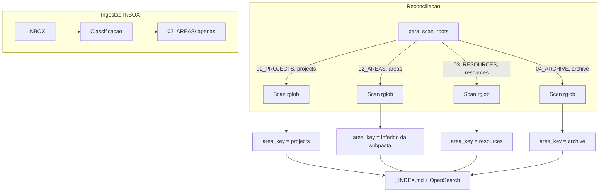

# Scan de todas as roots PARA + remoção do legado _WORK

## Contexto

Atualmente o reconcile varre apenas `02_AREAS/` (via `areas_root_rel`) e `_WORK/` (legado). Documentos colocados manualmente em `01_PROJECTS/`, `03_RESOURCES/` ou `04_ARCHIVE/` ficam invisíveis para o index e para o OpenSearch.

A metodologia PARA define 4 categorias de acervo -- todas devem ser indexadas e pesquisáveis. A ingestão automatica (INBOX) continua roteando exclusivamente para `02_AREAS/`; as demais roots recebem apenas arquivos colocados manualmente.

## Mudancas

### 1. `profile_runtime.py` -- nova funcao `para_scan_roots`

Adicionar funcao que retorna as roots escaneáveis a partir de `layout.roots` do profile:

```python
def para_scan_roots(profile: dict[str, Any]) -> list[tuple[str, str]]:
    """Return (folder, category) pairs for all PARA roots defined in layout."""
    layout = profile.get("layout") or {}
    roots = layout.get("roots") or {}
    # Garante ao menos areas_root como fallback
    if not roots:
        return [(areas_root_rel(profile), "areas")]
    return [(folder, category) for category, folder in roots.items() if folder]
```

Retorno para o template default:

- `("01_PROJECTS", "projects")`
- `("02_AREAS", "areas")`
- `("03_RESOURCES", "resources")`
- `("04_ARCHIVE", "archive")`

### 2. `reconcile.py` -- scan com todas as PARA roots

**Trecho atual** ([reconcile.py](backend/app/reconcile.py) linhas 178-185):

```python
work_root = project_root / areas_root_rel(profile)
scan_roots = [work_root]
legacy_work = project_root / "_WORK"
if legacy_work.exists() and legacy_work.resolve() != work_root.resolve():
    scan_roots.append(legacy_work)
```

**Novo** -- substituir por iteracao sobre `para_scan_roots()`:

```python
from .profile_runtime import para_scan_roots

scan_entries = para_scan_roots(profile)
# scan_entries = [("01_PROJECTS", "projects"), ("02_AREAS", "areas"), ...]
```

- Iterar cada `(folder, category)` e construir `scan_dir = project_root / folder`
- Para `area_key` inference: se `category == "areas"`, manter logica atual (`_infer_area_from_layout_path`); senao, usar `category` diretamente como `area_key`
- Remover completamente o bloco `legacy_work = project_root / "_WORK"`

### 3. `reconcile.py` -- area_key para roots nao-areas

Na linha 223, onde `_infer_area_from_layout_path` e chamado, passar a categoria PARA:

```python
if category == "areas":
    inferred_area = _infer_area_from_layout_path(f, project_root, profile, scan_root=scan_dir)
else:
    inferred_area = category  # "projects", "resources", "archive"

work_rows.append({
    ...
    "area": (prev or {}).get("area", inferred_area),
    ...
})
```

### 4. Testes unitarios -- `test_reconcile.py`

Adicionar testes:

- `test_reconcile_scans_all_para_roots`: criar arquivos em `01_PROJECTS/`, `03_RESOURCES/`, `04_ARCHIVE/` e verificar que aparecem no `_INDEX.md` com area_key = "projects", "resources", "archive"
- `test_reconcile_no_legacy_work_scan`: garantir que `_WORK/` nao e mais escaneado
- `test_reconcile_areas_root_still_infers_area`: confirmar que `02_AREAS/04_financeiro/` continua inferindo `area_key = financeiro`

### 5. Documentacao

- Atualizar `docs/04_naming_convention.md` mencionando que todas as roots PARA sao indexadas
- Atualizar `CHANGELOG.md` na secao 0.4.0

## Arquivos impactados

- [backend/app/profile_runtime.py](backend/app/profile_runtime.py) -- nova funcao `para_scan_roots`
- [backend/app/reconcile.py](backend/app/reconcile.py) -- scan_roots PARA, remocao `_WORK`, area_key por categoria
- [backend/tests/unit/test_reconcile.py](backend/tests/unit/test_reconcile.py) -- novos testes
- [docs/04_naming_convention.md](docs/04_naming_convention.md) -- update
- [CHANGELOG.md](CHANGELOG.md) -- update

## O que NAO muda

- **Ingestao** (`ingestion.py`): continua roteando apenas para `02_AREAS/`
- **Template** (`default.json`): `layout.roots` ja define as 4 pastas, nenhuma alteracao necessaria
- **Busca/Stats**: documentos das novas roots aparecem automaticamente nas buscas por `area_key` ("projects", "resources", "archive")
- `**_find_latest_version`** (`ingestion.py`): continua buscando apenas em `areas_root` para versionamento

## Diagrama do fluxo pos-mudanca




