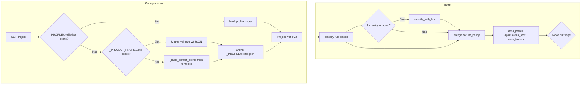

# Validação do plano v4 e plano de implementação ajustado

## 1. Entendimento do problema e objetivos (do plano v4)

- **Objetivos:** (1) Eliminar hardcode de work_areas/routing_rules; (2) Profile v2 editável pelo frontend (JSON, sem .md como storage); (3) Reorganização/migração de pastas (PARA/JD ou custom); (4) LLM governado por política (tag_only / review / full_override); (5) Topics controlados via topics_v1.yaml.
- **Restrições:** Incremental, reversível, com auditoria; fonte da verdade = `_PROFILE/profile.json`; cada fase só avança com testes passando.

---

## Pontos de decisão

Estas são as escolhas que precisam ser definidas por você (produto/time) antes ou durante a implementação. Nenhuma opção está assumida.

| #       | Ponto de decisão                                                                                        | Opções (escolher uma ou combinar conforme indicado)                                                                                                                                                                                                                                              |
| ------- | ------------------------------------------------------------------------------------------------------- | ------------------------------------------------------------------------------------------------------------------------------------------------------------------------------------------------------------------------------------------------------------------------------------------------ |
| **D1**  | Onde fica o arquivo de template default do profile v2?                                                  | (A) `config/templates/profile_v2_default.json` na raiz do repositório; (B) `backend/config/templates/profile_v2_default.json`; (C) outro caminho (especificar).                                                                                                                                  |
| **D2**  | Quando um projeto já tem `_PROJECT_PROFILE.md` e ainda não tem `_PROFILE/profile.json`, o que fazer?    | (A) Migrar automaticamente na primeira carga (ler .md → gerar JSON e gravar em `_PROFILE/profile.json`); (B) Exigir ação explícita do usuário (ex.: botão "Migrar para profile v2"); (C) Apenas converter em memória para exibir/editar, e só gravar JSON quando o usuário salvar pelo frontend. |
| **D3**  | Depois de gerar `_PROFILE/profile.json` a partir de `_PROJECT_PROFILE.md`, o que fazer com o .md?       | (A) Renomear para `_PROJECT_PROFILE.md.bak`; (B) Remover o .md; (C) Manter o .md no disco (somente leitura; não usar mais como fonte da verdade).                                                                                                                                                |
| **D4**  | Como incorporar topics no pipeline de indexação?                                                        | (A) Integrar no indexer atual ([backend/app/indexer.py](backend/app/indexer.py)): adicionar matcher de topics + campo `topics` no documento OpenSearch; (B) Migrar o código para a proposta indexer_v3 em docs/ (substituir uso do indexer atual).                                               |
| **D5**  | Layout default para projetos novos (criados via init ou bootstrap): qual estrutura inicial?             | (A) Layout PARA: criar raízes 01_PROJECTS, 02_AREAS, 03_RESOURCES, 04_ARCHIVE e areas_root = 02_AREAS com area_folders; (B) Layout “flat”: manter comportamento atual (apenas _WORK + subpastas por área, sem 01/02/03/04).                                                                      |
| **D6**  | Para o LLM poder sugerir `area_key` (modos review / full_override), como a tool deve evoluir?           | (A) Estender a tool MCP `submit_classification` com parâmetros opcionais `area_key` e `explanation`; (B) Criar outra tool (ex.: `suggest_area`) que o orchestrator chama quando a política for review/full_override; (C) Outro mecanismo (especificar).                                          |
| **D7**  | Quando `require_explanation` estiver true nos guardrails e o LLM não enviar `explanation`, o que fazer? | (A) Rejeitar a resposta do LLM (não aplicar override de area_key e tratar como tag_only para esse doc); (B) Aceitar o override mas registrar explanation vazio no audit; (C) Exigir explanation no schema da tool (obrigatório quando modo for full_override).                                   |
| **D8**  | Rollback de migração de layout (desfazer apply): em escopo na primeira entrega?                         | (A) Sim: implementar rollback (ex.: log de operações e endpoint “revert”) em P1; (B) Não: deixar rollback apenas para P2 (opcional).                                                                                                                                                             |
| **D9**  | Export do profile em Markdown (leitura/export para .md): quando entregar?                               | (A) Incluir em P0/P1 (ex.: GET .../profile/export ou “Download as Markdown”); (B) Deixar para P2 (melhorias).                                                                                                                                                                                    |
| **D10** | Ordenação das fases: Topics deve ser tratado como parte de P0 ou como fase separada após P1?            | **Decidido: (A) P0.4 Topics** — Topics junto com P0. Numeração: P0.1–P0.4, P1.1–P1.4 (não há P1.5/P1.6).                                                                                                                                                                                         |

Após definir cada ponto, o plano de implementação pode ser ajustado (ex.: texto da migração, escopo de rollback, local do template).

---

## 2. Validação e crítica do conteúdo do plano

### 2.1 O que está correto e alinhado ao código

- **Estado atual** descrito no plano bate com o código: `_build_default_profile()` e `bootstrap_project.py` com hardcode; ingest rule-based → LLM opcional (só confidence/tags/document_type); triagem em `_TRIAGE_REVIEW`; reconcile em `_WORK` ([main.py](backend/app/main.py), [ingestion.py](backend/app/ingestion.py), [reconcile.py](backend/app/reconcile.py), [triage.py](backend/app/triage.py)).
- **Schema ProjectProfileV2** em [docs/plano_profile/profile_v2.py](docs/plano_profile/profile_v2.py) (conteúdo a virar `backend/app/profile.py`): válido (paths, layout.areas_root + area_folders, classification com llm_policy, indexing.topics_path); validação cross (area_folders cobre work_areas; areas_root não sobrepõe inbox/triage) é adequada.
- **layout_migration.py** em [docs/plano_profile/layout_migration.py](docs/plano_profile/layout_migration.py): `plan_layout_migration` e `apply_layout_migration` estão coerentes com Profile v2; escopo apenas sob areas_root; reserved roots; estratégias de conflito; rmdir vazio best-effort.
- **topics_v1.yaml**: formato com key/label/synonyms/area_bias é adequado para matcher determinístico; [docs/plano_profile/indexer_v3.py](docs/plano_profile/indexer_v3.py) já resolve `topics_path` por profile/env/default.
- **Decisão “profile editável via API com version/etag”** e “layout migration plan/apply sem LLM executar apply” estão claras e corretas.

### 2.2 Lacunas e pontos a ajustar

| Ponto                                  | Crítico | Observação                                                                                                                                                                                                                                                                                                                                                                                                         |
| -------------------------------------- | ------- | ------------------------------------------------------------------------------------------------------------------------------------------------------------------------------------------------------------------------------------------------------------------------------------------------------------------------------------------------------------------------------------------------------------------ |
| **Migração de projetos existentes**    | Sim     | Projetos atuais usam `_PROJECT_PROFILE.md` (YAML frontmatter). O plano diz “não existe .md como storage” mas não descreve one-time: ler .md → gerar `_PROFILE/profile.json` (ProjectProfileV2) e opção de manter/remover .md. Sem isso, projetos já criados quebram ao passar a ler só JSON.                                                                                                                       |
| **Paths de triagem/inbox dinâmicos**   | Sim     | Hoje [triage.py](backend/app/triage.py) e [ingestion.py](backend/app/ingestion.py) usam `_TRIAGE_REVIEW` e `_INBOX_DROP` fixos. O v2 usa `profile.paths.triage.`* e `profile.paths.inbox`. Triagem e ingest precisam receber profile (v2) e usar esses paths; triage_base/pending/resolved/rejected devem ser derivados do profile (ou compatibilidade: se profile for dict legado, fallback para _TRIAGE_REVIEW). |
| **Reconcile e work_root**              | Sim     | [reconcile.py](backend/app/reconcile.py) usa `project_root / "_WORK"` e `_infer_area_from_work_path` com primeiro segmento sob _WORK. Com v2, work_root = `layout.areas_root` (ex.: 02_AREAS) e área vem de layout.area_folders (mapear path → area_key). Precisa de função que, dado path relativo a areas_root, retorne area_key usando area_folders.                                                            |
| **Local do template default**          | Não     | Plano: `config/templates/profile_v2_default.json`. No repo hoje não existe `config/` na raiz; pode ser `backend/config/templates/` ou `config/` na raiz do projeto. Definir um único lugar e documentar.                                                                                                                                                                                                           |
| **Ordenação/numeracao das fases**      | Não     | Resolvido: Topics = P0.4 (junto com P0). Numeração: P0.1–P0.4, P1.1–P1.4.                                                                                                                                                                                                                                                                                                                                          |
| **indexer_v3 vs indexer atual**        | Sim     | indexer_v3 está em docs/ (proposta); o app usa [indexer.py](backend/app/indexer.py) sem topics. Opções: (A) integrar topics no indexer atual (ler topics_path do profile, matcher, campo no doc); (B) migrar para indexer_v3. Plano deve optar (recomendação: A para menor risco e incremental).                                                                                                                   |
| **layout_migration no app**            | Sim     | layout_migration.py está em docs/ e importa `.profile_v2`. No app: conteúdo em `backend/app/layout_migration.py`, import de `app.profile` (ProjectProfileV2).                                                                                                                                                                                                                                                      |
| **Guardrails full_override**           | Média   | profile_v2 define `area_override_only_if_rule_confidence_below`, `require_explanation`, `max_area_changes`. O orchestrator hoje não recebe area_key do LLM (tool submit_classification não tem area_key). Para full_override será preciso: (1) adicionar area_key (opcional) ao schema da tool no MCP; (2) ingest/orchestrator aplicar guardrails antes de sobrescrever.                                           |
| **_build_default_profile e bootstrap** | Sim     | Ambos devem passar a ler template JSON e gravar `_PROFILE/profile.json`. Para projetos novos sem pasta _PROFILE, ensure_structure deve criar também layout.roots (01_PROJECTS, 02_AREAS, 03_RESOURCES, 04_ARCHIVE) quando layout.mode == para_jd; hoje bootstrap não cria essas raízes.                                                                                                                            |

### 2.3 Trade-offs a explicitar

- **Compatibilidade legado:** Manter suporte a projeto “só com _PROJECT_PROFILE.md” (sem _PROFILE/profile.json) até migração one-time: ao carregar projeto, se existir .md e não existir profile.json, rodar migração em memória (parse YAML → ProjectProfileV2) e opcionalmente persistir JSON. Isso evita quebrar projetos existentes no primeiro deploy.
- **Paths triagem/inbox:** Se profile for v2 (ProjectProfileV2), usar paths.paths; se for dict (legado), usar profile.get("inbox_path", "_INBOX_DROP") e triage como hoje. Assim triage.py e ingestion aceitam os dois formatos durante a transição.
- **Custo de Topics:** Matcher por sinônimos + area_bias é leve; índice OpenSearch com campo `topics` (keyword/multi) é padrão. Risco baixo.
- **Migração de layout:** plan/apply é determinístico e auditável; aplicar em horário de baixo uso e com backup recomendado. rollback (P2) fica opcional na primeira entrega.

---

## 3. Decisões de schema e armazenamento

- **Profile:** Fonte da verdade = `project_root/_PROFILE/profile.json`. Histórico = `_PROFILE/history/<timestamp>__vNN.json` (append-only). Version (int) para optimistic lock; etag = hash do JSON canônico.
- **Template default:** Um único arquivo, ex.: `backend/config/templates/profile_v2_default.json` (ou raiz `config/` se preferir). Conteúdo alinhado a [profile_v2_example.json](docs/plano_profile/profile_v2_example.json) com layout PARA (roots + areas_root 02_AREAS + area_folders).
- **Migração .md → v2:** Regra: se existir `_PROJECT_PROFILE.md` e não existir `_PROFILE/profile.json`, converter frontmatter YAML para ProjectProfileV2 (mapear work_areas, routing_rules, confidence_thresholds, inbox_path; layout default areas_root=_WORK, area_folders a partir de work_areas com jd_number) e gravar `_PROFILE/profile.json`; opcionalmente renomear .md para .md.bak ou deixar legado.
- **Topics:** Path no profile `indexing.topics_path` (ex.: `config/topics_v1.yaml` ou caminho absoluto). Resolução: env ATLASFILE_TOPICS_V1_PATH > profile.indexing.topics_path > default repo. Arquivo YAML em [docs/plano_profile/topics_v1.yaml](docs/plano_profile/topics_v1.yaml) pode ser copiado para `config/topics_v1.yaml` ou referenciado por path configurável.

---

## 4. Plano de implementação ajustado (resumo executável)

### P0 — Profile v2 JSON + fim do hardcode + compatibilidade

- **P0.1 Template e escrita em _PROFILE**
  - Criar `config/templates/profile_v2_default.json` (ou `backend/config/templates/`) com conteúdo equivalente ao example (layout PARA, classification com work_areas/routing_rules, llm_policy tag_only).
  - Alterar `_build_default_profile()` em [main.py](backend/app/main.py): deixar de montar dict hardcoded; ler template JSON, preencher project_id/project_label/project_root, validar com ProjectProfileV2, gravar em `project_root/_PROFILE/profile.json`.
  - Alterar [scripts/bootstrap_project.py](scripts/bootstrap_project.py): usar o mesmo template, criar `_PROFILE` e gravar profile.json; criar estrutura de pastas a partir de profile (paths + layout.roots + layout.areas_root + area_folders).
  - Aproveitar conteúdo de [docs/plano_profile/profile_v2.py](docs/plano_profile/profile_v2.py) em `backend/app/profile.py` (nome por conteúdo, sem numeração).
  - Testes: template roundtrip (load → validate → save → load); init de projeto “vazio” gera `_PROFILE/profile.json`.
- **P0.2 Carregamento e compatibilidade .md → v2**
  - Criar `backend/app/profile_store.py`: `load_profile(project_root) -> ProjectProfileV2 | dict`: se existir `_PROFILE/profile.json`, carregar e validar ProjectProfileV2; senão, se existir `_PROJECT_PROFILE.md`, converter (função de migração) para ProjectProfileV2 e gravar em `_PROFILE/profile.json`; senão retornar erro ou None. Para compatibilidade com código que espera dict, pode retornar profile.model_dump() ou um adapter.
  - `save_profile(project_root, profile: ProjectProfileV2, if_match_version, updated_by)`: gravar profile.json, append em history/, incrementar version, retornar etag/version.
  - ensure_project_structure: passar a receber profile (v2 ou dict). Se v2: criar paths.inbox, paths.triage.*, layout.roots (se para_jd), layout.areas_root, layout.area_folders; se dict legado, comportamento atual (_INBOX_DROP, _TRIAGE_REVIEW, _WORK + work_areas).
  - Testes: load existente .md migra para JSON; ensure_structure com profile v2 cria 01/02/03/04 e pastas de áreas.
- **P0.3 API de profile (GET/PUT/validate/history)**
  - Criar [backend/app/profile_api.py](backend/app/profile_api.py): GET/PUT /api/projects/{id}/profile, POST validate, GET history. PUT com if_match_version; conflito → 409.
  - Rotas registradas em main.py; usar profile_store.
  - Testes: get retorna version/etag; put com version errada → 409; put grava history; validate rejeita area_folders inválidos.
- **P0.4 Topics (matcher + pipeline)**
  - Criar `backend/app/topics.py`: carregar topics_v1.yaml (path do profile ou default), matcher por sinônimos (texto normalizado), area_bias opcional. Retornar lista de topic keys.
  - Integrar no [indexer.py](backend/app/indexer.py): ao indexar, se profile tiver indexing.topics_path, chamar matcher sobre title/content excerpt e preencher campo `topics` no documento. Schema OpenSearch: campo `topics` (keyword multi). Não obrigatório migrar para indexer_v3; manter indexer atual.
  - Testes: matcher retorna só keys do YAML; area_bias influencia ordenação; source synonym match.

### P1 — Layout dinâmico e migração plan/apply

- **P1.1 area_resolver e ingest usam layout v2**
  - Em [area_resolver.py](backend/app/area_resolver.py): se profile for ProjectProfileV2 (ou tiver layout.areas_root e layout.area_folders), retornar `layout.areas_root + "/" + folder_for_area(area_key)`; senão manter lógica atual (work_root + jd).
  - Em [ingestion.py](backend/app/ingestion.py): obter area_path via resolver; dest_dir = project_root / area_path; paths de triagem: usar profile.paths.triage.pending (se v2) ou "_TRIAGE_REVIEW/pending". Idem para _sha_exists_in_triage e rejected_dir.
  - [triage.py](backend/app/triage.py): aceitar profile opcional; se v2, triage_base = project_root / paths.triage.*; senão _TRIAGE_REVIEW. Ou manter triage recebendo apenas project_root e obter paths do profile carregado no caller (main/ingest) e passar paths explicitamente para save_pending_metadata e list_pending.
  - Testes: ingest move para layout.areas_root/area_folders[area_key].folder; não usa _WORK quando profile é v2.
- **P1.2 Reconcile usa layout v2**
  - Em [reconcile.py](backend/app/reconcile.py): work_root = project_root / profile.layout.areas_root (se v2), senão _WORK. _infer_area_from_work_path: dado path relativo a work_root, primeiro segmento = pasta; mapear pasta → area_key via layout.area_folders (folder → area_key). Iterar arquivos sob work_root.
  - Testes: reconcile indexa docs sob 02_AREAS/ quando profile tem areas_root 02_AREAS.
- **P1.3 Layout migration no app**
  - Aproveitar conteúdo de [docs/plano_profile/layout_migration.py](docs/plano_profile/layout_migration.py) em `backend/app/layout_migration.py`; import de `app.profile` (ProjectProfileV2).
  - Criar `backend/app/layout_api.py`: POST plan (dry-run, retorna plan_id + summary + ops); POST apply (plan_id, confirm, run_reconcile). plan_id = hash do plano (ex.: sha256 do JSON do plan).
  - Testes: plan não altera FS; apply move arquivos e preserva reserved roots; cleanup empty best-effort.

### P1 — LLM governado (llm_policy)

- **P1.4 Política LLM no ingest**
  - Em [ingestion.py](backend/app/ingestion.py): em vez de só `settings.classification_llm_enabled`, usar `profile.classification.llm_policy.enabled` (v2) ou settings (legado). Se enabled, chamar classify_with_llm; ao mesclar resultado: se mode tag_only, não alterar area_key; se review e LLM sugerir area_key diferente do rule-based, forçar triage_pending (não auto); se full_override, aplicar guardrails (confidence rule-based < threshold, require_explanation, max_area_changes) e então permitir sobrescrever area_key.
  - MCP [submit_classification](backend/app/mcp/server.py): adicionar parâmetro opcional `area_key: str | None` e `explanation: str | None` para review/full_override. Orchestrator repassa ao ingest.
  - Testes: tag_only não altera area_key; review com divergência → triage_pending; full_override com guardrails (ex.: só sobrescreve se confidence rule < 0.65).

---

## 5. Reuso de código em docs/plano_profile e nomeação

- **Princípio:** Reuso **aderente ao redesenho**, não cópia literal. Cada artefato em `docs/plano_profile` deve ser avaliado: trazer só o que for compatível com este plano (profile JSON em _PROFILE, layout dinâmico, API version/etag, llm_policy, topics no indexer atual). Ajustar imports, dependências e integração ao backend existente; descartar ou refatorar o que não aderir (ex.: suposições de paths, módulos que não existem no app).
- **Artefatos e critério de reuso:**
  - [profile_v2.py](docs/plano_profile/profile_v2.py): reusar schema Pydantic (ProjectProfileV2), enums e validação **que batam com** o schema e decisões deste plano; adaptar se o exemplo tiver campos/regras desatualizados.
  - [layout_migration.py](docs/plano_profile/layout_migration.py): reusar `plan_layout_migration`, `apply_layout_migration` e modelos (MigrationOp/MigrationPlan) **na medida em que** assumam profile v2 e areas_root/area_folders; integrar com `app.profile` e paths do app (project_root, _PROFILE).
  - [profile_v2_example.json](docs/plano_profile/profile_v2_example.json): base para o template default; alinhar ao schema e decisões (layout PARA, paths, llm_policy tag_only, etc.).
  - [topics_v1.yaml](docs/plano_profile/topics_v1.yaml): formato como referência; matcher e resolução de path implementados no app conforme profile e env.
  - [indexer_v3.py](docs/plano_profile/indexer_v3.py): **não copiar arquivo**; só reusar a ideia de resolução de `topics_path` (profile > env > default) e incorporar no indexer atual.
- **Nomeação no app:** Nenhum `.py` no backend com numeração no nome; nomear pelo conteúdo (ex.: `profile_v2.py` → `backend/app/profile.py`; `layout_migration.py` → `backend/app/layout_migration.py`). Imports e referências ajustados ao redesenho (`app.profile`, `app.profile_store`, etc.).

---

## 6. Lista de arquivos a criar/alterar

**Criar:**  
`backend/config/templates/profile_v2_default.json` (conteúdo baseado em profile_v2_example.json), `backend/app/profile.py` (conteúdo de docs/plano_profile/profile_v2.py), `backend/app/profile_store.py`, `backend/app/profile_api.py`, `backend/app/topics.py`, `backend/app/layout_migration.py` (conteúdo de docs/plano_profile/layout_migration.py, import `app.profile`), `backend/app/layout_api.py`.

**Alterar:**  
[backend/app/main.py](backend/app/main.py) (_build_default_profile, _initialize_project_if_needed, registro de rotas profile_api e layout_api; carregar profile via profile_store onde hoje load_project_profile), [backend/app/bootstrap.py](backend/app/bootstrap.py) (ensure_project_structure a partir de profile v2 ou dict), [backend/app/area_resolver.py](backend/app/area_resolver.py) (layout.areas_root + area_folders), [backend/app/ingestion.py](backend/app/ingestion.py) (paths do profile; dest_dir via resolver; llm_policy), [backend/app/reconcile.py](backend/app/reconcile.py) (work_root e inferência de área a partir de layout), [backend/app/triage.py](backend/app/triage.py) (paths a partir de profile quando v2), [backend/app/orchestrator.py](backend/app/orchestrator.py) (merge por llm_policy; repasse de area_key/explanation quando tool tiver), [backend/app/mcp/server.py](backend/app/mcp/server.py) (submit_classification com area_key e explanation opcionais), [backend/app/indexer.py](backend/app/indexer.py) (topics: carregar topics_path, matcher, campo topics no doc), [scripts/bootstrap_project.py](scripts/bootstrap_project.py) (template JSON + _PROFILE/profile.json + estrutura layout).

---

## 7. Migração de dados (projetos existentes)

1. **One-time ao carregar projeto:** Se `_PROFILE/profile.json` não existe e `_PROJECT_PROFILE.md` existe: parse frontmatter YAML → construir ProjectProfileV2 (layout default: areas_root="_WORK", area_folders = work_areas com pasta jd_number_key); gravar `_PROFILE/profile.json`; opcionalmente renomear .md para .md.bak.
2. **Sem migração de arquivos:** Arquivos continuam em _WORK/...; profile v2 com areas_root="_WORK" e area_folders espelhando a estrutura atual mantém comportamento. Migração física (para 02_AREAS etc.) só quando o usuário alterar layout e rodar plan/apply.

---

## 8. Testes e validação

- **Onde:** `backend/tests/unit/` e `backend/tests/integration/` (ex.: test_profile_store.py, test_profile_api.py, test_layout_migration.py, test_topics.py, test_ingest_layout_v2.py).
- **Por fase:** Cada bloco P0.1–P0.4 e P1.1–P1.4 com os testes listados no plano v4 (e nos pontos acima); CI deve passar antes de avançar.
- **Validação E2E:** Criar projeto com profile v2 (template), colocar arquivo no inbox, scan → documento em layout.areas_root/area_folder; alterar layout, plan → apply → reconcile → documentos nos novos caminhos.

---

## 9. Diagrama de fluxo (carregamento de profile e ingest com v2)

---

## 10. Critérios de aceitação (revisados)

1. Defaults do profile só no template JSON; nenhum hardcode de work_areas/routing_rules em main ou bootstrap.
2. Profile editável via API (GET/PUT/validate/history), com version e etag; 409 em conflito de versão.
3. Layout (areas_root + area_folders) usado em ingest, triagem e reconcile; migração via plan/apply com preview e confirmação.
4. LLM sob política llm_policy (tag_only / review / full_override) com guardrails; alteração de area_key apenas quando permitido pela política.
5. Topics controlados por topics_v1.yaml como faceta no índice e no pipeline (matcher determinístico).
6. Projetos existentes com apenas _PROJECT_PROFILE.md migram para _PROFILE/profile.json ao carregar, sem perda de dados.

