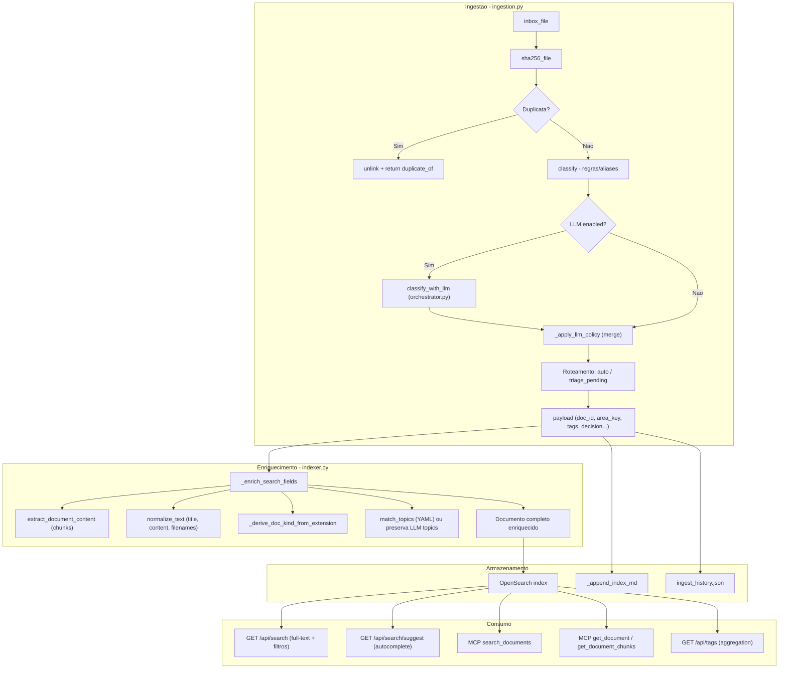

# Busca com filtros, Stats/Agregacao e Contexto LLM

## Visao geral: campos do AtlasFile -- origem, derivacao e uso

Todos os campos indexados no OpenSearch, organizados por **quem os produz** e **quem os consome/altera**.

### Grupo 1 -- Identidade e metadados de arquivo (automaticos, nunca alterados por LLM)


| Campo                           | Tipo OS            | Produzido por                                                | Consumido por                          |
| ------------------------------- | ------------------ | ------------------------------------------------------------ | -------------------------------------- |
| `doc_id`                        | keyword            | `uuid4()` em `ingestion.py:334`                              | Chave primaria em toda a aplicacao     |
| `project_id`                    | keyword            | `profile["project_id"]` em `ingestion.py:308`                | Filtro em search, reconcile, stats     |
| `sha256`                        | keyword            | `utils.sha256_file()` em `ingestion.py:309`                  | Dedup early check (`_find_original_`*) |
| `original_filename`             | keyword            | `inbox_file.name` em `ingestion.py:482`                      | Exibicao UI, search highlight          |
| `original_filename_text`        | text               | `_enrich_search_fields` em `indexer.py:238`                  | Full-text search                       |
| `original_filename_normalized`  | text               | `normalize_text()` em `indexer.py:239`                       | Busca normalizada (sem acentos)        |
| `original_filename_suggest`     | search_as_you_type | `_enrich_search_fields` em `indexer.py:243`                  | Autocomplete (modal cmd+K)             |
| `canonical_filename`            | keyword            | `build_canonical_filename()` em `ingestion.py:391`           | Path final, exibicao                   |
| `canonical_filename_text`       | text               | `indexer.py:240`                                             | Full-text search                       |
| `canonical_filename_normalized` | text               | `indexer.py:241`                                             | Busca normalizada                      |
| `path`                          | keyword            | Destino final (auto ou triage) em `ingestion.py:405/417/449` | Download link, reconcile               |
| `extension`                     | keyword            | `Path(path).suffix.lower()` em `indexer.py:225`              | (Nao usado em filtros hoje)            |
| `doc_kind`                      | keyword            | `_derive_doc_kind_from_extension()` em `indexer.py:227`      | (Nao usado em filtros hoje)            |


### Grupo 2 -- Conteudo extraido (automatico, nunca alterado por LLM)


| Campo                       | Tipo OS                                  | Produzido por                                                | Consumido por                             |
| --------------------------- | ---------------------------------------- | ------------------------------------------------------------ | ----------------------------------------- |
| `title`                     | text                                     | `inbox_file.stem` em `ingestion.py:480`                      | Search ranking (boost 5x)                 |
| `title_normalized`          | text                                     | `normalize_text()` em `indexer.py:235`                       | Busca normalizada                         |
| `title_suggest`             | search_as_you_type                       | `indexer.py:242`                                             | Autocomplete                              |
| `content`                   | text                                     | `extract_document_content()` via `indexer.py:198-207`        | Full-text search, LLM chat chunks         |
| `content_normalized`        | text                                     | `normalize_text()` em `indexer.py:236`                       | Busca normalizada                         |
| `content_chunks`            | nested {location, text, text_normalized} | Chunking em `document_extractor.py` via `indexer.py:210-219` | Search inner_hits (evidencias por pagina) |
| `content_chunks_text`       | text                                     | Chunks concatenados em `indexer.py:208`                      | Full-text search (boost 2x)               |
| `content_chunks_normalized` | text                                     | `indexer.py:237`                                             | Busca normalizada                         |
| `chunk_locations`           | keyword                                  | IDs dos chunks (ex: `page:1`) em `indexer.py:209`            | Exibicao de localidade nos resultados     |
| `content_type`              | keyword                                  | MIME type da extracao em `indexer.py:222`                    | Icone no frontend                         |
| `extraction_status`         | keyword                                  | `ok`, `partial`, `error` em `indexer.py:223`                 | Diagnostico                               |
| `extraction_metadata`       | object (disabled)                        | Metadados da extracao em `indexer.py:224`                    | Nao indexado (storage only)               |


### Grupo 3 -- Classificacao (regras + LLM pode alterar)


| Campo              | Tipo OS         | Produzido por                                                                                 | LLM pode alterar?                                          | Condicao para LLM alterar                                                                                                 |
| ------------------ | --------------- | --------------------------------------------------------------------------------------------- | ---------------------------------------------------------- | ------------------------------------------------------------------------------------------------------------------------- |
| `area_key`         | keyword         | `classify()` (alias scoring/routing rules) em `ingestion.py:336`                              | Sim (mode=full_override)                                   | `max_area_changes >= 1` AND confidence do regra < `area_override_only_if_rule_confidence_below` AND explanation fornecida |
| `confidence_score` | float           | `classify()` em `ingestion.py:367`                                                            | Sim                                                        | `"confidence" in allow_override_fields`                                                                                   |
| `document_type`    | keyword         | LLM via `submit_classification`                                                               | Sim (e a fonte primaria)                                   | `"document_type" in allow_override_fields`                                                                                |
| `tags`             | keyword (array) | `[area_key] + classification.suggested_tags` em `ingestion.py:470-475`                        | Sim                                                        | `"tags" in allow_override_fields`                                                                                         |
| `topics`           | keyword (array) | `match_topics()` (synonym_match do YAML) em `indexer.py:255` OU LLM em `ingestion.py:498-500` | Sim                                                        | `"topics" in allow_override_fields`; se LLM fornece, indexer preserva (pre_source = "llm_policy")                         |
| `topics_source`    | keyword         | `"synonym_match"`, `"llm_policy"`, ou `"none"` em `indexer.py:248/261`                        | Indiretamente (se LLM fornece topics, source = llm_policy) | Automatico                                                                                                                |
| `decision`         | keyword         | `auto`, `triage_pending`, `duplicate` em `ingestion.py:404/416/448/326`                       | Indiretamente (mode=review forca `triage_pending`)         | `force_triage_pending` em `_apply_llm_policy`                                                                             |
| `review_status`    | keyword         | `"needs_review"` se conf < threshold em `ingestion.py:501-502`                                | Indiretamente (LLM pode alterar confidence)                | --                                                                                                                        |


### Grupo 4 -- Proveniencia e timestamps (automaticos, nunca alterados por LLM)


| Campo            | Tipo OS | Produzido por                                                   | Consumido por                          |
| ---------------- | ------- | --------------------------------------------------------------- | -------------------------------------- |
| `source_channel` | keyword | Hardcoded `""` em `ingestion.py:485`                            | Futuro: integracao com canais externos |
| `source_ref`     | keyword | Hardcoded `""` em `ingestion.py:486`                            | Futuro                                 |
| `sender`         | keyword | Hardcoded `""` em `ingestion.py:487`                            | Futuro                                 |
| `received_at`    | date    | Hardcoded `None` em `ingestion.py:488`                          | Futuro                                 |
| `ingested_at`    | date    | `utc_now_iso()` em `ingestion.py:380`                           | Filtro date_from/date_to no search     |
| `processed_at`   | date    | `utc_now_iso()` em `ingestion.py:490`                           | Ordenacao, auditoria                   |
| `correspondent`  | keyword | Nao populado na ingestao; alteravel via MCP tool `set_metadata` | Futuro: filtro, exibicao               |


### Fluxo de dados por etapa




### O que o LLM de classificacao recebe HOJE vs. o que DEVERIA receber


| Dado                                               | Recebe hoje? | Deveria receber?                                        |
| -------------------------------------------------- | ------------ | ------------------------------------------------------- |
| Trecho do documento (text_excerpt, max 8000 chars) | Sim          | Sim                                                     |
| Nome do arquivo (filename)                         | Sim          | Sim                                                     |
| doc_id                                             | Sim          | Sim                                                     |
| Lista de work_areas (key + aliases)                | **NAO**      | **SIM** -- para classificar dentro das areas existentes |
| Topics validos (keys do topics_v1.yaml)            | **NAO**      | **SIM** -- para sugerir topics corretos                 |
| Instrucao para propor area nova                    | **NAO**      | **SIM** -- para nao forcar match em area inadequada     |
| Instrucao de calibracao de confidence              | **NAO**      | **SIM** -- para evitar 0.98 em classificacoes ambiguas  |


---

## Gaps identificados e aprovados

Cinco gaps:

1. O LLM de classificacao opera sem contexto de areas/topics do projeto
2. Falta filtro `doc_kind` no endpoint de busca
3. Nao existe endpoint de stats/agregacao
4. O LLM de chat nao tem tool de contagem nem conhece os filtros
5. A UI de busca (card Resultados completos) nao tem input proprio nem filtros

---

## Frente 1 -- Prompt de classificacao com contexto do projeto

**Problema**: `system_prompt_classify.md` e generico; o LLM nao recebe work_areas, aliases nem topics validos. Resultado: classificacoes incorretas (ex: Marketing & Products -> contratos_comunicacao).

**Mudancas**:

- [backend/app/orchestrator.py](backend/app/orchestrator.py) -- `classify_with_llm()` (linha 275): receber `profile` como novo parametro. Montar dinamicamente o bloco de contexto injetado no user message (antes do trecho do documento):

```
Areas disponíveis neste projeto:
- societario_fiscal (aliases: societario, fiscal, cnpj, filiais, incorporacao, estabelecimentos)
- juridica (aliases: juridico, passivo, contingencia, parecer)
- ...

Topics validos: marketing, produtos, tecnologia, IA, ...

Se nenhuma area existente for adequada, proponha uma nova area_key descritiva e explique o motivo em "explanation".
Se a classificacao for ambigua, use confidence < 0.6.
```

- [backend/app/orchestrator.py](backend/app/orchestrator.py) -- `_classify_openai()` (linha 317) e `_classify_anthropic()` (linha 351): o `user_content` passa a incluir o bloco de contexto antes do trecho.
- [backend/app/prompts/system_prompt_classify.md](backend/app/prompts/system_prompt_classify.md) -- Reescrever para instruir o LLM a usar o contexto de areas fornecido, calibrar confidence, e poder propor areas novas.
- [backend/app/ingestion.py](backend/app/ingestion.py) -- Ajustar a chamada a `classify_with_llm` (linha ~343) para passar `profile`.
- [backend/app/topics.py](backend/app/topics.py) -- Expor funcao publica `get_topic_keys(profile)` que retorna a lista de keys validas para injetar no prompt.

**Testes**:

- Novo: `test_classify_with_llm_receives_project_context` -- mock do LLM verificando que o user_content contem areas e topics
- Existente: `test_ingestion_llm_policy.py` -- garantir nao-regressao

---

## Frente 2 -- Backend: filtro `doc_kind` no search + endpoint `GET /api/stats`

### 2a. Filtro `doc_kind` no `GET /api/search`

- [backend/app/main.py](backend/app/main.py) -- Adicionar parametro `doc_kind: str | None = Query(None)` na funcao `search()` (linha 1311). Adicionar `filters.append({"term": {"doc_kind": doc_kind}})` no bloco de filtros (apos linha 1427).

### 2b. Novo endpoint `GET /api/stats`

- [backend/app/main.py](backend/app/main.py) -- Novo endpoint:

```python
@app.get("/api/stats")
def get_stats(project_id: str | None = Query(None)):
```

Executa uma unica query OpenSearch com `size: 0` e aggregations:

- `by_doc_kind`: `terms` em `doc_kind`, size 20
- `by_area_key`: `terms` em `area_key`, size 50
- `by_document_type`: `terms` em `document_type`, size 50
- `by_extension`: `terms` em `extension`, size 30
- `by_tags`: `terms` em `tags`, size 100
- `total_documents`: usa `hits.total.value`

Se `project_id` fornecido, adiciona filtro `_project_scope_filter`.

Retorno:

```json
{
  "project_id": "Kaido" | null,
  "total_documents": 8,
  "by_doc_kind": [{"key": "pdf", "count": 5}, ...],
  "by_area_key": [...],
  "by_document_type": [...],
  "by_extension": [...],
  "by_tags": [...]
}
```

- [backend/app/models.py](backend/app/models.py) -- Adicionar `StatsResponse` e `StatsBucket` Pydantic models.

**Testes**:

- Novo: `backend/tests/unit/test_stats_endpoint.py` -- mock do OpenSearch, verificar shape do retorno e filtro por project_id
- Existente: `test_api_profile_layout.py` -- garantir nao-regressao

---

## Frente 3 -- MCP tools: `get_stats` + `doc_kind` no `search_documents`

- [backend/app/mcp/server.py](backend/app/mcp/server.py) -- Adicionar parametro `doc_kind: str | None = None` na tool `search_documents` (linha 27). Passar para params se fornecido.
- [backend/app/mcp/server.py](backend/app/mcp/server.py) -- Nova tool:

```python
@mcp.tool()
def get_stats(project_id: str | None = None) -> str:
    """Get document statistics and counts. Returns total_documents and breakdowns by doc_kind (pdf, docx, xlsx, pptx, plain_text...), area_key, document_type, extension, and tags. Each breakdown has key and count. Use this to answer quantity questions like 'how many PDFs?' or 'document distribution by area'."""
    params = {}
    if project_id:
        params["project_id"] = project_id
    data = get("/api/stats", params=params or None)
    return json.dumps(data, ensure_ascii=False)
```

**Testes**:

- Existentes do MCP continuam funcionando (nenhum parametro obrigatorio adicionado)

---

## Frente 4 -- System prompt do chat

- [backend/app/prompts/system_prompt_chat.md](backend/app/prompts/system_prompt_chat.md) -- Adicionar instrucoes sobre:
  - Tool `get_stats` para perguntas quantitativas ("quantos PDFs?", "distribuicao por area")
  - Filtros disponiveis em `search_documents`: `doc_kind` (pdf, docx, xlsx, pptx, plain_text, html, msg), `document_type` (contrato, nota_fiscal, etc.), `area_key`, `tags`, `date_from`/`date_to`
  - Estrategia: para "liste contratos com X" usar `search_documents(q="X", document_type="contrato")`; para "quantos PDFs?" usar `get_stats()`

**Testes**: nao aplica (arquivo de prompt estatico)

---

## Frente 5 -- Frontend: input de busca + filtros no card Resultados completos

### 5a. Backend API client

- [frontend/src/api.ts](frontend/src/api.ts) -- Alterar `searchDocuments` para aceitar filtros opcionais:

```typescript
export interface SearchFilters {
  doc_kind?: string;
  document_type?: string;
  area_key?: string;
  tags?: string[];
}

export async function searchDocuments(
  query: string,
  projectId?: string,
  page = 1,
  size = 20,
  filters?: SearchFilters
): Promise<SearchResponse> {
```

Adicionar cada filtro como query param se presente.

- [frontend/src/api.ts](frontend/src/api.ts) -- Nova funcao `fetchStats`:

```typescript
export async function fetchStats(projectId?: string): Promise<StatsResponse> {
```

- [frontend/src/types.ts](frontend/src/types.ts) -- Adicionar interfaces `StatsResponse`, `StatsBucket`, `SearchFilters`.

### 5b. Card Resultados completos -- input + filtros

Estado atual (linhas 1030-1101 de [App.tsx](frontend/src/App.tsx)):

- Card aparece quando `fullQuery` esta preenchido (via Enter no modal)
- Cabecalho: titulo + `consulta: "..." | N resultado(s)` + botao "Limpar busca"
- Lista paginada + footer com paginacao

**Mudancas**:

Abaixo do cabecalho, adicionar:

1. **Input de busca**: pre-preenchido com `fullQuery`. Submit via Enter ou botao. Ao submeter, chama `runFullSearch(1)` com o novo texto e filtros ativos. Reseta pagina para 1.
2. **Linha de filtros** (colapsavel `details/summary`, mesma estetica dos colapsaveis do profile editor):
  - Formato: `<select>` com opcoes vindas de `stats.by_doc_kind` + "Todos"
  - Tipo doc: `<select>` com opcoes vindas de `stats.by_document_type` + "Todos"
  - Area: `<select>` com opcoes vindas de `stats.by_area_key` + "Todas"
  - Ao mudar qualquer filtro: re-executa busca com filtros aplicados, pagina volta para 1
3. **Estado adicional em App.tsx**:
  - `searchFilters: SearchFilters` (doc_kind, document_type, area_key)
  - `searchStats: StatsResponse | null` -- carregado ao abrir o card
4. `**runFullSearch`**: passa os filtros para `searchDocuments()`
5. **Atualizacao do total**: `N resultado(s)` ja reflete o total filtrado (vem do backend)

### Mockup do card:

```
+-------------------------------------------------------------+
|  [icone] Resultados completos                  [Limpar X]    |
|                                                              |
|  [vicio critico________________________] [Buscar]            |
|                                                              |
|  > Filtros                                                   |
|  +----------------------------------------------------------+|
|  | Formato: [Todos v]  Tipo: [Todos v]  Area: [Todas v]    ||
|  +----------------------------------------------------------+|
|                                                              |
|  12 resultado(s) -- pagina 1/1                               |
|                                                              |
|  Kaido > 01_societario_fiscal                                |
|  [icone] docusign_project_neptune_spa_anexos...pdf           |
|  ... "Vicio Critico" significa, de forma ...                 |
|  Local: page:15 (1) | page:16 (1) e outras 7                |
|                                                              |
|  Kaido > 05_contratos_comunicacao                            |
|  [icone] 4600051808_-_contrato_original__v01.pdf             |
|  Nenhum dado critico de usuarios deve ser replicado ...      |
|  Local: Trecho de conteudo | Conteudo                        |
|                                                              |
|  ...                                                         |
|                                                              |
|                      [Anterior] [Proxima]                    |
+-------------------------------------------------------------+
```

### 5c. Modal (cmd+K) -- sem alteracao funcional

O modal permanece como esta: input rapido, top 6 hits em tempo real, Enter transfere para o card completo. Nenhum filtro adicionado ao modal.

**Testes**:

- Atualizar: `frontend/src/App.test.tsx` -- ajustar mock de `searchDocuments` para nova assinatura (novo parametro `filters` opcional)
- Atualizar: `frontend/src/api.test.ts` -- teste de `searchDocuments` com filtros; novo teste para `fetchStats`
- Novo: teste do card com input de busca e filtros renderizados

---

## Ordem de implementacao

1. Frente 2 (backend stats + doc_kind) -- sem dependencias
2. Frente 3 (MCP tools) -- depende de 2
3. Frente 1 (prompt classificacao) -- independente
4. Frente 4 (prompt chat) -- depende de 3
5. Frente 5 (frontend) -- depende de 2

Frentes 1 e 2 podem ser executadas em paralelo.

---

## Arquivos alterados (resumo)

- `backend/app/main.py` -- filtro doc_kind + endpoint stats
- `backend/app/models.py` -- StatsResponse, StatsBucket
- `backend/app/orchestrator.py` -- profile como param, contexto no prompt
- `backend/app/ingestion.py` -- passa profile ao classify_with_llm
- `backend/app/topics.py` -- get_topic_keys()
- `backend/app/prompts/system_prompt_classify.md` -- reescrita
- `backend/app/prompts/system_prompt_chat.md` -- instrucoes stats/filtros
- `backend/app/mcp/server.py` -- doc_kind em search + nova tool get_stats
- `frontend/src/api.ts` -- filtros em searchDocuments + fetchStats
- `frontend/src/types.ts` -- novas interfaces
- `frontend/src/App.tsx` -- input + filtros no card Resultados completos
- `frontend/src/styles.css` -- estilos do input/filtros (reutilizar variaveis existentes)
- Testes novos: `test_stats_endpoint.py`, `test_classify_context.py`
- Testes atualizados: `App.test.tsx`, `api.test.ts`

