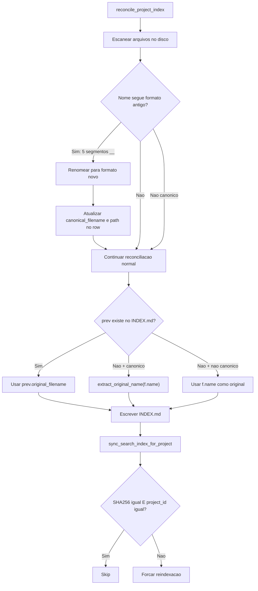

# Formato canonico configuravel + fix de bugs de metadados

## Contexto

Formato atual (hardcoded): `YYYYMMDD__proj__area__sanitize_token(title)__vNN.ext`
Formato novo (default configuravel): `{date}__{project}__{original_name}` + `__v{version}{ext}` (mandatorio)

Mudancas chave:

- **Formato configuravel por template/profile** — o usuario define quais campos compoe o nome
- Remove `area_key` do formato default (redundante — ja esta na pasta e no indice; pode mudar se template mudar)
- **Preserva o nome original do arquivo sem sanitizacao** (sem lowercase, sem remover acentos, sem colapsar underscores)
- Unica limpeza: remover chars invalidos de filesystem (`/ \ : * ? < > |`)
- Sufixo `__v{version}{ext}` e **sempre adicionado pelo sistema** — o usuario configura apenas o prefixo
- Parsing reverso e nao-ambiguo: posicao de `{original_name}` determinada pelo pattern

Decisoes do usuario:

- **Migracao**: renomear automaticamente na reconciliacao
- **Versao**: manter `area_key` internamente no calculo de versao (evitar colisao), mas nao exibir no nome por default
- **Sanitizacao do titulo**: nenhuma (preservar nome original intacto, apenas chars de filesystem)
- **Configuracao**: junto com simplificacao, nao em sequencia

## Arquivos a alterar

### 0. Template e Profile schema

`**config/templates/default.json`** — Adicionar secao `naming`:

```json
{
  "naming": {
    "_available_fields": {
      "date": "Data de ingestao (formato definido em date_format)",
      "project": "ID do projeto (normalizado, lowercase, sem acentos)",
      "area": "Area classificada (ex: financeiro, juridica)",
      "original_name": "Nome original do arquivo sem extensao (preservado intacto)",
      "document_type": "Tipo classificado (ex: contrato, relatorio, ata)"
    },
    "_mandatory_suffix": "__v{version}{ext} (adicionado automaticamente pelo sistema)",
    "canonical_pattern": "{date}__{project}__{original_name}",
    "date_format": "%Y%m%d"
  }
}
```

- `_available_fields`: documentacao inline dos campos disponiveis (prefixo `_` indica metadata, nao campo funcional)
- `_mandatory_suffix`: documentacao do sufixo obrigatorio
- `canonical_pattern`: o pattern configuravel pelo usuario. `**{original_name}` e obrigatorio** — validado em runtime
- `date_format`: formato strftime para `{date}`
- Resultado final: `{canonical_pattern resolvido}__v{version}{ext}`

Exemplos de patterns que o usuario pode configurar:

- `{date}__{project}__{original_name}` (default)
- `{date}__{project}__{area}__{original_name}` (formato legado para quem preferir)
- `{original_name}` (minimalista)
- `{project}__{document_type}__{original_name}` (por tipo)

`**backend/app/profile_schema_v2.py`** (se existir) ou validacao inline — validar que `canonical_pattern` contem `{original_name}`.

### 1. `backend/app/utils.py` (L36-49)

**Mudanca**: `build_canonical_filename` passa a receber o `canonical_pattern` do profile e um dict de campos resolvidos:

```python
_FS_INVALID_RE = re.compile(r'[/\\:*?"<>|]')
_CANONICAL_TAIL_RE = re.compile(r"__v(\d{2})(\.\w+)$")
DEFAULT_CANONICAL_PATTERN = "{date}__{project}__{original_name}"

def _fs_safe(value: str) -> str:
    """Remove apenas chars invalidos em filesystem. Preserva case, acentos e underscores."""
    return _FS_INVALID_RE.sub("", value).strip()

def build_canonical_filename(
    *,
    pattern: str = DEFAULT_CANONICAL_PATTERN,
    date_format: str = "%Y%m%d",
    fields: dict[str, str],
    original_suffix: str,
    version: int = 1,
) -> str:
    resolved_fields = {
        "date": datetime.now().strftime(date_format),
        "project": sanitize_token(fields.get("project", "")),
        "area": sanitize_token(fields.get("area", "")),
        "original_name": _fs_safe(fields.get("original_name", "documento")),
        "document_type": sanitize_token(fields.get("document_type", "")),
    }
    prefix = pattern.format(**resolved_fields)
    return f"{prefix}__v{version:02d}{original_suffix.lower()}"
```

Nota: `project`, `area` e `document_type` usam `sanitize_token` (sao IDs tecnicos). Apenas `original_name` usa `_fs_safe` (preserva case/acentos).

**Funcao de parsing reverso** — precisa do pattern para saber quantos segmentos `__` pular antes de `{original_name}`:

```python
def extract_original_name_from_canonical(canonical: str, pattern: str = DEFAULT_CANONICAL_PATTERN) -> str | None:
    """Extrai nome original + extensao do formato canonico usando o pattern."""
    tail = _CANONICAL_TAIL_RE.search(canonical)
    if not tail:
        return None
    ext = tail.group(2)
    without_tail = canonical[:tail.start()]
    # Contar segmentos __ antes de {original_name} no pattern
    prefix_part = pattern.split("{original_name}")[0]
    n_prefix_segments = prefix_part.count("__") + (1 if prefix_part and not prefix_part.endswith("__") else 0)
    parts = without_tail.split("__", n_prefix_segments)
    if len(parts) <= n_prefix_segments:
        return None
    return parts[n_prefix_segments] + ext
```

Para pattern `{date}__{project}__{original_name}`: prefix = `{date}__{project}__`, n_prefix_segments = 2, `split("__", 2)[2]` = original_name.

### 2. `backend/app/ingestion.py`

- **L421-427**: Carregar `naming.canonical_pattern` e `naming.date_format` do profile; passar como `pattern` e `date_format` para `build_canonical_filename`; montar `fields` dict com `project`, `area`, `original_name` (= `inbox_file.stem`), `document_type`
- **L237-275** (`_find_latest_version`): O escopo de versao mantem `(project, area, title)` internamente. O token de busca em arquivos no disco usa `sanitize_token` do titulo para comparacao case-insensitive. Para arquivos no novo formato (sem area no nome), adicionar busca complementar com token `__{project}__{title}__v` (sanitizado para matching). Buscar com AMBOS padroes (antigo e novo)

### 3. `backend/app/reconcile.py`

**Bug fix 1 — Sync incremental nao atualiza metadados (L422-430)**:

- Alterar `_source=["sha256"]` para `_source=["sha256", "project_id"]`
- Comparar `project_id` alem de SHA256; se diferir, forcar reindexacao

**Bug fix 2 — `original_filename` reconstruido (L144)**:

- Quando `prev` e `None`, em vez de usar `f.name` (canonico), chamar `extract_original_name_from_canonical(f.name, f.suffix)` para extrair a parte do titulo + extensao
- Para arquivos que nao seguem o formato canonico (sem `__vNN`), manter `f.name` como fallback

**Migracao automatica (nova logica em `reconcile_project_index`)**:

- Ao escanear arquivos, se o nome segue o formato ANTIGO (`YYYYMMDD__proj__area__title__vNN.ext` — 5 segmentos com `_`_), renomear para o novo formato (`YYYYMMDD__proj__title__vNN.ext` — 4 segmentos)
- Usar `os.rename()` no disco e atualizar `canonical_filename` e `path` no row
- Logar a migracao

**Bug fix 3 — `cleanup_orphan_projects` (L295-342)**:

- Na comparacao `indexed_ids - valid_project_ids` (L320), normalizar ambos os lados com `normalize_text()` e `_canonical()` (space/underscore)

### 4. `backend/app/main.py`

- **L1442-1455** (`decide_triage`): Usar `build_canonical_filename` com pattern do profile ao construir canonical_filename durante triage resolve
- **Expor naming config na API** (se necessario para o editor de templates no frontend)

### 5. `backend/tests/`

- `test_utils.py` (L57-68): Atualizar `test_build_canonical_filename` para novo formato (sem area)
- `test_reconcile.py`: Atualizar fixtures com formato novo; adicionar teste de migracao automatica (formato antigo -> novo)
- `test_project_id_normalization.py`: Adicionar teste de `extract_original_name_from_canonical`
- `test_ingestion_dedup.py`: Atualizar mocks com formato novo
- `test_api_search.py`: Atualizar mocks

### 6. Documentacao

- `docs/04_naming_convention.md`: Atualizar formato e exemplos
- `docs/05_index_models.md`: Atualizar formato
- `docs/09_field_mapping.md`: Atualizar descricao de `canonical_filename`
- `README.md` (L139, 142): Atualizar exemplos
- `CHANGELOG.md`: Registrar mudanca

## Fluxo de migracao




## Formato de deteccao antigo vs novo

Deteccao usa `split("__", 2)` no prefixo (antes de `__vNN.ext`) + regex `__v\d{2}\.\w+$` no final:

- **Canonico (antigo ou novo)**: bate com `__v\d{2}\.\w+$` no final
- **Antigo vs novo**: diferenciar pelo conteudo — se o 3o segmento (apos split) contem `sanitize_token(area_key)` de alguma area do profile, e formato antigo; caso contrario, e novo ou titulo que coincidentemente parece area
- **Abordagem pragmatica para migracao**: para cada arquivo canonico, tentar extrair area_key do formato antigo (regex com 5 segmentos conhecidos via `sanitize_token`). Se bater, renomear removendo o segmento de area
- **Nao canonico**: nao bate com `__v\d{2}\.\w+$` (ex: `Slide Resumo Jan25.pdf`)

## Riscos e mitigacoes

- **Risco**: Rename automatico pode causar conflito se dois arquivos de areas diferentes produzem o mesmo nome novo
  - **Mitigacao**: verificar existencia do destino antes de renomear; se existir, manter nome antigo e logar warning
- **Risco**: `_find_latest_version` pode nao encontrar versoes em formato antigo
  - **Mitigacao**: buscar com AMBOS os padroes (antigo e novo) no calculo de versao
- **Risco**: Titulo sem sanitize_token pode conter chars que causem problemas em alguns filesystems (ex: acentos em FAT32)
  - **Mitigacao**: apenas chars invalidos de filesystem sao removidos (`/ \ : * ? < > |`); acentos e case sao preservados. Filesystems modernos (APFS, NTFS, ext4) suportam Unicode sem problemas
- **Nota sobre `original_filename`**: Para arquivos migrados do formato antigo, o titulo extraido sera a versao sanitizada (lowercase, sem acentos) pois `sanitize_token` ja foi aplicado na criacao original. O nome exato original esta perdido para esses arquivos. Novos arquivos terao o nome original preservado

