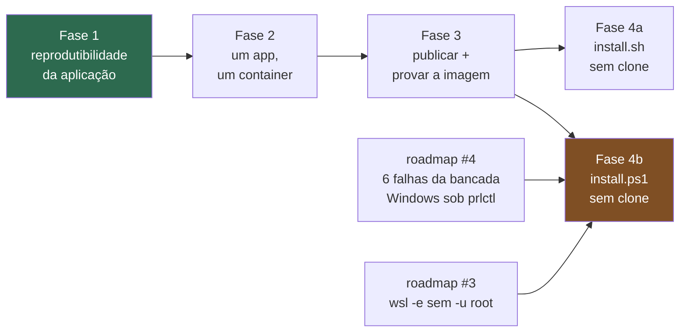

# AtlasFile — distribuir a build em vez de compilar na máquina do usuário

> **Status: plano refinado, nada executado.** Medições e referências de linha
> valem para a `main` em 2026-07-29 (**v0.56.5**). O documento foi escrito
> contra a v0.56.2 e **recalibrado no mesmo dia contra a v0.56.5**, depois que
> os PRs #7–#9 tocaram `install.sh`, `install.ps1`, `win/run.ps1` e `ci.yml`
> (itens já resolvidos estão marcados; números remedidos). Toda afirmação é
> **fato verificado no código**, salvo onde marcada como inferência ou
> desconhecido.
>
> Quando alguma fase for executada, o registro vai para
> `docs/planos_concluidos/` com o checklist do `CLAUDE.md`. Enquanto não for,
> o lugar deste documento no repositório é `docs/roadmap/` (o rascunho
> `plan_one_line_installer.md`, superado, foi movido para
> `docs/planos_concluidos/` em 2026-07-29).

---

## Context

O `install.sh` hoje clona o repositório e roda `docker compose build` na máquina
do usuário (`install.sh:2488-2502` e `install.sh:2646`). A pergunta que originou
este plano era se distribuir a build pronta não seria mais simples. Medi antes de
responder, e a resposta mudou de forma com os dados: **o ganho não é tempo, é o
artefato**.

### O argumento fraco: tempo de compilação

94s a frio num runner x86 (CI run 30406119732, step "Build das imagens") e 48s
numa VM ARM64 e 1m05s num Windows 11 real (medições registradas em
`install.sh:242-243`). Ninguém está esperando 15 minutos.

**Resolvido na v0.56.5:** a questão do "~15 min" morreu antes deste plano
executar. O roadmap item 5 recalibrou os textos com medições reais (build
1m05s num Windows 11 real, 48s numa VM ARM64, 94s no runner x86) — hoje
`install.ps1:2386` diz `"first run builds images (~1-2 min)"` e **não existe
mais "15 min" em nenhum dos dois instaladores**. O que resta para as Fases
4a/4b é trocar a semântica ("builds/compiles" → "pulls"), não o número.

### O argumento forte: o artefato instalado nunca é o artefato testado

**Camada de aplicação — o que a Fase 1 fecha:**

- `backend/requirements.txt` tem **9 de 25** deps com piso `>=` e nenhum teto
  (linhas 9, 12, 16, 17, 18, 19, 20, 24, 25).
- **`mcp>=1.0.0` (`requirements.txt:17`) é um piso falso — fragilidade real,
  não defeito ativo** (narrativa recalibrada na v0.56.5).
  `backend/app/mcp_client/client.py:7` importa `streamable_http_client` de
  `mcp.client.streamable_http`. Fatos verificados: o venv de referência
  (`backend/.venv`, **Python 3.11**, `mcp` **1.26.0**) tem o símbolo, e um
  `pip install` fresco resolve para o topo do índice e funciona — o
  `streamablehttp_client` antigo é que está `@deprecated` no 1.26.0. A versão
  quebrada não chega por resolve limpo; chega por **ambiente que já satisfaz o
  piso com um `mcp` antigo** (o site-packages global do pyenv desta máquina
  tem `mcp` 1.9.3, onde o símbolo novo não existe — exatamente o cenário que o
  stub de `backend/tests/conftest.py:11-21` mitiga). E a suíte não provaria o
  contrário: `backend/tests/unit/test_mcp_client.py:39,68` fazem
  `patch("app.mcp_client.client.streamable_http_client", ...)` — patch por
  atributo num módulo já importado — e não há teste afirmando que o símbolo
  real resolve.
- `backend/requirements-dev.txt` **contradiz** `requirements.txt`: redeclara
  `httpx>=0.24.0` contra `httpx>=0.27.0` (`requirements.txt:18`) e duplica
  `scikit-learn==1.8.0`. Ou seja, a bancada roda com um piso mais baixo que o
  produto.
- `frontend/package.json:31` declara `"lucide-react": "latest"` — **o único
  outlier entre 39 dependências**, todas as outras com caret. O lockfile trava
  `0.576.0` (`package-lock.json:4913-4914`). O CI usa `npm ci` (`ci.yml:73` → lê
  o lock), mas `frontend/Dockerfile:6` usa `npm install` (dist-tag → re-resolve e
  **reescreve o lockfile dentro da imagem**). **Divergência provada entre bancada
  e produto**, e o `Makefile:52,67` faz `docker builder prune --keep-storage=2GB`
  todo ciclo, o que garante que essa camada seja reexecutada com frequência —
  transformando drift teórico em drift recorrente.

**Camadas que a Fase 1 NÃO fecha — só a imagem publicada fecha:**

- `backend/Dockerfile:8-14` instala `poppler-utils`, `tesseract-ocr`,
  `tesseract-ocr-por` e `unrar-free` **sem versão**. OCR é função central do
  produto. Pinar apt é possível mas frágil: quando o Debian remove a versão
  antiga, o build quebra em vez de divergir.
- `FROM python:3.12-slim` (`backend/Dockerfile:1`) e `node:22-alpine`
  (`frontend/Dockerfile:1`) são tags móveis, sem digest.
- **Ninguém testa a imagem.** O job `docker-build` (`ci.yml:368-386`) roda
  exatamente `cp .env.example .env` e `docker compose build`. Não sobe container,
  não faz request, não tagueia, não empurra, não escaneia, não usa cache de
  buildx (apesar do `setup-buildx-action`), não é multi-arch.
- **Zero testes tocam uma stack real.** Verificado: nenhuma ocorrência de
  `localhost:9200`, `opensearch:9200` ou testcontainers em `backend/tests/`
  (93 arquivos); `conftest.py:1` declara o mock, e `ci.yml:50-52` documenta que a
  ausência de `services:` é deliberada. O incidente do circuit breaker registrado
  em `docker-compose.yml:8-9` é exatamente a classe de falha que esse mock não
  pode pegar.
- **O CI nem instala `unrar-free`** (`ci.yml:36-38` lista 3 dos 4 pacotes apt do
  Dockerfile), então o caminho `rarfile==4.2` é inexercitado.

Mesmo com pin perfeito, **build reprodutível ≠ artefato testado**: o CI compila em
`ubuntu-latest` amd64, o usuário compila em arm64. Distribuir a imagem é o que faz
o usuário rodar **o mesmo bit** que passou na bancada.

### Defeitos arquiteturais que a consolidação corrige

| Defeito | Evidência |
|---|---|
| Servidor de desenvolvimento em produção | `frontend/Dockerfile:12` → `CMD ["npm","run","dev"]`; `vite --host 0.0.0.0` (`package.json:7`). Sem minificação, HMR aberto, source maps. O `vite build` só roda no CI (`ci.yml:75-78`) — a imagem nunca o executa. |
| Acesso remoto quebrado | `docker-compose.yml:122` fixa `VITE_API_URL=http://localhost:8000` (hardcoded, sem `${…:-}`), anulando o fallback de `frontend/src/api.ts:45-49`. Abrir de outra máquina faz o browser dela procurar a API no `localhost` dela. Assimetria: o irmão `DASHBOARDS_PUBLIC_URL` **é** parametrizado (`docker-compose.yml:62`). |
| 5 containers para 2 | `api` e `mcp` têm blocos `build:` idênticos (`docker-compose.yml:46-48` e `100-102`), diferindo só no `command:` (`:105`). |
| Segredo assado na imagem | `backend/Dockerfile:20` faz `COPY config /workspace/config`; `config.py:139` lê `/workspace/config/api_keys.json`. O comentário `docker-compose.yml:85-86` admite: "mudou key, rebuild do api". A key mora numa camada de imagem. |
| `frontend/` sem `.dockerignore` | `frontend/Dockerfile:8` faz `COPY . .` e o `.dockerignore` da raiz **não se aplica** (contexto é `./frontend`). Numa máquina que rodou `npm install` local, o `node_modules` do host entra e sobrescreve o install nativo do container. |
| Zero tags, zero releases | `git tag` → vazio. "Ele está rodando a 0.56.2" não é verificável. |
| Build na máquina do usuário | Incidente real em `Makefile:44-48`: 36 GB de cache derrubaram a ingestão por disco cheio (2026-07-25). |

### Peso removível — medido na Docker Hub API hoje

| Componente | amd64 | arm64 |
|---|---:|---:|
| `opensearchproject/opensearch:2.17.1` | 924 MiB (969 MB) | 701 MiB (735 MB) |
| `opensearchproject/opensearch-dashboards:2.17.1` | 430 MiB (451 MB) | 428 MiB (449 MB) |

Dashboards é **um terço do download de terceiros** e o acoplamento é raso: um link
em `frontend/src/views/PainelView.tsx:497` (via `getObservabilityUrl()`,
`api.ts:109`), o endpoint `/api/observability/open` (`main.py:1251-1281`) e o
auto-import em background já gated por `dashboards_auto_import`
(`dashboards_setup.py:70`) → vira opt-in barato.

O OpenSearch **não** é reduzível: as 79 tags publicadas não têm variante
`-slim`/`-alpine`; remover plugins numa camada derivada não diminui o pull; e o
k-NN é obrigatório (`config.py:154`, `opensearch_chunk_vectors_index`).

### Resultado alvo (arm64)

| | Hoje | Depois |
|---|---:|---:|
| Download total | ~1.648 MB | **~1.023 MB** (medido no rc.2: app 288 MB arm64 / 293 MB amd64 + OpenSearch 735 MB) |
| CPU de compilação no host | 94s | **0** |
| Build cache no disco | ~1 GB/ciclo | **0** |
| Containers | 5 | **2** (3 com Dashboards) |
| Imagens publicadas | 0 | **1** |
| Repo que o usuário final baixa | 64 MB | **~10 KB** |
| API key em camada de imagem | sim | **não** (bind mount) |

### O que foi descartado, com fato

- **Publicar no npm.** `install.sh:6-10` declara: *"No make/node/python needed."*
  A ausência de Node no host é invariante deliberado. npm obrigaria Node no host
  para entregar um script que o `curl | bash` já entrega, e o limite de tarball
  (256 MB) impede as imagens. A analogia com Claude Code / Codex / opencode não se
  sustenta: os três **são** um binário único. Os análogos corretos são
  Paperless-ngx e Immich — ambos `docker compose pull`, sem `build:` no compose,
  com o Immich pinando deps de terceiros por digest SHA256.
- **App nativo sem Docker.** 8 arquivos importam `opensearchpy`, 112 chamadas ao
  client, 101 ocorrências de sintaxe de query só em `main.py` (4.740 linhas),
  sobre 20.163 linhas de backend — mais busca híbrida RRF, k-NN, highlight e
  aggs. **Gatilho para reavaliar:** o OpenSearch virar gargalo medido de adoção
  (usuário desistir por RAM/disco), não antes.

### O que este plano NÃO entrega

- **Build bit-reproduzível** (rebuildar a v0.57.0 em 3 meses e obter o mesmo
  digest). Exigiria `SOURCE_DATE_EPOCH`, pip com hashes e apt pinado. Importa
  para auditoria de supply chain, não para o usuário. Fora de escopo.
- **Compatibilidade.** A Fase 2 é breaking por desenho — ver Migração.

---

## Forma da mudança

**Topologia — hoje e depois:**

```
HOJE                                    DEPOIS
                                        
browser :5173 ─┐                        browser :8000 ─┐
  vite dev     │                          StaticFiles  │
               ▼                                       ▼
         api :8000 ◄── mcp :8001         ┌──────── atlasfile :8000 ────────┐
               │         (mesma imagem)  │  uvicorn                        │
               ▼         command difer.  │   ├── /            StaticFiles  │
       opensearch :9200                  │   ├── /api/*       83 rotas     │
               │                         │   └── /mcp         FastMCP      │
               ▼                         └──────────────┬──────────────────┘
       dashboards :5601                                 ▼
                                                opensearch :9200
   5 containers · 2 imagens buildadas                   ┆
   no host · 0 imagens publicadas             dashboards :5601 (profile, opt-in)
                                        
                                         2 containers · 1 imagem, do GHCR
```

**Ordem de dependência entre as fases:**



**Refinamento estrutural em relação ao rascunho:** a Fase 4 **se divide em 4a
(Linux) e 4b (Windows)**, e só a 4b é bloqueada pelo item 4 do roadmap.
Justificativa medida (remedida na v0.56.5): `tests/installer/win/run.ps1`
(1.076 linhas, 206 callsites `Assert-*`) tem **zero linhas** mencionando
`clone`, `compose build` ou `git` — contra **94 linhas** em
`tests/installer/run.sh`. Isso não é só uma lacuna: é
consequência de arquitetura — o `install.ps1` delega clone e build ao
`install.sh` dentro do WSL via `--delegated`, então a bancada Windows não tem o
que asseverar sobre eles. Logo, o lado Linux (com 80 linhas de cobertura **mais**
E2E real em VM lima) pode andar antes; o lado Windows, que muda flags, painel
final e a string de `install.ps1:2386`, é o que depende de enxergar a bancada.

---

## Fase 1 — Reprodutibilidade da camada de aplicação

Pré-requisito de tudo: publicar um artefato não-reprodutível só congela o
problema num lugar novo.

> **Escopo honesto:** esta fase fecha as deps de aplicação. **Não** fecha o apt,
> a imagem base, nem a ausência de prova funcional. Terminá-la não autoriza a
> frase "reprodutibilidade resolvida".

**Arquivos e mudanças**

- `backend/requirements.txt` — trocar os 9 `>=` (linhas 9, 12, 16, 17, 18, 19,
  20, 24, 25) por `==` na versão que o ambiente já roda. **Para o `mcp`, pinar
  na versão que exporta `streamable_http_client`** — o venv de referência roda
  1.26.0, que exporta (e deprecia o nome antigo); pinar numa versão antiga
  (ex.: 1.9.x) reintroduz o `ImportError`.
- **Novo `backend/requirements.lock.txt`** travando transitivos (`numpy`,
  `scipy`, `httpcore`, `starlette`…). **Gerar dentro de `python:3.12-slim`**
  (ex.: `docker run --rm -v ...` com venv limpo criado **só** de
  `requirements.txt`) — armadilha achada na recalibração: o venv de referência
  local é **Python 3.11** e a imagem do produto é 3.12, então `pip freeze` no
  venv local herdaria resolução de outra versão de Python. E não partir de
  `requirements-dev.txt` — senão o lock do produto herda `pytest` e o piso
  baixo de `httpx`.
- `backend/requirements-dev.txt` — remover a redeclaração de `httpx` e a
  duplicata de `scikit-learn`; passar a fazer `-r requirements.lock.txt`.
- `backend/Dockerfile:16-17` — instalar a partir do lock.
- `frontend/package.json:31` — `"lucide-react": "latest"` → `"^0.576.0"` (a
  versão que o lockfile já resolve), ou bump deliberado com bancada verde.
- `frontend/Dockerfile:6` — `npm install` → `npm ci`.
- **Novo `frontend/.dockerignore`** (`node_modules`, `dist`) — enquanto a imagem
  frontend existir. A Fase 2 torna isso obsoleto de graça, porque o contexto
  passa a ser a raiz e o `.dockerignore:16-17` já cobre.
- `.github/workflows/ci.yml` — guarda nova no job `frontend` ou num job próprio:
  reprova se `backend/requirements.txt` contiver `>=` ou se qualquer
  `package.json` contiver `"latest"`.

**A guarda tem de provar o defeito.** Guarda que nunca reprovou não prova nada.
Validar com mutante: reintroduzir `openai>=1.0.0` num branch descartável e
confirmar o job vermelho; só então mergear.

**Teste que faltava e agora é barato:** um teste que importe
`app.mcp_client.client` de verdade (sem patch) e afirme que
`streamable_http_client` é chamável. É a asserção que teria pego o piso falso.

---

## Fase 2 — Um app, um container

> **EXECUTADA na v0.57.0 (2026-07-30)** — registro completo em
> `docs/planos_concluidos/fase2_um_app_um_container_v0570.plan.md`. Três
> correções de fato a esta seção, achadas na execução: (i) o mount em `/mcp`
> não funciona como descrito abaixo — o Starlette interno do SDK registra a
> própria rota em `/mcp` (viraria `/mcp/mcp`) e Mount responde 307 no path
> exato; a forma final é `Route("/mcp")` delegando ao
> `session_manager.handle_request` por request; (ii) remover `host="0.0.0.0"`
> auto-liga a proteção DNS-rebinding do SDK (421 fora de localhost) — exige
> `transport_security` explícito; (iii) **a premissa da armadilha nº 4 estava
> errada**: o SDK executa tool síncrona INLINE no event loop, não no
> threadpool — consolidado, cada tool call deadlockava o processo por 60s
> (medido na stack real); as tools passaram a ser registradas via wrapper
> async→to_thread, e só então o limiter de 100 passou a valer (50 calls
> concorrentes em 1.2s, medido).

Consolidar `api` + `mcp` + `web` num único processo uvicorn.

### Backend — `backend/app/main.py`

**Montar o FastMCP.** `mcp.streamable_http_app()` existe e retorna um `Starlette`
(verificado no fonte do SDK v1.26.0).

**Armadilha nº 1 — session manager (verificada, mecanismo exato).** O
`streamable_http_app()` constrói o `StreamableHTTPSessionManager` preguiçosamente
e devolve um Starlette cujo **próprio** lifespan é
`lambda app: self.session_manager.run()`. `app.mount()` **não executa lifespan de
sub-app**. E a property `session_manager` levanta
`RuntimeError("Session manager can only be accessed after calling
streamable_http_app()")` se acessada antes. Portanto a ordem é obrigatória:

1. chamar `mcp.streamable_http_app()` em escopo de módulo (guardando o app);
2. dentro do lifespan existente (`main.py:490-541`), envolver o `yield` com
   `async with mcp.session_manager.run():`.

Sem isso o erro é `Task group is not initialized`, em runtime, não no boot.

**Armadilha nº 2 — buraco de auth (dois lados, o rascunho via só um).**
`main.py:553` cria o app com `dependencies=[Depends(require_auth)]` **global**, e
sub-apps montados via `app.mount()` **não herdam** dependencies do FastAPI.

- *Lado externo:* montar o MCP sem tratamento próprio deixa `/mcp` aberto quando
  `API_AUTH_ENABLED=true`. Precisa de middleware de auth próprio no app do MCP,
  reusando `resolve_api_key` (`auth.py:93-105`) — não reimplementar comparação de
  key; ela usa `secrets.compare_digest` sem early-return de propósito
  (`auth.py:102`).
- *Lado interno, que o rascunho não previu:* fechar `/mcp` **quebra o
  orchestrator**. `backend/app/mcp_client/client.py:17,34` chama
  `streamable_http_client(url)` sem header nenhum, e a assinatura verificada é
  `streamable_http_client(url, *, http_client=None, terminate_on_close=True)` —
  **não aceita `headers=` nem `auth=`**. A única via é passar um
  `httpx.AsyncClient(headers={"Authorization": f"Bearer {token}"})` em
  `http_client=`. Tem de mudar junto, no mesmo commit.

O `StaticFiles` fica aberto **de propósito** (a UI carrega antes de autenticar), e
isso acontece automaticamente pelo mesmo motivo: mount não herda dependencies.

**Armadilha nº 3 — ordem do mount.** `StaticFiles(directory=..., html=True)` em
`/` casa tudo que não casou antes, e o roteamento do Starlette é ordenado. O
mount tem de ficar **no fim de `main.py`** (arquivo de 4.740 linhas, com rotas
espalhadas até a última), não junto do `FastAPI()` na linha 553.

**Não precisa de catch-all SPA — verificado, e o motivo é mais forte que "não usa
react-router".** A navegação é por **hash**
(`frontend/src/contexts/NavigationContext.tsx:24`, *"deep-link barato, sem
react-router"*), então o path que chega no servidor é sempre `/`. Nenhuma rota
profunda existe do lado do servidor.

**Armadilha nº 4 — threadpool, quantificada.** As 13 tools do MCP
(`app/mcp/server.py`) são **todas `def` síncronas** e fazem I/O bloqueante com
`httpx.Client` (`app/mcp/api_client.py:27,34,41`). E **75 dos 83 handlers de rota
de `main.py` também são `def` síncronos** (contado: 8 `async def`, 75 `def`).
Ambos rodam no mesmo threadpool do anyio, limitado a **40 threads por padrão**.
Consolidados, **uma chamada de tool consome 2 slots** — a thread da tool mais a
thread do endpoint síncrono que ela chama de volta por HTTP loopback. ~20
chamadas concorrentes saturam.

Mitigação recomendada (barata, uma linha no startup):
`anyio.to_thread.current_default_thread_limiter().total_tokens = 100`.

Alternativa descartada por custo/risco: fazer as tools chamarem as funções Python
direto, sem o hop HTTP. São 13 tools × todo o `api_client.py`, e o hop loopback é
barato. **Recomendação: manter o HTTP loopback e elevar o limiter.** Reavaliar só
se a medição sob carga mostrar contenção.

**Correção de fato ao rascunho:** são **13** tools, não 14.

### Config — `backend/app/config.py`

- `mcp_server_url` (`:106`) default → `http://localhost:8000/mcp`.
- `allowed_origins` (`:125`) deixa de ser necessário na topologia padrão (mesma
  origem). `_cors_origins()` (`main.py:540-544`) e o middleware continuam, para
  quem põe proxy na frente.
- **Nova `dashboards_enabled: bool = False`.** Necessária porque com Dashboards
  opt-in o botão de observabilidade passaria a 502. O import em background já é
  gated por `dashboards_auto_import` (`dashboards_setup.py:70`), mas o **link não
  é** — expor a flag no payload do `/api/setup/status` (`main.py:1233-1248`, ao
  lado de `dashboards_public_url` na linha 1247) e esconder o link em
  `PainelView.tsx:497`.

### Frontend

- `frontend/src/api.ts:45-49` — com mesma origem, `API_BASE` vira string vazia
  (caminho relativo). A derivação por hostname e o bug de acesso remoto somem
  juntos. **Isso alinha prod com dev**: `frontend/vite.config.ts:9-13` já faz
  proxy de `/api` e `/health` para `localhost:8000` justamente para permitir
  `VITE_API_URL` same-origin em dev.
- `frontend/src/App.test.tsx:263-273` afirma
  `href="http://localhost:8000/api/observability/open"` (asserção na `:271`) —
  **quebra e tem de ser atualizado** para o caminho relativo. Nuance achada na
  recalibração: a asserção valida um **mock** de `getObservabilityUrl`
  (`App.test.tsx:103`), então mock e asserção mudam juntos — e a derivação real
  de `api.ts:45-49` continua sem teste próprio.
- `frontend/Dockerfile` deixa de existir como imagem própria; `npm ci &&
  npm run build` vira estágio do `backend/Dockerfile` multi-stage que copia o
  `dist`. Efeito colateral bom: o contexto passa a ser a raiz, então o
  `.dockerignore:16-17` (`frontend/node_modules`, `frontend/dist`) finalmente se
  aplica, e a imagem passa a rodar bundle de produção em vez de `vite dev`.

### Compose — `docker-compose.yml`

- Serviços `mcp` (`:99-114`) e `web` (`:116-126`) removidos; portas 8001 e 5173
  removidas. O serviço restante ganha nome novo (sugestão: `atlasfile`,
  `container_name: atlasfile`).
- `opensearch-dashboards` vai para `profiles: [dashboards]`.
- **Adicionar `healthcheck`** ao serviço da app e `depends_on: condition:
  service_healthy`. Hoje **não há um único `healthcheck` no arquivo** e todos os
  `depends_on` são lista simples — ordem de start não é ordem de prontidão. A
  Fase 3 precisa disso.
- `config/api_keys.json` passa a **bind mount** em vez de ser assado no build.
  `api_keys_config_path` já é campo de settings (`config.py:139`) → basta o
  mount, **sem mudança de código**.
  **Armadilha:** o Docker cria um **diretório** no destino quando o arquivo do
  host não existe, e aí `_load_key_entries()` (`auth.py:72-90`) falha silencioso
  devolvendo `[]` — que com auth ligado rejeita *toda* key. O instalador tem de
  materializar `config/api_keys.json` (mínimo `{"keys": []}`) **antes** do `up`.
- `${PROJECTS_HOST_ROOT}:/projects` (`:93`) não tem default `:-` (ao contrário da
  forma env na linha 65). Manter assim é ok em produção, mas o smoke de CI
  precisa setar a variável.
- Opcional, hardening barato: parar de publicar `9200`/`9600` no host — só a app
  precisa do OpenSearch. Fora do caminho crítico; decidir na implementação.

---

## Fase 3 — Publicar e provar a imagem

> **EXECUTADA na v1.0.0 (2026-07-30)** — registro completo em
> `docs/planos_concluidos/fase3_publicar_provar_imagem_v100.plan.md`. Decisão
> da primeira tag: **v1.0.0**, com ensaio `v1.0.0-rc.1`. Correções de fato a
> este documento, achadas na revisão adversarial pré-execução: (i) **doc em
> triagem NÃO é indexado** — `index_document` só roda com `decision == "auto"`
> (`ingestion.py:820-822`) e o passo 4 do smoke ("esperar a classificação,
> buscar") só funciona **aprovando a triagem** antes (a fixture recomendada
> abaixo classifica a 0,7598 < 0,85); (ii) o aviso sobre `Makefile:64` listar
> 5 serviços ficou obsoleto — o Makefile pós-Fase 2 não nomeia serviços;
> (iii) parte do que este documento aloca na **Fase 4a** teve de vir para a 3:
> `install.sh` grava `ATLASFILE_VERSION`, builda pelo overlay e o `un_collect`
> casa as imagens nomeadas — sem isso o one-liner e o uninstall quebrariam no
> merge da Fase 3 (o `down` também interpola o `:?`, e `--rmi local` não
> remove imagem com `image:` nomeado); (iv) o smoke exigiu duas envs novas no
> compose (`EMBEDDING_ENABLED`, `AUTO_INGEST_ENABLED`) e
> `DASHBOARDS_COOKIE_PASSWORD` no `.env` do CI — a interpolação roda antes do
> filtro de profiles.

### Novo — `.github/workflows/release.yml`, disparado por tag `v*`

- Build multi-arch **nativo** em dois runners: `ubuntu-latest` (amd64) +
  `ubuntu-24.04-arm` (arm64, GA e gratuito em repositório público desde
  2025-08-07), com merge de manifest. Evita QEMU.
- Push para `ghcr.io/aleonnet/atlasfile` (org confirmada em `install.sh:35`) com
  tags `X.Y.Z`, `X.Y` e `latest`.
- `actions/attest-build-provenance`. Escolha deliberada: o opencode não verifica
  checksum nenhum; o Claude Code assina e publica manifest com checksums.
  Provenance é o meio-termo que custa uma linha de workflow.
- **GHCR e não Docker Hub:** gratuito para pacote público, sem o limite anônimo de
  100 pulls/6h por IP, e a auth já existe via `GITHUB_TOKEN`.
- **Benefício de segurança que a publicação traz de graça:** como o CI não tem
  `config/api_keys.json` (gitignored), o `COPY config /workspace/config`
  (`backend/Dockerfile:20`) deixa de poder assar a key de ninguém na imagem — o
  vetor descrito em `docker-compose.yml:85-86` desaparece.

### Smoke E2E funcional — o que dá conteúdo à palavra "testada"

Job novo que sobe a stack **pela imagem publicada** e exerce o fluxo crítico:

1. `docker compose pull && up -d` + healthcheck. Reusar o poll de `/health` 30× a
   1s que já existe em `scripts/smoke-project-init.sh:29-36`.
2. Ingerir fixture de PDF com texto nativo. Os menores disponíveis em
   `backend/tests/fixtures/classifier_datasets/validation_set/files/`:
   `Neptune_Milestones e Estimativa de Esforço_….pdf` (166 KB) e
   `FATO RELEVANTE_Oferta Vinculante Torres_Venus.pdf` (231 KB).
3. Ingerir fixture de PDF **escaneado** → prova o OCR. Não existe fixture de scan
   hoje; **criar uma**, reusando `_make_text_image`
   (`backend/tests/unit/test_embedded_image_ocr.py:21-27`) e
   `_make_paragraph_image` (`:117-128`, calibrado para passar o corte de ruído de
   85 chars), com a proveniência registrada no próprio arquivo.
4. Esperar a classificação, buscar e conferir o **highlight**.
5. Bater no `/mcp` — e, com `--enable-auth` ligado, confirmar que ele **recusa**
   sem key (a guarda do buraco da Fase 2), e que o orchestrator interno
   **continua funcionando** (o outro lado da mesma armadilha).

Reusar o que existe: `scripts/smoke-project-init.sh` (130 linhas) já cobre health,
template, initialize, profile com os 11 domínios e 9 tipos, e a árvore
materializada; o roteiro do fluxo completo está em
`docs/plano_teste_e2e_v0.36.0.md`.

**Ganho colateral:** o CI passa a exercitar OpenSearch de verdade pela primeira
vez — o `ci.yml:50-52` documenta que hoje isso é mockado de propósito.

### `docker-compose.yml`

- `image: ghcr.io/aleonnet/atlasfile:${ATLASFILE_VERSION}` — **sem default
  `latest`**.
- Deps de terceiros (`opensearch`, `opensearch-dashboards`) pinadas por digest
  SHA256, padrão do Immich.
- **Novo `docker-compose.build.yml`** com o `build:` para `make docker-update` e
  contribuidor. `Makefile` passa a usar
  `-f docker-compose.yml -f docker-compose.build.yml`; **e o `Makefile:64` lista
  os 5 serviços por nome** (`opensearch opensearch-dashboards api mcp web`) — tem
  de mudar junto ou o `docker-update` quebra.

### Versão explícita, decidida

O instalador grava `ATLASFILE_VERSION=X.Y.Z` no `.env`. Duas instalações da mesma
versão são idênticas para sempre, e atualizar vira ato deliberado. Sem isso,
`latest` faria duas instalações em datas diferentes divergirem — e "a release"
deixaria de ser uma coisa fixa.

### Novo — bundle de release

Tarball com `docker-compose.yml`, `.env.example`,
`config/opensearch_dashboards.yml` e `config/api_keys.example.json`, anexado ao
release. ~10 KB. É o único conteúdo do repositório que o usuário final passa a
precisar — verificado: `docker-compose.yml:39` é o único mount vindo do clone, e
todo o resto de `config/` vai para dentro da imagem via `COPY config
/workspace/config` (`backend/Dockerfile:20`).

### Primeira tag

**Decisão adiada para a Fase 3, por escolha do autor.** As Fases 1 e 2 não
dependem dela. Os dois candidatos, para quando a decisão vier: `v0.57.0`
(continua a série 0.x a partir de 0.56.2; SemVer permite breaking em minor
enquanto 0.x) ou `v1.0.0` (marca a primeira imagem publicada e a primeira prova
funcional, assumindo compromisso público de estabilidade).

---

## Fase 4a — `install.sh` sem clone (Linux/macOS)

> **EXECUTADA em 2026-07-31 (sem bump de versão — o app segue 1.0.0; o
> install.sh chega pelo raw/main no merge)** — registro em
> `docs/planos_concluidos/fase4a_installsh_sem_clone_bundle_pull.plan.md`.
> Correções de fato encontradas na execução: os números de linha abaixo estão
> defasados (o arquivo cresceu para 2809 linhas); NÃO existe prompt do Xcode
> CLT a aposentar; o braço GHCR do `un_collect` já existia desde a v1.0.0
> (faltava a guarda do caso "imagem única"); e o código git NÃO foi deletado —
> vive atrás de `--from-source` e do auto-despacho por `.git`, porque o
> uninstall de instalações clonadas continua precisando dele.
> **Endurecimentos anotados para o futuro** (fora do escopo da 4a): digest
> pinning/attestation da imagem no instalador (`gh attestation verify` já é
> publicado pela release) e checksum do próprio `install.sh` servido por
> raw.githubusercontent.com.

Desbloqueada. Cobertura existente (remedida na v0.56.5): 94 linhas de
`tests/installer/run.sh` (1.488 linhas, 60 callsites estáticos de `assert_*`;
o contador de PASS em runtime passa de 200 por causa dos loops) tocando
clone/build/git, mais E2E real em VM lima.

**`install.sh`** (2.745 linhas, 66 menções a git)

- `git clone` (`:2488-2502`) e `af_update_clone` (`:2288-2306`) → baixar e extrair
  o bundle da tag.
- `docker compose build` (`:2646`) → `docker compose pull`.
- Grava `ATLASFILE_VERSION` no `.env`; materializa `config/api_keys.json` antes do
  `up` (ver armadilha do bind mount na Fase 2).
- A linha do café **já morreu na v0.56.5** — a mensagem virou dependente de
  estado (`:2640-2644`); o que resta é trocar *"first run downloads images and
  compiles"* (`:2641`) pela semântica de pull, com número real.
- Aposenta: `ensure_git()` (`:706-729`), a dirty-guard do uninstall
  (`:1260-1262`), a detecção de sujeira em `un_collect` (`:1193-1201`),
  `af_own_pathspec()` (`:1463-1470`), `un_dirty_lines()` (`:1446-1456`), e o
  prompt do Xcode Command Line Tools no macOS.
- **Armadilha que causaria vazamento silencioso:** `un_collect()` casa imagens por
  nome exato `${UN_PROJECT}-${f}` para `for f in api web mcp`
  (`install.sh:1211-1218` — o comentário ali explica que o match exato é
  deliberado, para não pegar `atlasfile-dev-*`). Com uma imagem só vinda do GHCR
  isso **para de casar** — o uninstall reportaria sucesso e deixaria ~275 MB no
  disco. Muda junto, com guarda de bancada que reprove sem a correção.
- `--from-source` mantém o caminho de hoje para contribuidor.

**Bancada** — `tests/installer/run.sh` e `check_consistency.py`: as asserções de
clone/build viram asserções de bundle/pull. Atenção: `check_consistency.py` roda
**13 checks**, não os 3 do docstring — incluindo `check_flags` (paridade
help↔parser **nos dois sentidos**, com `# hidden` para flags ocultas) e
`check_assertions` (toda asserção da bancada sobre output tem de casar, como
regex, o fonte). Flags novas exigem tocar `usage()` (`:89-150`) **e**
`Show-Usage` do PowerShell (`install.ps1:82-136`) no mesmo commit.

---

## Fase 4b — `install.ps1` sem clone (Windows)

**Bloqueada até o item 4 do roadmap.** `tests/installer/win/run.ps1`
(1.076 linhas, 206 callsites `Assert-*`) tem **zero linhas** mencionando
clone/build/git — contra 94 em `run.sh`. Some a isso as 6 asserções de
fechamento de trilho que já falham
sob `prlctl exec` (`docs/ROADMAP.md:52`, hipótese não provada: `nt authority\
system` com output redirecionado derruba `$AfTrueColor`). Reescrever painel e
flags com a bancada nesse estado é trial-and-error por definição.

- Mesmo tratamento do lado WSL (o `install.ps1` delega via `--delegated`).
- `-RepoUrl` (item 2 do roadmap) **não deve ser implementado como está** — vira
  `-Version` / `-Registry`. Sem clone não há repo URL.
- Corrigir `install.ps1:2457-2458` — as duas únicas ocorrências de `wsl -e` sem
  o usuário; todas as outras 7 chamadas reais splicam `$script:WslUser`
  (`@("-u","root")`). Nuance da recalibração: são **strings de instrução** que o
  painel imprime para o usuário colar (`logs`/`stop`), não invocações do
  script — o defeito é o comando ensinado falhar, não o instalador falhar.
  Item 3 do roadmap; o painel é reescrito aqui de qualquer jeito.
- ~~Atualizar a string de tempo em `install.ps1:2267`~~ — **resolvido na
  v0.56.5** (hoje `:2386`, "~1-2 min"); aqui só muda a semântica build→pull.

---

## Migração e compatibilidade

A Fase 2 quebra compatibilidade **por desenho**.

| O que quebra | Tratamento |
|---|---|
| UI de `:5173` → `:8000` | `INSTALL.md:241-248` e `:467-475`, `README.md`, `README.pt-BR.md`, site, painel final dos instaladores |
| MCP de `:8001/mcp` → `:8000/mcp` | **Clientes MCP externos param.** Nota de release destacada; é o item mais visível para o autor |
| `docker compose up -d --build web` (`INSTALL.md:398-405`) | Deixa de existir; documentar o substituto |
| Restart granular de web/mcp | Some. Um crash derruba API+MCP juntos — aceito ao escolher o nível de consolidação |
| `App.test.tsx:263-273` | Asserção de URL absoluta quebra; atualizar (mock em `:103` e asserção em `:271` mudam juntos) |

Riscos **não** intencionais, a tratar na mesma mudança:

1. **Instalação existente + `git pull`.** Quem está na 0.56.x e roda
   `git pull && make docker-update` pega o compose novo com `image:` e passa a
   consumir do GHCR sem ter pedido. O `Makefile` (incluindo a lista literal de
   serviços em `:64`) tem de apontar para `docker-compose.build.yml` **na mesma
   mudança**.
2. **Migração do `.env`.** O `.env` existente carrega `PROJECTS_HOST_ROOT`, as
   senhas do OpenSearch e `DASHBOARDS_COOKIE_PASSWORD`. O compose novo tem de
   continuar lendo tudo isso e ignorar com elegância o que perdeu sentido
   (`VITE_API_URL`, `ALLOWED_ORIGINS`, `MCP_SERVER_URL`). Nota: `config.py:169-172`
   usa `extra="ignore"`, então o backend já tolera env desconhecida — o risco
   real é só o compose.
3. **O volume `opensearch_data`.** Sobrevive porque o nome do projeto compose vem
   do diretório — dependência implícita que precisa de guarda, não de sorte.
4. **`config/api_keys.json` inexistente vira diretório** no primeiro `up` pós-Fase 2
   (ver Fase 2). Guarda no instalador e no `make docker-up`.

---

## Testes e validação

| O quê | Como |
|---|---|
| Piso falso do `mcp` | Teste que importa `app.mcp_client.client` sem patch e afirma que `streamable_http_client` é chamável |
| Reprodutibilidade | Guarda de CI com mutante: reintroduzir `openai>=1.0.0` tem de ficar vermelho antes do merge |
| Consolidação em 1 container | `make test` + fluxo real: ingestão → triagem → busca com highlight → chat (SSE) → link de observabilidade (`docs/plano_teste_e2e_v0.36.0.md`) |
| MCP montado | Cliente MCP externo real contra `/mcp`; com `--enable-auth`, confirmar que recusa sem key **e** que o orchestrator interno continua funcionando |
| Threadpool | Carga concorrente de tools medindo latência; confirmar que o limiter elevado remove a contenção prevista em 40 threads |
| Imagem publicada | Smoke E2E funcional da Fase 3, pela imagem publicada: ingestão, OCR, classificação, busca com highlight, `/mcp` |
| Multi-arch | `docker manifest inspect` confirmando amd64 + arm64 |
| Migração | Instalação 0.56.x real → `git pull` → `make docker-update` continua buildando local, e o `.env` antigo sobe sem edição |
| Instaladores | E2E do `install.sh` na VM lima (roteiro em `planos_concluidos/uninstall_linux_stack_real_v0562.plan.md`), os 5 caminhos do `--uninstall` e o ciclo `--keep-data` |
| Uninstall não vaza imagem | Guarda que reprova se `un_collect` (`install.sh:1211-1218`) não casar o nome do GHCR |
| Números do plano | ~~Medir o pull real~~ **MEDIDO no rc.2 (2026-07-30)**: imagem da app 274,7 MiB (288 MB) arm64 / 279,8 MiB (293 MB) amd64 comprimidos; pull anônimo real em 18,7s na VM — as estimativas `~275 MB`/`~1.010 MB` cravaram |

---

## Correlação com `docs/ROADMAP.md` e prioridades

**Sobe de prioridade**

1. **Item 4 — 6 falhas da bancada Windows sob `prlctl exec`.** Era "a mais
   valiosa" e sem gatilho. Passa a ser **bloqueante da Fase 4b** (não da 4a):
   `win/run.ps1` tem 0 linhas sobre clone/build, e é justamente o caminho a
   reescrever, com 6 falhas não explicadas por cima.
2. **Item 3 — `wsl -e` sem `-u root` no painel final** (`install.ps1:2457-2458`).
   Correção pequena, quebra assim que alguém completar o assistente de conta do
   Ubuntu, e o painel é reescrito na Fase 4b de qualquer jeito. Vai junto.

**Sai da fila**

3. ~~**Item 1 — `--dry-run` do `install.sh` se contradiz.**~~ **Resolvido na
   v0.56.3** — e não era a correção de ~1 linha que este plano supunha: eram
   duas fontes de verdade (ver
   `planos_concluidos/tres_correcoes_naming_reconcile_dryrun_v0563.plan.md`).

**Congela até a Fase 4b definir a forma**

4. **Item 2 — `-RepoUrl` / `-NoOpen` / `-NoOllama` no `install.ps1`.** Implementar
   `-RepoUrl` agora é construir uma bandeira que a Fase 4b apaga: sem clone não há
   repo URL, há registry e versão. `-NoOpen` e `-NoOllama` são ortogonais e podem
   ir a qualquer momento.

**Resolvido antes deste plano executar**

5. ~~**Item 5 — estimativa de tempo desatualizada.**~~ **Resolvido na v0.56.5**
   pela terceira medição (Windows 11 real): textos recalibrados para "~1-2 min"
   e a mensagem do café virou dependente de estado. Zero "15 min" no repositório
   hoje. O que este plano ainda muda é a **semântica** (build→pull) nas Fases
   4a/4b, não o número.
6. **E2E `install.ps1` com stack real** — segue bloqueado por virtualização
   aninhada, mas o **lado Linux** entra em CI na Fase 3, o que hoje não cabia por
   causa dos 94s de build somados ao boot.

**Sem relação**

7. Item 6 (site publica `--with-ollama`) — fora deste repositório, mas o site
   também passa a ensinar o one-liner novo e as portas novas. Medido na
   recalibração (`atlasfile-website` @ `f7057d2`): 4 comandos publicados
   recomendam `--with-ollama`/`-WithOllama` (`index.html:220`,
   `install.html:72,80`, `js/terminal.js:7`) e `install.html:108` promete
   *"also install Ollama + a local model"* — **promessa falsa desde a v0.55.0**
   (flag aceita e ignorada). Drift extra: `js/terminal.js:15-22` simula
   `[1/5]…[5/5]` contra o `1/4…4/4` real; "five Docker services" em 6 lugares e
   "60 seconds/58s" em 8 — tudo isso muda nas Fases 2–4a. Os comandos ficam
   fora do i18n (5 edições em 3 arquivos); as descrições são 35 pares EN/PT em
   `js/i18n.js`.
8. "Durabilidade de chats e eventos de custo" — gatilho é "antes da próxima minor
   com mudanças de índice"; a Fase 2 não mexe em índice. Segue no roadmap.

**Achado lateral, sem custo:** `tests/installer/win/run.ps1:1073` diz "uma
bancada de 123 assertivas" e o arquivo tem 206 callsites — número obsoleto num
comentário (e envelhecendo: eram 195 na v0.56.2), que o `check_consistency.py`
não pega por não ser asserção. Corrigir quando a Fase 4b tocar o arquivo.

### Ordem recomendada

```
Fase 1 → Fase 2 → Fase 3 → Fase 4a (Linux)
                            ↘ roadmap #4 → Fase 4b (Windows, leva o roadmap #3)
```

A Fase 1 é barata e fecha uma fragilidade real hoje. As Fases 2 e 3 entregam 33%
do download, 100% do tempo de compilação e a primeira prova funcional que o
projeto já teve, sem tocar em instalador. A Fase 4a reduz muito código e está
desbloqueada. A 4b espera a bancada Windows enxergar.

---

## Checklist ao concluir cada fase (regra do `CLAUDE.md`)

Aplicável a **cada fase quando executada**, não a este documento:

1. Plano da fase em `docs/planos_concluidos/<nome_unico>.plan.md`
2. `docs/planos_concluidos/README.md` atualizado
3. Bump de versão em `frontend/package.json` + `package-lock.json` (SemVer)
4. `CHANGELOG.md` no formato vigente (`## [X.Y.Z] - YYYY-MM-DD` + subseções
   `###` narrativas)
5. Revisão de `README.md`, `README.pt-BR.md` e `INSTALL.md` — as 541 linhas do
   `INSTALL.md` separam hoje usuário e desenvolvedor de forma implícita; passam a
   ter trilhas explícitas a partir da Fase 3
6. Staging de tudo + texto de commit proposto
